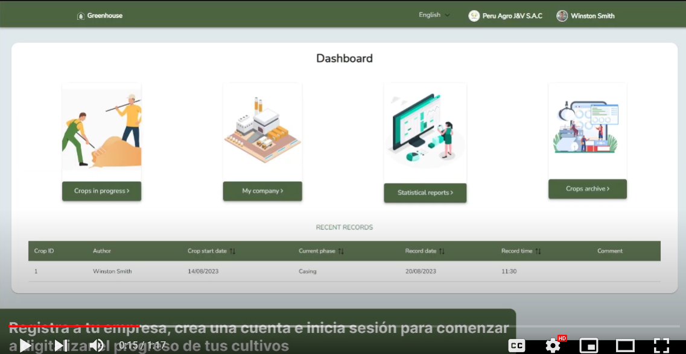

<h1 style="text-align: center;"> Informe del Trabajo Final </h1>
<h3 style="text-align: center;"> Universidad Peruana de Ciencias Aplicadas </h3>

<h5 style="text-align: center"> Ingeniería de Software </h5>

<h5 style="text-align: center"> Aplicaciones Web - SW51 </h5>

<h5 style="text-align: center"> Docente: Juan Carlos Tinoco Licas </h5>

<h5 style="text-align: center"> Startup: Integradis </h5>

<h5 style="text-align: center"> Producto: Greenhouse </h5>

## Team members:
| Nombre |Código|
|:-------:|:----------:|
|Commetant Rubiños, Jessica Elizabeth|U20211C009|
|Espinoza Rodriguez, Nicolas Antonio|U202110278|
|Galavis Du Bois, Alan Enrique|U202110223|
|Seminario Garbin, Carlo Luca|U20211A475|
|Soto Kong Requena, Andres Eduardo|U202116113|

<h5 style="text-align: center"> Ciclo 2023-02 </h5>

## Registro de versiones del informe

|Versión|Fecha|Autor|Descripción de modificación|
|:-:|:-:|:-:|-|
|1.0|15/08/2023|Comettant, Espinoza, Galavis, Seminario, Soto|Creación del documento de trabajo en formato markdown|
|1.1|20/08/2023|Comettant, Espinoza, Galavis, Seminario, Soto|Redacción del startup profile y solution profile, delimitación de segmentos objetivo, redacción de preguntas para el diseño de entrevistas |
|1.2|23/08/2023|Comettant, Espinoza, Galavis, Seminario, Soto|Elaboración y registro de entrevistas a segmentos objetivo, análisis de entrevistas|
|1.3|25/08/2023|Comettant, Espinoza, Galavis, Seminario, Soto|Elaboración de user personas, impact mapping, as-is y to-be|
|1.4|26/08/2023|Comettant, Espinoza, Galavis, Seminario, Soto|Elaboración de user stories, product backlog|
|1.5|28/08/2023|Comettant, Espinoza, Galavis, Seminario, Soto|Elaboración de prototipos de wireframes y mockups|
|1.6|31/08/2023|Comettant, Espinoza, Galavis, Seminario, Soto|Redacción de style guidelines e information architecture|
|1.7|03/09/2023|Comettant, Espinoza, Galavis, Seminario, Soto|Elaboración de diagrama de base de datos, diagrama de clases, diccionario de clases, diagramas de contenedores, diagramas de contexto, diagramas de componentes|
|1.8|03/09/2023|Comettant, Espinoza, Galavis, Seminario, Soto|Registro de evidencias del Sprint 1|
|1.9|04/09/2023|Comettant, Espinoza, Galavis, Seminario, Soto|Rediseño de mockups. Elaboración de wireflows y user-flows|
|1.10|07/09/2023|Comettant, Espinoza, Galavis, Seminario, Soto|Redacción de software configuration management y conclusiones|
|2.1|22/09/2023|Espinoza|Redacción de Collaboration Insights|
|2.2|24/09/2023|Galavis|Corrección de user stories, descripción y acceptance criteria. Repriorización del backlog y repuntaje del sprint|
|2.3|25/09/2023|Galavis, Soto|Corrección del índice. Redacción del capítulo 5.2.2.1|
|2.3|26/09/2023|Galavis|Mejora continua, agregadas descripciones a wireframes, mock-ups, wireflos y user flows.|
|2.4|26/09/2023|Soto|Corrección de análisis de entrevistas. Redacción de development evidence for sprint review, testing suite evidence for sprint review, execution evidence for sprint review, deployment evidence for sprint review, collaboration insights during sprint|
|2.5|26/09/2023|Galavis, Seminario| Mejora continua, corrección del diagrama de base de datos. Redacción de documentation evidence for sprint review|
|2.6|26/09/2023|Galavis, Seminario| Mejora continua, corrección del diagrama de base de datos. Redacción de documentation evidence for sprint review|
|2.7|26/09/2023|Espinoza| Avance de conclusiones|

## Project Report Collaboration Insights

URL del repositorio para el reporte del proyecto: https://integradis-opensource.github.io/LandingPage/

**TB1**

Para el desarrollo del informe perteneciente a la entrega TB1, se dividió la implementación de secciones de la siguiente forma para cada integrante del equipo:

|Integrante|Tareas Asignadas|
|-|-|
|Nicolás Espinoza|Diseño de entrevistas. Diagrama de clases. Diagrama de contexto, componentes y contenedores. User Personas. Information Architecture. User Stories. Diagrama de base de datos.|
|Alan Galavis|Diseño de mockups y wireframes. Descripción de user flows. Capítulo V, Software Development Environment Configuration, Source Code Management, Style Guide & Conventions. User Stories. Product Backlog|
|Carlo Seminario|Impact Mapping, registro y análisis de entrevistas. User Task Matrix. As-Is To-be Scenarios. Empathy Mapping. Technical User Stories. User Stories. Product Backlog. Bibliografía.|
|Jessica Comettant|Antecedentes y problemática 5W y 2H. Lean UX Process, Problem Statement, Assumptions e Hypothesis statements. Lean UX Canvas. Segmentos Objetivos. Análisis de competidores. Diseño de entrevistas. Conclusiones y recomendaciones.|
|Andres Soto|General Style Guidelines. Landing Page, Services & Applications implementation. Software Deployment Configuration.|

**TP**

Para el desarrollo del informe perteneciente a la entrega TB1, se dividió la implementación de secciones de la siguiente forma para cada integrante del equipo:

|Integrante|Tareas Asignadas|
|-|-|
|Nicolás Espinoza|Mejora del diagrama de clases. Avance de conclusiones|
|Alan Galavis|Corrección del modelo de base de datos. Completar explicaciones de flows. Sprint Backlog 2.|
|Carlo Seminario|Corrección de impact map. Documentation Evidence for Sprint Review|
|Jessica Comettant|Correcciones en Lean UX, completar explicación de collaboration|
|Andres Soto|Sprint Planning 1, Development Evidence for Sprint Review, Testing Suite Evidence for Sprint Review, Execution Evidence for Sprint Review|

El proceso de colaboración en el informe se realizó mediante commits constantes al repositorio de la organización Integradis.

**Github Collaboration Insights**

Los siguientes gráficos representan analíticos de commits en el repositorio del informe. En los gráficos se incluye la cantidad de lineas de texto añadidas por cada integrante del equipo.

Los integrantes son:

* Alan Galavis (trabajosUPC-AlanGalavis)
* Nicolás Espinoza (EspinozaNaer)
* Carlo Seminario (CarloLSG)
* Jessica Comettant (Mei0202)
* Andrés Soto (asotito231)

**TB1**

En el siguiente gráfico se muestran la cantidad total de commits realizados en todas las ramas del proyecto.

**TB1**

Github también presenta un timeline de las ramas principales y los procesos de merge a los que se han sometido. Todas las ramas se crearon tomando en cuenta el diseño de GitFlow para una buena organización cuando se usa un software de control de versiones.
Se explican las ramas más prominentes:

**main**: Es representada por el color negro. Se trata de la rama principal del proyecto y se actualiza para cada entregable.
**develop**: Es representada por el color azul. Se trata de la rama principal para el proceso del desarrollo del proyecto.
**feature-product-design**: Es representado por el color verde. Incluye el contenido de user flows y wireframes.
**feature-sprint1**: Es representada por el color amarillo. Esta rama incluye los artefactos relacionados al sprint 1 en el informe.

El siguiente gráfico incluye la cantidad de commits realizados en la semana con más actividad durante el desarrollo del informe. 

## Student Outcome

|Criterio especifico|Acciones realizadas|Conclusiones|
|-|-|-|
|Participa en equipos multidisciplinarios con eficacia, eficiencia y objetividad, en el marco de un  proyecto en soluciones de ingeniería de software.|**Andrés Soto** TB1: Se realizó la seccion de header en el documento, además de su correspondiente codigo en javascript para cumplir funcionalidades.   TP: Se encargó de arreglar los bugs presentados en el landing page del sprint anterior. De la misma forma colaboró con la realización de la seccion sprint 2 del infomre. **Carlo Luca Seminario** TB1: Se aplicó conventional commits y el uso de herramientas de control de versiones para así mejorar el trabajo del equipo tanto para la documentación como para la landing page.   TP: Se realizaron reuniones para mantener una comunicación constante e ir presentando nuestros avances durante el proyecto de modo que todos estemos en sintonía para entregar un proyecto de Software.   **Nicolás Espinoza** TB1: Los diagramas C4 están involucrados en el proceso de DDD o Domain Driven Design. Los diagramas hacen uso de un lenguaje ubicuo que permite a todos los stakeholders internos y externos del proyecto entender detalles técnicos a un alto nivel. TP: Se está utilizando activamente en el proyecto la metodología Scrum para trabajar, mediante sprints, activamente en el proyecto de la aplicación web frontend. Esta colaboración se puede apreciar en la sección de development evidence.  **Alan Enrique Galavis Du Bois** TB1: Todos los miembros del equipo contribuyeron a elaborar todas las partes del informe, bien sea elicitación, análisis y especificación de requisitos, diseño de experiencias de usuario, diseño de base de datos y de patrones de software, etc. Adicionalmente, los integrantes mantuvieron una comunicación activa y una organización constante, lo cual fue posible mediante el uso de herramientas tales como Trello y Github.   TP: Para este entregable, resultó necesario que todos los miembros del equipo se desempeñen en actividades tanto generales como específicas. Se evidenció cómo múltiples integrantes colaboraron para implementar una funcionalidad core para el negocio.   **Jessica Elizabeth Comettant Rubiños** TB1:  El startup profile se concibe como elemento esencial para comunicar la visión, misión, propuesta de valor y otros aspectos claves de la empresa para la los stakeholders. Por otra parte, el solution profile presenta una descripción plena del servicio, producto o solución que una empresa  ofrece y cómo puede satisfacer las necesidades de sus clientes. Finalmente, las herramientas tales como el Lean UX Canvas, el User Task Matrix y el User Journey Mapping proporcionan un marco estructurado para la colaboración entre equipos multidisciplinarios. Asimismo, representan la experiencia del usuario en interacción con el servicio.   TP: En el contexto de este entregable, fue esencial que cada miembro del equipo desempeñara un rol eficiente tanto en la implementación de la plataforma como el segmento de documentacón. Fue evidente cómo varios miembros trabajaron en conjunto de manera colaborativa para llevar a cabo la implementación de una funcionalidad fundamental para el éxito del negocio. Este proceso demostró la importancia de la cooperación y la contribución individual en la consecución de nuestros objetivos.|Como equipo pudimos encontrar medios de organización para solucionar el problema de la falta de tiempo y poder entregar un trabajo parcialmente completo.|
|Conoce al menos un sector empresarial o dominio de aplicación de soluciones de software.|**Andrés Soto** TB1: Se realizó diferentes secciones del informe teniendo en cuenta los criterios para obtener una nota sobresaliente. Haciendo mencion en la realización de la segunda sección del capitulo 5 y la realización del landing page mock up y su correspondiente mobile design.   TP: Desarrollo la caracteristica de toolbar en la aplicación web. Asimismo desarrollo las ventanas emergentes para el registro de datos de cada fase establecida.  **Carlo Luca Seminario** TB1: Se realizó el proceso de especificación y análisis de requisitos para así lograr conocer al sector de las empresas de champiñones de modo que pudimos identificar en que areas enfocarnos para agilizar su flujo de trabajo.   TP: Se realizó el producto mínimo viable o MVP para así poder presentar como segundo sprint un producto de valor para nuestro cliente de modo que este mismo se pueda sentir satisfecho con nuestro avance.   **Nicolás Espinoza** TB1: Se llevó a cabo el proceso de entrevistas con los segmentos objetivos para realizar el proceso de _requirements elicitation_, se comunicó la propuesta de solución a los clientes esperados del proyecto y se dirigió el diseño de la solución a una opción que cumple con los requisitos pedidos. TP: Se profundizó en el uso del framework Vue creando en este entregable componentes hechos en base a materiales proporcionados por primevue, por ejemplo, tablas y dialogs.   **Alan Enrique Galavis Du Bois** TB1: Para poder elaborar un producto solución a un problema real resultó necesario cumplir con una elicitación, análisis, especificación de requisitos, dentro de los cuales se identificaron las necesidades actuales de un sector industrial. Para resolver las necesidades encontradas, se propuso elaborar una aplicación web que permita digitalizar el registro de procesos.   TP: El segmento objetivo afirmó que le interesa que la solución esté disponible tanto para dispositivos móviles como para computadoras de escritorio. Por ello, que la solución tenga un diseño que se acomode a las dimensiones del dispositivo empleado. Se determinó que para lograr este propósito, el framework Vue se presenta como una opción viable por los componentes y herramientas que ofrece, los cuales permiten hacer con facilidad y agilidad una aplicación responsive y funcional.   **Jessica Elizabeth Comettant Rubiños** TB1: Para conocer las necesidades del usuario, se realizó el diseño y desarrollo de entrevistas, las cuales buscaban entablar una correcta comunicación con el segmento objetivo. Por otra parte, para un continuo trabajo colaborativo, se realizaron constantes reuniones grupales que retroalimentaban los avances individuales. TP: El segmento objetivo expresó un interés firme en la disponibilidad de nuestra solución tanto en dispositivos móviles como en computadoras de escritorio. Después de un análisis exhaustivo, hemos determinado que el framework Vue se posiciona como una opción altamente viable debido a sus componentes y herramientas, los cuales permiten desarrollar una aplicación responsive y funcional de manera eficaz y ágil. Esto asegura que nuestra solución cumpla con las expectativas y necesidades de nuestro público objetivo en términos de accesibilidad y usabilidad en diferentes plataformas.|Se logro realizar un trabajo parcialmente sobresaliente pues cumplimos con todos los segmentos del trabajo, de tal manera que se pueda entregar un trabajo digno.|

## Contenido

1. **Capítulo I: Introducción.**
    1. Startup Profile.
        1. Descripción del startup.
        2. Perfiles de los integrantes del equipo.
    2. Solution Profile.
        1. Antecedentes y Problemática.
        2. Lean UX Process.
            1. Lean UX Problem Statements.
            2. Lean UX Assumptions.
            3. Lean UX Hypothesis Statements.
            4. Lean UX Canvas.
    3. Segmentos objetivo.
2. **Capítulo II: Requirements Elicitation & Analysis.**
    1. Competidores.
        1. Análisis competitivo.
        2. Estrategias y tácticas frente a competidores.
    2. Entrevistas.
        1. Diseño de entrevistas.
        2. Registro de entrevistas.
        3. Análisis de entrevistas.
    3. Needfinding.
        1. User Personas.
        2. User Task Matrix.
        3. User Journey Mapping.
        4. Empathy Mapping.
        5. As-is Scenario Mapping.
4. **Capítulo III: Requirements Specification.**
    1. To-Be Scenario Mapping.
    2. User Stories.
    3. Impact Mapping.
    4. Product Backlog.
9. **Capítulo IV: Product Design.**
    1. Style Guidelines.
        1. General Style Guidelines.
        2. Web Style Guidelines.
    2. Information Architecture.
        1. Organization Systems.
        2. Labeling Systems.
        3. SEO Tags and Meta Tags
        4. Searching Systems.
        5. Navigation Systems.
    3. Landing Page UI Design.
        1. Landing Page Wireframe.
        2. Landing Page Mock-up.
    4. Web Applications UX/UI Design.
        1. Web Applications Wireframes.
        2. Web Applications Wireflow Diagrams.
        3. Web Applications Mock-ups.
        4. Web Applications User Flow Diagrams.
    5. Web Applications Prototyping.
    6. Domain-Driven Software Architecture.
        1. Software Architecture Context Diagram.
        2. Software Architecture Container Diagrams.
        3. Software Architecture Components Diagrams.
    7. Software Object-Oriented Design.
        1. Class Diagrams.
        2. Class Dictionary.
    8. Database Design.
        1. Database Diagram.
11. **Capítulo V: Product Implementation, Validation & Deployment.**
    1. Software Configuration Management.
        1. Software Development Environment Configuration.
        2. Source Code Management.
        3. Source Code Style Guide & Conventions.
        4. Software Deployment Configuration.
    2. Landing Page, Services & Applications Implementation.
        1. Sprint 1
            1. Sprint Planning 1.
            2. Sprint Backlog 1.
            3. Development Evidence for Sprint Review.
            4. Testing Suite Evidence for Sprint Review.
            5. Execution Evidence for Sprint Review.
            6. Services Documentation Evidence for Sprint Review.
            7. Software Deployment Evidence for Sprint Review.
            8. Team Collaboration Insights during Sprint.
        2. Sprint 2
            1. Sprint Planning 2.
            2. Sprint Backlog 2.
            3. Development Evidence for Sprint Review.
            4. Testing Suite Evidence for Sprint Review.
            5. Execution Evidence for Sprint Review.
            6. Services Documentation Evidence for Sprint Review.
            7. Software Deployment Evidence for Sprint Review.
            8. Team Collaboration Insights during Sprint.
        2. Sprint 3
            1. Sprint Planning 3.
            2. Sprint Backlog 3.
            3. Development Evidence for Sprint Review.
            4. Testing Suite Evidence for Sprint Review.
            5. Execution Evidence for Sprint Review.
            6. Services Documentation Evidence for Sprint Review.
            7. Software Deployment Evidence for Sprint Review.
            8. Team Collaboration Insights during Sprint.
    3. Validation Interviews.
        1. Diseño de Entrevistas.
        2. Registro de Entrevistas.
        3. Evaluación según Heurísticas.

12. **Conclusiones.**
13. **Bibliografía.**
14. **Anexos.**

## Capítulo I: Introducción.

### 1. **Startup Profile.**
En esta sección se presenta la descripción del startup y los perfiles de los miembros del equipo.
####     1.1. Descripción del startup
La startup, presentada con el nombre de “Integradis”, se enfoca en ofrecer una solución de índole tecnológica avanzada a la industria champiñonera del Perú. Para ello, implementa una plataforma encargada de segmentar el proceso de producción del cultivo de champiñones en determinadas fases. Estas involucran la elaboración del compost, fase de cocina (cocción, pasteurización y acondicionamiento del búnker), la recolección y siembra, la administración de procesos, entre otros. Así mismo, se establece un análisis efectivo entre datos históricos de previo registro y actualizados a tiempo real para la trazabilidad de metas a largo plazo como agroempresa. Es así que, se evalúan los costos operativos actuales, la demanda de exportaciones y se toman futuras decisiones dentro del mercado. Nuestra misión es revolucionar la forma en que las fábricas de champiñones monitorean, registran y optimizan sus procesos de producción a través de una aplicación web intuitiva y poderosa. 

**Misión:** Revolucionar la documentación de los procesos fundamentales de las fábricas enfocadas en la producción de champiñones del Perú.

**Visión:** GreenHouse se direcciona a ser la plataforma más destacada dentro del mercado respecto al registro de procesos para los próximos tres años. 
Integradis busca ser reconocido como un modelo de negocio sostenible y comprometido en brindar un servicio de calidad capaz de satisfacer las necesidades de los usuarios.

##### Logotipo de la Startup:

##### Logotipo del servicio

##### Logotipo de la Startup:

##### Logotipo del servicio

####     1.2. Perfiles de los integrantes del equipo

||Perfiles de los integrantes del equipo|
| :--------| :--------: |
| Mi nombre es **Nicolás Antonio Espinoza Rodriguez**. Tengo 19 años y estoy estudiando la carrera de ingeniería de software en la UPC desde el año 2021. Soy una persona creativa e imaginativa, lo que me ayuda a aportar soluciones para resolver los problemas en común. También, me considero empático y colaborativo, lo que facilita el trabajo en equipo con mis compañeros. Finalmente, me considero una persona ordenada y con ambición, lo que ayuda a trazar metas posibles y significativas para la solución que queremos presentar como equipo. Soy competente en los lenguajes de programación C++, Python y Javascript. Además, tengo conocimiento de tecnologías ágiles y software de control de versiones.|
| Mi nombre es **Alan Enrique Galavis Du Bois**, tengo 20 años y actualmente curso el sexto ciclo de la carrera de ingeniería de software en la UPC (Universidad Peruana de Ciencias Aplicadas). Considero que soy organizado, perseverante y creativo, cualidades que me serán de gran utilidad al momento de trabajar en equipo. Me apasiona encontrar soluciones innovadoras a problemas relacionados con la computación. Al haber crecido en la era digital, estoy familiarizado con el uso de tecnologías de la información y la comunicación.||
Mi nombre es **Carlo Luca Seminario Garbín** tengo 19 años de edad y actualmente curso el quinto ciclo de la carrera de ingeniería de software en la Universidad Peruana de Ciencias Aplicadas (UPC). Considero que soy una persona que es capaz de trabajar bajo presión, además de ser responsable y perseverante. En cuanto a cualidades para la realización del trabajo considero que soy bueno identificando problemáticas y buscando soluciones, a lo que le puedo sumar los conocimientos previos de los ciclos anteriores en cursos de programación y de empresas.||
Mi nombre es **Andrés Eduardo Soto Kong Requena**, soy estudiante de ingeniería de software de la UPC (Universidad Peruana de Ciencias Aplicadas). Me gusta generar soluciones para problemas digitales, es por ello que elegí dicha carrera. Además, me considero bueno para trabajar en situaciones bajo estrés. De la misma forma, considero que las situaciones de mi vida personal me han preparado para afrontar una gran variedad de situaciones en las áreas, tanto laboral como social. Finalmente, soy una persona responsable, lo cual me ha ayudado en una gran cantidad de ocasiones en el momento de la entrega de trabajos.||
Mi nombre es **Jessica Elizabeth Comettant Rubiños** y tengo 19 años. Soy estudiante de la carrera de ingeniería de software de la UPC (Universidad Peruana de Ciencias Aplicadas). Estoy en el quinto ciclo de mi carrera. Gracias a las asignaturas correspondientes a la malla curricular de mi carrera, cuento con las habilidades intelectuales propicias para el desarrollo del proyecto. Asimismo, mi personalidad se encuentra basada en la autonomía. Por lo tanto, he sido capaz de extender mis conocimientos de programación con mayor material de estudio. Finalmente, destaco de mi personalidad la empatía, la responsabilidad, la amabilidad y la capacidad de trabajar en equipo.|

### 2. **Solution Profile.**
####     2.1. Antecedentes y Problemática
##### ¿Cuáles son las 5W?
###### What (Qué)
###### ¿Cuál es el problema?
 El problema radica en la ausencia de una herramienta cuya capacidad sea proporcionar al personal técnico, de supervisión y administrativo, un registro digital de los procesos involucrados en el crecimiento y 
 elaboración de cultivos de industrias champiñoneras en el Perú. A pesar del uso de sistemas manuales para el registro de procesos, es un sistema propenso a fallos relacionados con errores humanos y resultan 
 difíciles de navegar cuando se necesitan registros puntuales.

###### When (Cuando)
###### ¿Cuándo sucede el problema?
El dilema principal surge cuando se percibe la necesidad de entablar un análisis ágil y eficiente de la producción de cultivos en las industrias champiñoneras a partir de los factores ambientales y económicos dentro del contexto interno de la empresa. Asimismo, se comprende la escasez de innovación tecnológica (automatización) en el registro de cultivos.

###### Where (Dónde)
###### ¿A dónde se dirige?
El servicio está direccionado a ser agente de solución hacia las fábricas que incorporan el sector industria champiñonera del Perú.

###### ¿Dónde surge el problema?
El problema se manifiesta durante el desarrollo de las fases transcurridas para el registro de cultivos en las industrias champiñoneras. Es así que se involucra tanto al área de producción, siembra, cocción y pasteurización.

###### Who (Quién)
###### ¿Quiénes están involucrados? ¿Quién lo utilizará?
Los usuarios del sistema serían los técnicos encargados de la supervisión de los cultivos y los administradores de las fábricas champiñoneras en Perú. El personal técnico utilizaría la aplicación para registrar y monitorear en tiempo real los datos de crecimiento, humedad, temperatura, y otros aspectos cruciales en la producción de champiñones. Por otro lado, los administradores emplearían la plataforma para acceder a información clave generada por los técnicos y, así, realizar un seguimiento más amplio de la producción. Los datos recopilados en la aplicación les permitirán tomar decisiones estratégicas informadas como la asignación de recursos, la programación de tareas y la identificación de áreas de mejora en la producción.

###### Why (Por qué)
###### ¿Cuál es la causa del problema?
La causa principal del problema es la dificultad de incluir un sistema digital a una industria manual ya establecida. Muchos trabajadores de las fábricas champiñoneras no manejan eficientemente los medios digitales, por consiguiente, la optimización del registro de procesos vía un software de gestión resultaría ser un cambio complicado y costoso de realizar para la empresa. 

##### ¿Cuáles son las 2H?
###### How (Cómo)
###### ¿Cómo se utilizará el producto?
El producto será empleado para el registro de cultivos de champiñones. A partir de ello, se segmenta este proceso en determinadas fases y se consignan los insumos o elementos esenciales, agrícolas o ambientales, en la aplicación web para propiciar la adecuada producción de los champiñones.

###### ¿Cómo lograremos desarrollar la correcta gestión de cultivos de champiñones dentro de la plataforma?
Los técnicos y administradores acceden a la aplicación web a través de un navegador. La aplicación les permitirá registrar datos de producción en formularios digitales específicos para cada proceso, como la preparación del sustrato (compost), la siembra, el proceso del túnel, entre otros. Los datos se almacenan en una base de datos segura y se presentan en gráficos y tablas de entendimiento dinámico para el usuario.

###### How (Cómo)
###### ¿Cómo se utilizará el producto?
El producto será empleado para el registro de cultivos de champiñones. A partir de ello, se segmenta este proceso en determinadas fases y se consignan los insumos o elementos esenciales, agrícolas o ambientales, en la aplicación web para propiciar la adecuada producción de los champiñones.

###### How much (Cuánto)
###### ¿Cuál es la magnitud del problema?
Según AgroPerú (2023), en el año 2022, el Perú exportó 850 toneladas de champiñones secos por un valor de USD 7,1 millones. Ello representó un aumento del 11 % en volumen y 4 % en valor más que en el año 2021. Si bien el número de exportaciones aparenta ser próspero, se requiere un proceso de automatización adecuado para agilizar y monitorear el registro de las fases involucradas en la producción de cultivos de estas industrias. De acuerdo con The Yield Lab (2019), el reto para las startups de la industria agrícola es alcanzar soluciones para la producción de alimentos de una forma más sustentable y eficiente debido al incremento de la demanda en Latinoamérica. Es ahí que se ve implicada Greenhouse como alternativa de solución.

###### ¿Qué porcentaje del personal de la industria champiñonera se verá beneficiado por el servicio?
El sistema puede ser utilizado por múltiples técnicos, supervisores y administradores que incorporan al personal de las fábricas champiñoneras. No hay un límite específico en cuanto al número de usuarios. Sin embargo, se establece una estimación de un 35% de usuarios beneficiarios dentro de este sector.

####     2.2. Lean UX Process
#####         **2.2.1.Lean UX Problem Statements.**
###### **Problem Statement:** 

El propósito de Greenhouse es proporcionar a las fábricas champiñoneras del Perú un sistema de monitoreo de cultivos ágil mediante el cual técnicos supervisores y administradores del personal trabajador podrán registrar los procesos productivos implicados en la producción de champiñones.

El problema está presente al momento de realizar el registro de características en constante desarrollo durante el proceso de crecimiento de champiñones. Esta ineficiencia del registro y la dependencia del personal técnico y de supervisión hacia métodos manuales, como registros en papel y hojas de cálculo digitales conlleva a un aumento significativo en el margen de error. En primer lugar, se percibe un incremento en la cantidad de errores dentro del ingreso de datos de manera manual que incluyen omisiones, errores de transcripción y falta de consistencia en la información, relevante para la gestión de las fases posteriores de cultivo.

Hemos observado que los prejuicios hacia la calidad del monitoreo productivo de los cultivos de champiñones es un derivado principal del problema previo. La falta de precisión en la recopilación y supervisión de datos altera la capacidad de tomar decisiones informadas en tiempo real lo que repercute en la eficiencia de la producción. En adición a ello, esta ausencia de confiabilidad en los datos resulta en impactos negativos dentro de la certificación de calidad, la trazabilidad y, en última instancia, la competitividad de la industria champiñonera peruana en los mercados nacionales e internacionales.

¿Cómo podríamos monitorear de forma automatizada la información proveniente de los procesos productivos que implican los cultivos de champiñones sin generar pérdidas de datos relevantes?

#####         **2.2.2.Lean UX Assumptions.**
###### **Business Assumptions:**
1.  **Creemos que nuestros usuarios necesitan** una forma más eficiente de registrar y  monitorear los procesos productivos implicados en el cultivo industrial de champiñones.
2.  **Estas necesidades se pueden satisfacer** con el desarrollo de una plataforma que permitirá el acceso oportuno y confiable a los datos registrados por el personal técnico y administrativo de las fábricas champiñoneras del Perú.
3.  **Nuestros clientes iniciales serán** los supervisores y administradores de las fábricas champiñoneras que dispongan de aparatos tecnológicos (computadoras, tablets o teléfonos móviles).
4.  **El valor más importante que un cliente quiere de nuestros servicios es** registrar los insumos relevantes involucrados en cada fase productiva dentro del cultivo de champiñones y visualizar los datos registrados a lo largo del tiempo.
5.  **El cliente también va a obtener** diversos beneficios adicionales como visualizar gráficos estadísticos dentro de la aplicación con datos actuales e históricos.
6.  **Vamos a obtener la mayoría de los clientes mediante** publicidad en línea y campañas de retención en las fábricas del sector productivo de champiñones en el Perú.
7.  **Vamos a obtener ingresos mediante** el modelo de suscripción con diferentes niveles para el uso de la aplicación por parte de las empresas.
8.  **Nuestra competencia en el mercado serán** las plataformas propias de agroempresas direccionadas al monitoreo o control de cultivos agrícolas.
9.  **Vamos a tener ventaja frente a nuestra competencia debido a** que la plataforma incluye el registro de procesos productivos de cultivos a partir de la segmentación de fases involucradas en el desarrollo exclusivamente de la industria de champiñones.
10.  **El mayor riesgo del servicio es** que el segmento objetivo no se muestre dispuesto e interesado en automatizar los procesos productivos de cultivo. Las razones vendrían a ser de un contexto interno social: problemas de adaptación, pensamiento estático y manejo de herramientas tecnológicas.
11.  **Lo resolveremos realizando** un diseño dinámico y llamativo de la plataforma. De igual forma, se realizará una revisión constante de la plataforma y actualizaciones en caso de inserción de funcionalidades adicionales o mejoras.

###### **User Assumptions:**
###### **¿Quién es el usuario?**   
Los usuarios son, en primera parte, el personal técnico supervisor y administrativo que incorporan las fábricas champiñoneras del Perú. Sin embargo, si la plataforma tiene éxito en este primer sector, se plantea extender para la implementación de toda la industria agrícola. En cuestión, sería adaptar la segmentación de fases al proceso productivo de la agroempresa.

###### **¿Qué problemas tiene nuestro producto? ¿Resolver?**
Un problema, que enfrenta actualmente la aplicación, radica en la ausencia de la identificación automática de etapas de crecimiento involucradas dentro de los cultivos de champiñones. En ese sentido, los técnicos supervisores deben realizar dicha especificación de manera manual, es decir, cuando un cultivo debe ser trasladado de una fase de búnker a una fase de túnel y, posteriormente, a la fase de germinación.

###### **¿Qué características son importantes?**
Las características más importantes de la plataforma son: el registro y monitoreo de las fases productivas e insumos involucradas en los cultivos de champiñones, las cuales parten desde la siembra, la recolección, la producción, la administración, entre otros. Así mismo, se automatiza el análisis efectivo de datos históricos y actualizados a tiempo real, es así que se evitan pérdidas financieras y se trazan proyecciones como prósperas agroempresas dentro del mercado.

###### **¿Dónde encaja nuestro producto en su trabajo o vida?**
El producto encaja en la mejora de la gestión de procesos para el cultivo de champiñones lo que culmina en la eficiencia operativa, la rentabilidad y disminución de costos.

###### **¿Cuándo y cómo es nuestro producto? ¿Usado?**
El servicio será utilizado por el segmento objetivo cuando surja la necesidad de registrar la información relevante involucrada en los procesos de producción de champiñones o en el análisis de datos históricos para la trazabilidad de metas a largo plazo como agroempresa. Es así que se evalúan los costos operativos actuales, la demanda de exportaciones y se toman decisiones a futuro dentro del mercado.

###### **¿Cómo debe verse nuestro producto y cómo debe comportarse?**
El producto debe integrar una interfaz sencilla, inclusiva y dinámica. Debe entablar y maximizar la conexión entre todo el personal de la fábrica, sin generar retrasos ni deficiencia comunicativa. El diseño debe ser llamativo, capaz de captar la atención del segmento objetivo y otorgar una experiencia acogedora. Finalmente, el comportamiento se direcciona a los términos de privacidad y seguridad de datos personales de los usuarios así como de la agroempresa.
   
#####         **2.2.3.Lean UX Hypothesis Statements.**
* **Hypothesis Statement 01:**
    
    **Creemos que** los técnicos supervisores y administradores de las fábricas champiñoneras estarán dispuestos a adoptar la aplicación para llevar un registro digital de los procesos productivos involucrados en el cultivo de champiñones.
    
    **Sabremos** que hemos tenido éxito.
    
    **Cuando** la tasa de adopción de la aplicación en los usuarios objetivo se encuentre alrededor del 80% dentro del primer trimestre de lanzamiento.
  
* **Hypothesis Statement 02:**
    
    **Creemos que** la aplicación fomentará una mejor comunicación y colaboración entre los técnicos supervisores y administradores al proporcionar una plataforma que exponga información resumida de los últimos procesos dentro de la fábrica.
    
    **Sabremos** que hemos tenido éxito.
    
    **Cuando** se perciba un aumento del 30% en la frecuencia de interacciones entre los diferentes equipos/segmentos del personal a través de la plataforma.

* **Hypothesis Statement 03:**
    
    **Creemos que** la disponibilidad de datos en tiempo real y análisis históricos a través de la aplicación web permitirá a los administradores tomar decisiones más informadas y estratégicas sobre la asignación de recursos y mejoras en la producción.
    
    **Sabremos** que hemos tenido éxito.
    
    **Cuando** al menos un 70% de las decisiones claves, tomadas por los administradores, se basan en análisis proporcionados por la aplicación web.

* **Hypothesis Statement 04:**
    
    **Creemos que** la aplicación web mejorará la calidad de los datos de producción al reducir errores en los datos de entrada y registros inconsistentes en comparación con métodos manuales.
    
    **Sabremos** que hemos tenido éxito.
    
    **Cuando** se perciba una reducción del 50% en el margen de error de registro de datos de procesos productivos dentro de la plataforma.  

#####         **2.2.4.Lean UX Canvas.**
El Lean UX Canvas es una herramienta utilizada en el campo del diseño centrado en el usuario (UX) y la metodología Lean para crear y desarrollar productos de manera más eficiente y efectiva. Su objetivo es proporcionar un marco estructurado para la colaboración entre equipos multidisciplinarios. A continuación se presenta el Lean UX Canvas trabajado por el equipo a través de la herramienta digital **Mural**:

Enlace para acceder al [Canvas](https://app.mural.co/t/integradis6182/m/integradis6182/1693601172741/46f0026bfe73d12af59e3bc71c203bee710eb32a?sender=ufdf66b413172c812625a4806 )

### 3. **Segmento objetivo.**
Según AgroPerú (2023), en el año 2022, el Perú exportó 850 toneladas de champiñones secos por un valor de USD 7,1 millones. Ello representó un aumento del 11 % en volumen y 4 % en valor que en el año 2021. Si bien el número de exportaciones fluctúa ser próspero, se requiere un proceso de automatización para agilizar y monitorear el registro de las fases involucradas en la producción de cultivos de estas industrias. Así mismo, en los próximos treinta años, la demanda de alimentos se incrementará en un 70 %. Ello implica mejoras en la  gestión y producción de alimentos. El uso de herramientas tecnológicas e incluso disciplinas como la inteligencia artificial pueden ayudar a cumplir este objetivo mediante la creación de granjas virtuales que permiten planificar las actividades agrícolas y monitorear la evolución de los cultivos a través del registro de procesos y factores meteorológicos, ambientales y de cultivos involucrados. La automatización reduciría las dificultades exclamadas por el personal de las agroempresas en cuanto al registro de datos en herramientas manuales.
Finalmente, en relación a las principales empresas exportadoras de champiñones se comprenden a Novos Distribución y Exportación del Perú con un 52,5% de los envíos totales y un monto de US$ 387,5 mil; C & M Aromatic Group S.A.C., con unos envíos por valor de US$ 200,5 mil; Export Aromático S.A.C., con US$ 149,8 mil; y Andean Trading Corporation S.A.C, con US$ 172. Lo último entablaría una alta tasa de inversionistas y usuarios para la plataforma.

#### 3.1 **Stakeholders:**
* **Stakelholder Internos:** Equipo Integradis y resto de integrantes del equipo de desarrollo
* **Stakelholder Externos:** Personal técnico supervisor y administrador de las industrias enfocadas en el cultivo de champiñones, estudiantes y/o profesionales en carreras involucradas en agronomía, gerencia de agroempresas comerciales.

## Capítulo II: Requirements Elicitation & Analysis
### 1. **Competidores.**
####     1.1. Análisis competitivo:
El análisis competitivo es una herramienta esencial debido a su relevancia en la toma de decisiones estratégicas, la identificación de oportunidades y amenazas, y la creación de ventajas competitivas sostenibles en el mercado. Por tales motivos, ayuda a las empresas a mantenerse ágiles y a tomar decisiones informadas en un entorno empresarial de constante cambio. A continuación, se exhibe la incorporación de esta herramienta dentro del desarrollo del proyecto y la examinación de los competidores:

<html>
<head>
    <title>Tabla HTML</title>
    
</head>
<body>
    <table >
        <tr>
           <td colspan="6" class="sub">  <h1>Competitive Analysis Landscape</h1></td>
        </tr>
        <tr>
            <td colspan="2" rowspan="2" class="sub">¿Por qué llevar acabo este análisis?</td>
            <td colspan="4" class="sub"><h3>¿Quiénes son nuestros principales competidores?</h3></td>
        </tr>
        <!-- Filas restantes (13 filas) -->
        <tr>
            <td colspan="4">Gracias al análisis de la competencia perteneciente al mercado, se logra comprender el entorno competitivo 
                en el que operará nuestro producto. Ello proporciona una visión detallada de quienes son nuestros competidores 
                directos e indirectos, trazar estrategia a través de información recopilada sobre  su posicionamiento actual en el mercado.</td>
        </tr>
        <tr>
            <td rowspan="3" class="sub">PERFIL</td>
            <td rowspan="2" class="sub">Overview</td>
            <td> GreenHouse  </td>
            <td>Agroptima  </td>
            <td>Agrio Software </td>
            <td>AgrioBit  </td> 
        </tr>
        <tr>
            <td>Plataforma direccionada al registro y monitoreo de procesos productivos involucrados en los cultivos de las industrias de champiñones
                La plataforma permite la visibilidad de registro de datos históricos y actuales para un análisis exhaustivo lo que culmina en la toma de decisiones conscientes para las agroempresas
                Muestra alarmas o notificaciones cuando se muestran parámetros meteorológicos, ambientales o de cultivo fuera del rango normal.</td>
            <td>Es un software de gestión agrícola ágil e intuitivo para el control y registro de explotaciones agrarias</td>
            <td>Plataforma web dirigida a empresas que comercializan y procesan patatas, cebollas y hortalizas integrales.</td>
            <td>Plataforma para las empresas de agronegocios que buscan una gestión empresarial de agricultura y 
                ganadería inteligente en la nube, que combina datos agropecuarios y financieros en un mismo lugar.</td>      
        </tr>
        <tr>
            <td class="sub">Ventaja Competitiva ¿Qué valor ofrece a los clientes?</td>
            <td>Permite el registro de procesos productivos a partir de fases involucradas en la gestión de cultivos de champiñones</td>
            <td>
                <ul>
                    <li>Se adapta a cualquier tipo de sector agrícola (cultivo)</li>
                    <li>Muestra una precisión de los cultivos desde una vista satelital</li>
                    <li>Conecta a la administración, la gerencia y el técnico cultivo de la agroempresa</li>
                    <li>La aplicación móvil puede trabajar sin hacer uso de conexión inalámbrica</li>
                </ul>
            </td>
            <td>
                <ul>
                    <li>Integra software de Microsoft Dynamics y Microsoft Azure (software cloud)</li>
                    <li>Puede acceder a todas las herramientas de la pila de Microsoft 365</li>
                    <li>Ofrece almacenamiento de datos propio en la plataforma</li>
                </ul>
            </td>
            <td>
                <ul>
                    <li>Combina datos agropecuarios y financieros en un mismo lugar</li>
                    <li>Permite trabajar con contratos, aplicaciones, liquidaciones, operaciones empresariales, de logística y de inventarios.</li>
                    <li>Muestra disponibilidad en Microsoft AppSource y PlayStore</li>
                </ul>                
            </td>      
        </tr>
        <!----->
        <tr>
            <td rowspan="2" class="sub">PERFIL DEL MARKETING</td>
            <td class="sub" >Mercado Objetivo</td>
            <td>
                <ul>
                    <li>Personal técnico supervisor de las fábricas champiñoneras del Perú</li>
                    <li>Personal administrativo de las empresas champiñoneras del Perú.</li>
                </ul>  
            </td>
            <td>Personal de gerencia, administración y técnico cultivo pertenecientes a las agroempresas</td>
            <td>Dirigido a empresas que comercializan y procesan patatas, cebollas y hortalizas integrales</td>
            <td>Empresas de agronegocios que buscan una gestión empresarial de agricultura y ganadería inteligente en la nube</td>
        </tr>
        <tr>
            <td class="sub">Estrategias de Marketing</td>
            <td>
                <ul>
                    <li>Colaboración con expertos en agronomía y agroempresas para respaldar la eficacia del sistema</li>
                    <li>Ofrecer una prueba gratuita a los usuarios (estrategias de retención)</li>
                </ul>
            </td>
            <td>
                <ul>
                    <li>Prueba gratuita de 15 días (estrategia de retención)</li>
                    <li>Inserción de videos tutoriales</li>
                </ul>
            </td>
            <td>
                <ul>
                    <li>Establecer en un espacio dentro de la página, las empresas que ya han implementado el uso de la plataforma.</li>
                    <li>Entablar vínculos a los canales de comunicación personales de la startup.</li>
                </ul>
            </td>
            <td>
                <ul>
                    <li>Colocar de forma estratégica en la página los logros alcanzados por la empresa y los clientes que ya han implementado este software.</li>
                    <li>Ofrecer espacios publicitarios en redes sociales.</li>
                </ul>
            </td>
        </tr>
        <!----->
        <tr>
            <td rowspan="3" class="sub">PERFIL DEL PRODUCTO</td>
            <td class="sub">Productos & Servicios</td>
            <td>Plataforma web para el registro y monitoreo de procesos productivos involucrados en los cultivos de la industria champiñonera</td>
            <td>Software de gestión agrícola y registro de campos, personal, productos, clientes</td>
            <td>Plataforma web de control agrícola direccionada a agroempresas enfocadas en cultivos de hortalizas</td>
            <td>Plataforma que desarrolla soluciones a medida para que cooperativas, bancos, gobierno, proveedores, 
                fabricantes de agroinsumos y comunidades agrícolas puedan brindarles a sus clientes o asociados
                 tecnología mediante sólo una herramienta de innovación.  
                La aplicación permite tener cosechas más productivas, sustentables y con un manejo adecuado 
                para la preservación del medio ambiente.</td>
        </tr>
        <tr>
            <td class="sub">Precios & Costos</td>
            <td>Venta de espacios publicitarios dentro de la plataforma
                Suscripción gratuita por un rango de 15 días, luego el costo será proporcional al tamaño de la agroempresa. 
                Si la agroempresa registra de entre 100 a 500 usuarios, se considera un monto de $6.75 por usuario; de 500 a más, 
                el costo oscila en $4.45.</td>
            <td>Prueba de 15 días, luego los costos se clasifican en tres planes: plan Basic, 
                plan Pro y plan Premium, en dependencia de las funcionalidades que se desean adquirir.</td>
            <td>A tratar en mutuo acuerdo con la agroempresa</td>
            <td>A tratar en acuerdo con la empresa agropecuaria	</td>
        </tr>
        <tr>
            <td class="sub">Canales de distribución (web/móvil)</td>
            <td>El servicio, de forma momentánea, se brindará en plataforma web</td>
            <td>Dispone de plataforma web y aplicación móvil</td>
            <td>Solo plataforma web</td>
            <td>Plataforma web y aplicación móvil</td>        
        </tr>
        <!----->
        <tr>
            <td rowspan="4" class="sub">ANÁLISIS SWOT</td>
            <td class="sub">Fortalezas</td>
            <td>Comunicación flexible entre el personal supervisor y administrativo de las plantas agrícolas
                Registro y monitoreo eficiente de los procesos productivos de los cultivos de champiñones</td>
            <td> 
                <ul>
                    <li>Brinda control de ingresos y egresos de cada actividad agrícola involucrada en el tipo de cultivo (gestión de costos)</li>
                    <li>La vista satelital muestra a tiempo real una mejor percepción de los campos agrícolas, lo que garantiza una adecuada supervisión para el personal técnico</li>
                </ul>
            </td>
            <td>
                <ul>
                    <li>Portal ágil para consumidores y productores</li>
                    <li>Cálculos estables basados en herramientas de Microsoft</li>
                    <li>Muestra proyecciones generales a partir de los cálculos registrados</li>
                </ul>
            </td>
            <td>
                <ul>
                    <li>Planifica en base a la simulación de escenarios productivos</li>
                    <li>Combina datos agropecuarios y financieros en un mismo lugar</li>
                    <li>Reduce riesgos e impacto ambiental</li>
                </ul>
            </td>
        </tr>
        <tr>
            <td class="sub">Debilidades</td>
            <td>Desconocimiento del sector agrícola y productivo del cultivo de champiñones</td>
            <td>Errores en la recepción de información para la creación de cuenta del usuario (interfaz).</td>
            <td>Solo se encuentra disponible en países de Europa, aún no se ha internacionalizado ni intentó lanzarse al mercado norteamericano.</td>
            <td>Errores en el formulario de registro de información para entrar en contacto con la empresa</td>  
        </tr>
        <tr>
            <td class="sub">Oportunidades</td>
            <td>
                <ul>
                    <li>Mejora de las funcionalidades deficientes de nuestros competidores en el mercado</li>
                    <li>Baja presencia de competidores en el mercado</li>
                    <li>Alta demanda en exportaciones peruanas de cultivos de champiñones hacia el exterior</li>
                </ul>
            </td>
            <td>Implementación de una interfaz agradable y visual para el usuario</td>
            <td>Administración y planificación visual del departamento de producción de cultivos</td>
            <td>Combina inteligencia artificial e IoT para mitigar el cambio climático y gestionar cultivos agrícolas</td> 
        </tr>
        <tr>
            <td class="sub">Amenazas</td>
            <td>Inflación e inestabilidad económica del Perú</td>
            <td>La interfaz no puede centralizarse en el desarrollo de procesos 
                productivos para solo un tipo de cultivos. Es decir, la interfaz ha sido creada de forma generalizada.</td>
            <td>Bajas demandas al ser una startup reciente y no contar con una aplicación móvil</td>
            <td>Dilema del cambio climático en continuo agudizamiento</td>          
        </tr>
    </table>
</body>
</html>

####     1.2. Estrategias y tácticas frente a competidores.
En base al análisis competitivo efectuado anticipadamente, se logró identificar con exactitud las fortalezas, oportunidades, debilidades y amenazas destacadas de los competidores. Dicha información resulta ser clave para trazar estrategias y tácticas  de superación hacia la competencia, cuando el servicio entre al mercado (lanzamiento rentable). A continuación, se brindará una serie de estrategias y tácticas trazadas para alcanzar esta meta:

**Afrontando las fortalezas de nuestros competidores:**
* Gestión de costos por cada actividad agrícola involucrada en diferentes tipo de cultivo
* Adecuada supervisión para el personal técnico a través de una vista satelital que muestra a tiempo real una mejor percepción de los campos agrícolas
* Cálculos estables basados en herramientas de Microsoft
* Permite trabajar con contratos, aplicaciones, liquidaciones, operaciones empresariales, de logística y de inventarios.

**Comprendemos que nuestras fortalezas son:**
* Comunicación flexible entre el personal supervisor y administrativo de las plantas agrícolas
* Registro y monitoreo eficiente de los procesos productivos de los cultivos de champiñones

Entonces, podemos aplicar las siguientes estrategias y tácticas:

**Estrategias**
* Brindar al cliente un enfoque logístico de los registros realizados dentro de la plataforma.

**Tácticas**
* Incluir herramientas avanzadas de análisis de costos, perceptibles a la vista y comprensibles como gráficos, informes y comparaciones históricas

**Afrontando las debilidades de nuestros competidores:**
* Errores en la recepción de información para la creación de cuenta del usuario (interfaz).
* Errores en el formulario de registro de información para entrar en contacto con la empresa
* Algunas plataformas web aún no se internacionalizaron ni insertaron al  mercado norteamericano.

**Comprendemos que nuestras debilidades son:**
* Desconocimiento del sector agrícola y productivo del cultivo de champiñones

Entonces, podemos aplicar las siguientes estrategias y tácticas:

**Estrategias**
* Mantener constantes actualizaciones y verificación de errores dentro de la plataforma.

**Tácticas**
* Implementar un agente de soporte en donde el usuario registre alguna falla de la plataforma
* Realizar constantes actualizaciones de las funcionalidades dentro de la plataforma en paralelo con los procesos productivos dentro de las fases de cultivo de los champiñones
* Proporcionar tutoriales para el uso de la aplicación web como herramienta de interacción para nuestros usuarios.

**Afrontando las oportunidades de nuestros competidores:**
* Implementación de una interfaz agradable y visual para el usuario
* Administración y planificación visual del departamento de producción de cultivos
* Combina inteligencia artificial e IoT para mitigar el cambio climático y gestionar cultivos agrícolas
  
**Comprendemos que nuestras oportunidades son:**
* Mejorar las funcionalidades deficientes de nuestros competidores en el mercado
* Baja presencia de competidores en el mercado
* Alta demanda en exportaciones peruanas de cultivos de champiñones hacia el exterior.

Entonces, podemos aplicar las siguientes estrategias y tácticas:

**Estrategias**
* Desarrollar la interfaz de la plataforma en base a una experiencia de usuario acogedora y sostenible

**Tácticas**
* Aplicar los conceptos de psicología del color para la selección y diseño de la interfaz de usuario de la plataforma.
* Aplicar pruebas de usabilidad y recolección de comentarios para garantizar la atracción hacia la plataforma.
* Implementar una sección de información al usuario sobre  el impacto ambiental y mitigación al cambio climático

**Afrontando las amenazas de nuestros competidores:**
* La interfaz no puede centralizarse en el desarrollo de procesos productivos para solo un tipo de cultivos. Es decir, la interfaz ha sido creada de forma generalizada.
* Bajas demandas al no contar con una aplicación móvil
* Dilema del cambio climático en continuo agudizamiento

**Comprendemos que nuestras amenazas son:**
* Inflación e inestabilidad económica del Perú

Entonces, podemos aplicar las siguientes estrategias y tácticas:

**Estrategias**
* Potenciar las funcionalidades de la plataforma web

**Tácticas**
* Mantener actualizaciones continuas de la plataforma y agilizar la atención al registro de errores por los usuarios
* Desarrollar webinars para destacar la facilidad de planificación y administración visual para optimizar operaciones que ofrece nuestra plataforma (demostraciones prácticas)

### 2. **Entrevistas.**
La sección abarca el proceso de investigación de nuestros segmentos objetivos mediante la recolección de información en base a entrevistas.
####     2.1. Diseño de entrevistas.
_Preguntas dirigidas al personal técnico supervisor de las fábricas de champiñones._
___
- Preguntas principales:
  1. ¿Podría proporcionarnos su nombre completo y su edad?
  2. ¿Cuánto tiempo de experiencia posee en la industria de producción de champiñones y que rol desempeña en la fábrica?
  3. ¿Qué actividades desempeña dentro de la fábrica?
  4. ¿Cómo interactúa con el equipo a su cargo para asegurarse de que las operaciones en la fábrica sean eficientes y exitosas? ¿Qué estrategias utiliza para mantener un ambiente de trabajo colaborativo y motivador?
  5. ¿Podría proporcionar una descripción general del proceso de cultivo de champiñones?
  6. ¿Con que frecuencia registra los procesos de la fábrica?
  7. ¿Considera tedioso el registro de procesos? ¿Cómo consideras que podría agilizarse u optimizarse este proceso?
  8. ¿Han habido casos de confusiones, imprecisiones o fallos en la comunicación al momento de reportar de los procesos de la fábrica? ¿Cómo intentaron solucionar estos inconvenientes?
  9. ¿Cuál es el propósito principal de la pasteurización en el contexto del cultivo de champiñones?
  10. ¿Cuáles son los procesos clave que supervisa durante el crecimiento de los champiñones?
  11. ¿Qué factores son los más importantes a tomar en cuenta para un cultivo exitoso de los champiñones? (temperatura, humedad, iluminación, etc.)
  12. ¿Podría explicar a detalle como se realiza el registro de procesos de las naves para una producción óptima de champiñones? ¿Cómo se realiza en el proceso de pasteurización?
  13. ¿Cómo evalúan la efectividad de la pasteurización? ¿Qué indicadores utilizan para medir el éxito del proceso?
  14. ¿Cómo se comunica la información sobre el estado y el progreso del proceso de pasteurización con otros departamentos o equipos?
  15. ¿Cuáles son los desafíos más comunes que enfrentan en la supervisión de las naves de champiñones? ¿Qué incovenientes son frecuentes al momento de recibir reportes?
  16. ¿Cuáles son los desafíos más comunes que enfrentan durante el proceso de pasteurización de champiñones?
  17. ¿En qué medida se utiliza la tecnología y automatización en el proceso de cultivo? ¿Cuáles son los beneficios más importantes del uso de estas herramientas?
  18. ¿Qué funcionalidades considera que debe tener una aplicación web para ayudar con el registro de información del proceso de pasteurización y de los procesos que supervisas?
  19. ¿Cuál de estas características cree que es más importante en la aplicación web: velocidad, facilidad de uso o una interfaz amplia? 
  20. ¿Cuáles problemas crees que podrían surgir del uso de dicha aplicación?
   
- Preguntas complementarias:
  1. ¿Cómo garantizan la calidad y la seguridad alimentaria de los champiñones cultivados en la fábrica?
  2. ¿Qué tipo de capacitación y formación reciben los técnicos encargados de la supervisión? ¿Cuáles son las habilidades clave necesarias para este trabajo?

_Preguntas dirigidas a los administradores de las fábricas de champiñones._
___
- Preguntas principales:
  1. ¿Podría proporcionarnos su nombre completo y tu edad?
  2. ¿Cuanto tiempo de experiencia posee en la industria de producción de champiñones y que rol desempeña en la fábrica?
  3. ¿Qué actividades desempeña dentro de la fábrica?
  4. ¿Cómo es el proceso de cultivo de champiñones en las naves?
  5. ¿Cuáles son los procesos que supervisa personalmente en la fábrica?
  6. ¿Con qué frecuencia recibe un reporte relacionado con los procesos y el estado actual de la fábrica? ¿Para qué utiliza esta información?
  7. ¿Han habido casos de confusiones, imprecisiones o fallos en la comunicación al momento de reportar de los procesos de la fábrica? ¿Cómo intentaron solucionar estos inconvenientes?
  8. ¿Cuáles son los principales problemas reportados por los trabajadores que están bajo su administración?
  9. ¿Cómo se registra la información proveniente de los procesos realizados durante el cultivo y la pasteurización?
  10. Dentro de la fábrica, ¿Cuentan con algún tipo de análisis estadístico u otra manera de visualizar la producción dentro de la fábrica y su trayectoria a través del tiempo?
  11. ¿En qué medida se utiliza la tecnología y automatización en el proceso de cultivo? 
  12. ¿Qué tecnologías se han considerado implementar para automatizar el registro de procesos dentro de la fábrica?
  13. ¿Qué funcionalidades considera que debe tener una aplicación web para ayudar con el registro de información proveniente de la fábrica?
  14. ¿Cuál de estas características cree que es más importante en la aplicación web, velocidad, facilidad de uso o una interfaz amplia? 
  15. ¿Cuáles problemas cree que podrían surgir del uso de dicha aplicación?
    
- Preguntas complementarias:
  1. ¿Qué le inspira a trabajar en la administración de las naves de los champiñones?
  2. ¿Cómo se lleva un registro del inventario de champiñones producido?
####     2.2. Registro de entrevistas.

**Entrevista a técnicos supervisores**

|Entevistado 1|Elías Almenara|
|-|-|
|Edad|52|
|Distrito|Chilca|
||Cuenta con 17 años trabajando en plantas de cultivo de champiñones, actualmente es el técnico de producción en Perú Agro. Las funciones que desempeña son las relacionadas al proceso de las naves. Tiene un conocimiento muy claro del proceso y todo lo que este involucra como lo son los tiempos, condiciones de temperatura, CO2, Humedad. Trabaja en el turno de día y realiza un registro cada 4 horas. Se evidencia que no es una persona muy familiarizada con el entorno digital puesto que ciertas preguntas relacionadas al tema le costaban comprenderlas. No considera tedioso el tener que hacer los registros manualmente pero si considera que el proceso se podría agilizar mediante la implementación de una aplicación web. |
|Timing: 0:07-15:15 |URL: [upc-pre-202302-si729-SW51-Integradis- needfinding-sprint-1](https://upcedupe-my.sharepoint.com/:v:/g/personal/u20211a475_upc_edu_pe/EW0WUUHzXK5Nmzo3JosW8YoB8PYQfaqreFVmqAPr8VespQ?e=O84h23&nav=eyJyZWZlcnJhbEluZm8iOnsicmVmZXJyYWxBcHAiOiJTdHJlYW1XZWJBcHAiLCJyZWZlcnJhbFZpZXciOiJTaGFyZURpYWxvZyIsInJlZmVycmFsQXBwUGxhdGZvcm0iOiJXZWIiLCJyZWZlcnJhbE1vZGUiOiJ2aWV3In0sInBsYXliYWNrT3B0aW9ucyI6eyJzdGFydFRpbWVJblNlY29uZHMiOjcuMDR9fQ%3D%3D)|

|Entevistado 2|Kevin Urbano|
|-|-|
|Edad|32|
|Distrito|Chilca|
||Cuenta con 2 años y 3 meses trabajando en plantas de cultivo de champiñones, actualmente es el técnico de pasteurización y búnker en Perú Agro. Las funciones que desempeña son las relacionadas a los proceso previos a las naves, como lo son los bunkers y la pasteurización. Comenta que las cantidades para las mezclas se manejan con un excel del encargado. Trabaja en el turno de día y realiza un registro cada hora u hora y media. Comenta que se tienen registros tanto por WhatsApp como por informes manuales que se envían a oficina. Considera que una aplicación para el registro brindaría mayor organización puesto que todo estaría en la computadora. Comenta la posibilidad de añadir el seguimiento de las mejores naves|
|Timing: 15:16-27:45|URL: [upc-pre-202302-si729-SW51-Integradis- needfinding-sprint-1](https://upcedupe-my.sharepoint.com/:v:/g/personal/u20211a475_upc_edu_pe/EW0WUUHzXK5Nmzo3JosW8YoB8PYQfaqreFVmqAPr8VespQ?e=gW7L3K&nav=eyJyZWZlcnJhbEluZm8iOnsicmVmZXJyYWxBcHAiOiJTdHJlYW1XZWJBcHAiLCJyZWZlcnJhbFZpZXciOiJTaGFyZURpYWxvZyIsInJlZmVycmFsQXBwUGxhdGZvcm0iOiJXZWIiLCJyZWZlcnJhbE1vZGUiOiJ2aWV3In0sInBsYXliYWNrT3B0aW9ucyI6eyJzdGFydFRpbWVJblNlY29uZHMiOjkxNi4zN319)|

|Entevistado 3|Danny Martinez|
|-|-|
|Edad|33|
|Distrito|Chilca|
||El entrevistado posee un año y seis meses trabajando en la planta de cultivo de champiñones, y, actualmente está encargado de la coordinación general de los procesos productivos, ventas, cosecha. Se encarga de que todos los procesos se cumplan a cabalidad. Menciona que el registro de temperatura es diario y en algunas áreas se manejan por horas. Comenta que se tienen registros tanto por WhatsApp como por informes manuales que se envían a oficina. Considera que una aplicación para el registro brindaría mayor organización puesto que es a tiempo real de manera digital a diferencia de por escrito. Menciona la posibilidad de implementar una base de datos. Considera que el uso de la aplicación tendría como mayor problema capacitar al personal.
|Timing: 27:45-35:46|URL: [upc-pre-202302-si729-SW51-Integradis- needfinding-sprint-1](https://upcedupe-my.sharepoint.com/:v:/g/personal/u20211a475_upc_edu_pe/EW0WUUHzXK5Nmzo3JosW8YoB8PYQfaqreFVmqAPr8VespQ?e=6oRCHi&nav=eyJyZWZlcnJhbEluZm8iOnsicmVmZXJyYWxBcHAiOiJTdHJlYW1XZWJBcHAiLCJyZWZlcnJhbFZpZXciOiJTaGFyZURpYWxvZyIsInJlZmVycmFsQXBwUGxhdGZvcm0iOiJXZWIiLCJyZWZlcnJhbE1vZGUiOiJ2aWV3In0sInBsYXliYWNrT3B0aW9ucyI6eyJzdGFydFRpbWVJblNlY29uZHMiOjE2NjYuNH19)|

**Entrevista a administradores**

|Entevistado 1|Frank Alexander Du Bois Luna|
|-|-|
|Edad|42|
|Distrito|Miraflores|
||Cuenta con 5 años en el rubro, con una trayectoria previa en la industria de la construcción. Actualmente se encarga principalmente de labores administrativas dentro de la fábrica. Posee profundos conocimientos de todas las etapas de producción, y comenta que para realizar champiñones se requiere de un estricto control. Con respecto al sistema de registro, el entrevistado señala que documentar manualmente los procesos puede resultar complicado debido a la potencial acumulación de errores con el tiempo. Uno de los problemas que encuentra es que en caso de equivocación, ninguno de los técnicos asume la responsabilidad de sus actos. Adicionalmente, asegura apoyarse de una hoja de cálculo en Excel para tener una trazabilidad de las producción diaria de cada nave. Desde su perspectiva, la facilidad de uso es un aspecto muy importante que la aplicación debe cumplir. 
|Timing: 35:54-59:29|URL: [upc-pre-202302-si729-SW51-Integradis- needfinding-sprint-1](https://upcedupe-my.sharepoint.com/:v:/g/personal/u20211a475_upc_edu_pe/EW0WUUHzXK5Nmzo3JosW8YoB8PYQfaqreFVmqAPr8VespQ?e=F4cCyp&nav=eyJyZWZlcnJhbEluZm8iOnsicmVmZXJyYWxBcHAiOiJTdHJlYW1XZWJBcHAiLCJyZWZlcnJhbFZpZXciOiJTaGFyZURpYWxvZyIsInJlZmVycmFsQXBwUGxhdGZvcm0iOiJXZWIiLCJyZWZlcnJhbE1vZGUiOiJ2aWV3In0sInBsYXliYWNrT3B0aW9ucyI6eyJzdGFydFRpbWVJblNlY29uZHMiOjIxNTQuMDN9fQ%3D%3D)|

|Entevistado 2|Rosalyn Perez Clemente|
|-|-|
|Edad|41|
|Distrito|Chilca|
||Trabaja en la planta de cultivo de champiñones desde agosto de 2018 y actualmente ocupa una posición en el área administrativa. Se encarga de la gestión de pagos, trámites y la administración de documentación relacionada con las operaciones internas. Lleva la documentanción de los registros de los procesos y las producciones por naves. Rosalyn recibe informes de registros en un promedio de cinco ocasiones mensuales, lo cual concuerda con la frecuencia de las siembras realizadas en ese periodo específico. Sin embargo, sugiere que existe la posibilidad de enfrentar retrasos en la entrega de la documentación,  un aspecto que podría afectar la capacidad de toma de decisiones oportunas por parte de la empresa. Opina que una aplicación sería de utilidad para agilizar la comunicación, y que el mayor incoveniente de esta misma sería la necesidad de proporcionar capacitación adecuada al personal, con el objetivo de garantizar un uso efectivo de la aplicación.
|Timing: 59:30-1:03:30|URL: [upc-pre-202302-si729-SW51-Integradis- needfinding-sprint-1](https://upcedupe-my.sharepoint.com/:v:/g/personal/u20211a475_upc_edu_pe/EW0WUUHzXK5Nmzo3JosW8YoB8PYQfaqreFVmqAPr8VespQ?e=LqataW&nav=eyJyZWZlcnJhbEluZm8iOnsicmVmZXJyYWxBcHAiOiJTdHJlYW1XZWJBcHAiLCJyZWZlcnJhbFZpZXciOiJTaGFyZURpYWxvZyIsInJlZmVycmFsQXBwUGxhdGZvcm0iOiJXZWIiLCJyZWZlcnJhbE1vZGUiOiJ2aWV3In0sInBsYXliYWNrT3B0aW9ucyI6eyJzdGFydFRpbWVJblNlY29uZHMiOjM1NzAuOTF9fQ%3D%3D)|

|Entevistado 3|Julio Victor Du Bois Yabar|
|-|-|
|Edad|77|
|Distrito|San Borja|
||Gerente de la fábrica de champiñones de la marca Campo Alegre. Lleva 5 años en el cargo y se encarga principalmente de la parte financiera, estructural. Recibe a menudo reportes y hace las anotaciones y correciones correspondientes según el caso. Comenta que recibe los reportes por teléfono y tiene una constancia del registro a mano. Cuenta con los conocimientos técnicos referentes al cultivo de champiñones adquiridos a través de los años de experiencia. Menciona que aún no cuentan con la tecnología necesaria en la mayoría de procesos, y que buscan la integración de esta misma. |
|Timing: 1:03:31-1:22:35|URL: [upc-pre-202302-si729-SW51-Integradis- needfinding-sprint-1](https://upcedupe-my.sharepoint.com/:v:/g/personal/u20211a475_upc_edu_pe/EW0WUUHzXK5Nmzo3JosW8YoB8PYQfaqreFVmqAPr8VespQ?e=qop9GL&nav=eyJyZWZlcnJhbEluZm8iOnsicmVmZXJyYWxBcHAiOiJTdHJlYW1XZWJBcHAiLCJyZWZlcnJhbFZpZXciOiJTaGFyZURpYWxvZyIsInJlZmVycmFsQXBwUGxhdGZvcm0iOiJXZWIiLCJyZWZlcnJhbE1vZGUiOiJ2aWV3In0sInBsYXliYWNrT3B0aW9ucyI6eyJzdGFydFRpbWVJblNlY29uZHMiOjM4MTEuMzN9fQ%3D%3D)|

####     2.3. Análisis de entrevistas.

##### Análisis del segmento de técnicos supervisores

En primer lugar, el 100% de los entrevistados tiene una edad superior a 30 años, de los cuáles el 66% se encuentra entre los 30 y 40 años de edad. Asímismo, Un 66% de los entrevistados considera un proceso tedioso el tener que realizar los registros, puesto que pueden estar ocupados con otra tarea y tienen que ir a cumplir con esta labor. Además, el 66% de los entrevistados nos habló del grupo de WhatsApp además de los registros que llevan manualmente, en el cuál comunican los registros de forma que los administradores y demás técnicos pueden tener conocimiento de los procesos. A su vez, el 100% cuenta con más de año y medio de experiencia en la planta de champiñones, de los cuáles el 66% cuenta con más de 5 años de experiencia. De igual manera, el 100% de los entrevistados mencionan que los registros se hacen diarios y cada uno ellos maneja diferentes horas según su área. Por otra parte, la totalidad de los entrevistas afirman que han habido errores en el registro de los datos, ya sea que alguien se olvidó de hacerlo (principalmente en el turno noche mencionan) o que al hacer el registro puede haber un fallo al trasladar los datos al papel. Igualmente, el 66% considera que un problema sería la capacitación del personal, a lo cuál podemos añadir que un 33% parecía costarle entender las preguntas y la solución propuesta. Finalmente el 100% de los entrevistados considera que hacer el seguimineto al proceso del champiñón y registrarlo es clave para lograr un producto de calidad y poder aplicar una mejora continúa.

##### Análisis del segmento de administradores

En primer lugar, el 33% de los entrevistados pertenece al sector de adultos mayores mientras que el resto es mayor de ronda los 40 años. A su vez, todos los entrevistados trabajan en la champiñonera desde su apertura hace 5 años. De igual forma, el 100% menciona que el registro se realiza en papel y que esté luego es archivado por si se necesitan en un futuro, además mencionan que tienen un grupo de WhatsApp como un canal no ofocial dónde también se comparten los registros. Asímismo, el 66% de los entrevistados cuenta con los conocimientos técnicos del proceso productivo del champiñón, mientras que el 33% se dedica únicamente a actividades administrativas. Por parte, el 66% comenta que para recibir ciertos registros pueden haber demoras debido a que aún no los tienen en la oficina o que se tiene que buscar entre todos los registros archivados. Además, el 100% menciona que la tecnología se utiliza principalmente en las máquinas de mediciones y que para la comunicación y registro de los datos únicamente se cuenta con los registros manuales en papel y un grupo de WhatsApp. Por otro lado, el 33% de los entrevistas maneja un excel como herramienta tecnológica que utiliza para el control de inventarios y tener una trazabilidad de la producción. También, en su totalidad consideran que implementar una aplicación para registrar las mediociones y optimizar otros proceso agilizaría el trabajo y sería útil para tener una visión más general del proceso productivo y en que aspectos mejorar. Finalmente, todos los entrevistados consideran que el mayor problema sería la capacitación de los trabajadores para utilizar nuevas herramientas tecnológicas.

### 3. **Needfinding.**
####     3.1. User Personas.

####     3.2. User Task Matrix.

Se presentan los User Task Matrix, diagramas que contienen las tareas realizadas por los segmentos objetivos de los técnicos supervisores y los administradores. 

* **Luis Flores (Técnico Supervisor):**

| Tarea | Frequencia | Importancia |
| - | - | - |
|Monitorear los procesos| Always  | High     |
|Registrar temperatura del compost|Always|High |
|Registrar temperatura del aire|Always|High|
|Registrar CO2|Always|High|
|Registrar Humedad|Always|High|
|Registrar Setting|Always|High|
|Comunicar los registros|Always|High|
|Control de calidad|Always|High|
|Pesado de insumos|Always|High|
|Mezclado de insumos |Always|Medium|
|Remojar la paja|Always|Medium|
|Regado del compost|Always|Medium|
|Regado de las naves|Always|Medium|
|Traslados entre fases|Always|Medium|
|Utilizar los grupos de WhatsApp|Always|Low|

* **Alvaro Morales (Administrador):**

| Tarea | Frequencia | Importancia |
| -------- | -------- | -------- |
| Verificar la producción     | Always     | High     |
|Supervisar los registros|Always|High|
|Pagos al personal|Always|High|
|Comunicación con el personal|Always|High|
|Utilizar los grupos de WhatsApp|Always|High|
|Comprar insumos a proveedores|Often|High|
|Seguimiento de fallos|Often|High|
|Modificación de fórmulas |Sometimes|High|
|Buscar registros antiguos|Sometimes|Medium|
|Uso de gráficos estadísticos|Rarely|Medium|
|Manejo de Excel de la producción|Rarely|Medium|

Las tareas que tienen mayor frecuencia son aquellas que realizan los técnicos supervisores debido a que tienen que estar supervisando constantemente el proceso del champiñón. Tienen que monitorear, realizar los registros y hacer sus tareas de forma constante de modo que el champiñón producido cuente con los estándares de calidad. Por otro lado, los administradores tienen tareas que realizan de foma continúa tales como verificar o supervisar los registros de la producción y estar en constante comunicación con el personal. Por otro lado, cuentan también con otras tareas que son de menor importancia y que realizan esporádicamente, dichas tareas están relacionadas principalmente al proceso de mejora continua en la producción.

####     3.3. User Journey Mapping.
En la presente sección se ilustra el _end-to-end_ journey de la aplicación Greenhouse para los segmentos objetivos, Técnicos Supervisores y Administradores. El User Journey Mapping empieza desde el momento en el que el cliente adquiere conocimiento de la aplicación pasando por el prorceso de tomar la decisión de usarlo, registrarse, hacer uso de este mismo y finalmente la posibilidad de que deje de hacer uso de este mismo.

Técnico Supervisor:

Enlace para acceder al [UXPressia](https://uxpressia.com/w/0zjVz/p/K12gT/m/0cWAy)

Administrador:

Enlace para acceder al [UXPressia](https://uxpressia.com/w/0zjVz/p/K12gT/m/6xYWr)

####     3.4. Empathy Mapping.

* Técnico Supervisor:

Eblace para acceder al [UXPressia](https://uxpressia.com/w/0zjVz/p/K12gT/p/obQDr)

* Administrador:

Enlace para acceder al [UXPressia](https://uxpressia.com/w/0zjVz/p/K12gT/p/I5oHs)

####     3.5. As-is Scenario Mapping.

Para la realizar el As-is Scenario Mapping el equipo realizó el proceso de needfinding para así tener una mayor dominio sobre el negocio y poder determinar la situación actual de las plantas champiñoneras. Este proceso permitió conocer las diferentes fases que corresponden para cada uno de los segmentos objetivo y así tener un mejor conocimiento del flujo de trabajo.

* Técnico Supervisor:

Enlace para acceder al [Miro](https://miro.com/app/board/uXjVMqkRnQw=/?moveToWidget=3458764562441801592&cot=14)

* Administrador:

Enlace para acceder al [Miro](https://miro.com/app/board/uXjVMqkRnQw=/?moveToWidget=3458764562441801771&cot=14)

## Capítulo III: Requirements Specification
### 1. **To-Be Scenario Mapping.**

Para la realizar el To-be Scenario Mapping el equipo determinó como se vería el flujo de trabajo luego de que nuestra solución, Greenhouse, haya sido implementada para ambos segmentos objetivos. El objetivo del presente artefacto es comparar y mejorar los aspectos negativos identificados en el As-is Scenario.

* Técnico Supervisor:

Enlace para acceder al [Miro](https://miro.com/app/board/uXjVMqkRnQw=/?moveToWidget=3458764562441801833&cot=14)

* Administrador:

Enlace para acceder al [Miro](https://miro.com/app/board/uXjVMqkRnQw=/?moveToWidget=3458764562441933032&cot=14)

### 2. **User Stories.**
Las user stories son una forma de convertir el lenguaje informal de los clientes del producto a un requisito de software que debe ser considerado en el desarrollo del sistema. Una user story construida adecuadamente explica al desarrollador la naturaleza de la funcionalidad que construyen, su razón de ser, y el valor que esta genera para el usuario. Para el producto Greenhouse, Integradis presenta un conjunto de user stories para el desarrollo de la Landing Page, la aplicación web y user stories técnicas.

|Epic/User Story ID| Título | Descripción | Criterios de aceptación |Relacionado con (Epic ID)|
|-|-|-|-|-|
|EP01|Contacto|**Como** visitante de la landing page **Quiero** contar con una sección que me permita contactar con los desarrolladores de la aplicación Greenhouse **Para** dar a conocer mis dudas e inquietudes relacionadas con el producto|No corresponde|No corresponde|
|EP02|Información relacionada con la aplicación|**Como** visitante de la landing page **Quiero** contar con secciones específicas que detallen los beneficios que obtendré a través del uso de la aplicación Greenhouse **Para** tener un alcance sobre el propósito del producto|No corresponde|No corresponde|
|EP03|Establecer vínculo entre la landing page y la aplicación|**Como** visitante de la landing page **Quiero** contar con componentes que me redirijan a secciones específicas de la aplicación **Para** comenzar a disfrutar de los beneficios y funcionalidades que Greenhouse ofrece |No corresponde|No corresponde|
|EP04|Prefase|**Como** administrador / técnico supervisor **Quiero** un sistema de registro de procesos para la fábrica de champiñones **Para** gestionar eficientemente el seguimiento y control de todas las fases de producción|No corresponde|No corresponde|
|EP05|Fase 0: Insumos|**Como** técnico supervisor **Quiero** registrar información relevante sobre el compostaje en la fase de "Patio" **Para** que los administradores puedan obtener un reporte periódico que refleje el estado y evolución del compost durante esta fase|No corresponde|No corresponde|
|EP06|Fase 1: Patio|**Como** técnico supervisor **Quiero** registrar información relevante sobre el compostaje en la fase de "Patio" **Para** que los administradores puedan obtener un reporte periódico que refleje el estado y evolución del compost durante esta fase|No corresponde|No corresponde|
|EP07|Fase 2: Túnel|**Como** técnico supervisor **Quiero** registrar información crucial sobre la pasteurización, enfriamiento y acondicionamiento del compost en la fase de "túnel" **Para** que los administradores puedan obtener un reporte periódico que refleje el estado y evolución del compost durante esta fase|No corresponde|No corresponde|
|EP08|Fase 4: Incubación, Cobertura, Inducción, Cosecha|**Como** técnico supervisor **Quiero** poder registrar información crucial sobre el cultivo de champiñones en las últimas etapas del cultivo **Para** que los administradores obtengan un reporte periódico que indique el estado y evolución del crecimiento del champiñón durante las etapas de incubación, cobertura, inducción y cosecha.|No corresponde|No corresponde|
|EP09|Fase 4: Cosecha|**Como** técnico supervisor **Quiero** registrar información relevante sobre el proceso de cosecha de champiñones **Para** que los administradores puedan obtener un reporte periódico que refleje el estado y evolución de la cosecha|No corresponde|No corresponde|
|EP10|Reporte estadístico|**Como** administrador / técnico supervisor **Quiero** acceder a un reporte estadístico que resuma la información de todas las fases del proceso de cultivo de champiñones **Para** tener una visión global y actualizada del estado de la fábrica|No corresponde|No corresponde|
|EP11|Gestión de cuentas e Inicio de sesión|**Como** administrador **Quiero** tener la capacidad de crear una cuenta y registrar una empresa **Para** comenzar a documentar los procesos de la fábrica de champiñones en la que trabajo|No corresponde|No corresponde|
|EP12| Gestión de registros de procesos|**Como** administrador **Quiero** poder visualizar, exportar, editar y eliminar registros en específico **Para** mantener la integridad de la información documentada|No corresponde|No corresponde|
|US01|Sección "Header"|**Como** visitante de la landing page **Quiero** poder reducir mis acciónes **Para** interactuar con la landing page|**Escenario 1: Interacción con hipervinculos**   **Dado que** el visitante interactua con los hipervinculos   **Cuando** seleccióno una de la secciones   **Entonces** será dirigido a la sección seleccionada.   **Escenario 2: Interacción con el cambio de idioma**   **Dado que** el visitante interactua con el cambio de idioma  **Cuando** presione el boton   **Entonces** se le permitira al usuario cambiar de idioma.|No corresponde|
|US02|Sección "Contact"|**Como** visitante de la landing page **Quiero** contactarme con el startup **Para** resolver dudas.|**Escenario 1: Ingresa datos** **Dado que** el visitante se encuentra en la landing page   **Cuando** haga click a alguna barra de texto   **Entonces** podra ingresar texto.    **Escenario 2: Enviar datos** **Dado que** el visitante se encuentra en la landing page   **Cuando** haga click en el boton "sunmit"   **Entonces** los textos ingresados seran enviados.    **Escenario 3: redes sociales** **Dado que** el visitante se encuentra en la landing page   **Cuando** haga click a algun boton de redes sociales   **Entonces** será dirigido a la pagina principal de la red social.|EP01|
|US03|Sección "Footer"|**Como** visitante de la landing page **Quiero** tener una serie de posibles actividades **Para** evitar buscar la activdad que deseo realizar.|**Escenario 1: Redirigir al usuario al apartado de creación de cuenta**   **Dado que** el visitante se encuentra en la landing page y está decidido a ser cliente de Greenhouse   **Cuando** haga click al botón de "create account"   **Entonces** será enviado vía un enlace de la aplicación web a la pestaña de creación de cuentas.   **Escenario 2: Interacción con links de apoyo**   **Dado que** el visitante interactua con los links de apouyo   **Cuando** seleccióno una de los links   **Entonces** será dirigido a la sección seleccionada.   **Escenario 3: Interacción con los hipervinculos del area legal**   **Dado que** el visitante interactua con los links del area legal   **Cuando** seleccióno una de los links   **Entonces** será mostrara la politica de privacidad o los terminos y condiciones.|No corresponde|
|US04|Botones "start"|**Como** visitante de la landing page **Quiero** tener una serie de botones **Para** ser dirigido a la creación de cuenta en la aplicación web.|**Escenario 1: Redirigir al usuario al apartado de creación de cuenta**   **Dado que** el visitante se encuentra en la landing page y está decidido a ser cliente de Greenhouse   **Cuando** haga click al botón de "create account"   **Entonces** será enviado vía un enlace de la aplicación web a la pestaña de creación de cuentas.|EP03|
|US05|Registrar empresa|**Como** administrador **Quiero** poder crear una cuenta y registrar una empresa **Para** comenzar a registrar los procesos de mi fábrica|**Escenario 1: Llenar campos**   **Dado que** el usuario desee crear una cuenta en la aplicación Greenhouse **Cuando** ingrese la información solicitada por los campos "correo electrónico", "nombre de la empresa", "RUC", "nombres y apellidos del registrante", "contraseña" **Y** presione el botón "continuar" **Entonces** el sistema redigirá al usuario a una sección donde podrá elegir el plan que mejor se acomode a sus necesidades.     **Escenario 2: Elegir plan**   **Dado que** el usuario haya completado los campos que solicitan la información necesaria para crear una cuenta **Y** se encuentre en la vista que le solicita elegir un plan **Cuando** seleccione alguno de los planes ofrecitos **Entonces** se le solicitará al usuario ingresar un método de pago     **Escenario 3: Método de pago aceptado**   **Dado que** el usuario haya elegido un plan **Y** haya ingresado la información correcta y necesaria para efectuar el pago **Cuando** presione el botón "Pagar" **Entonces** el sistema validará la transacción y creará la cuenta     **Escenario 4: Método de pago denegado**   **Dado que** el usuario haya elegido un plan **Cuando** presione el botón "Pagar" habiendo ingresado la información incorrecta **Entonces** el sistema denegará la transacción y solicitará reingresar los datos | EP10 |
|US06|Registrar empleados|**Como** administrador **Quiero** enviar enlaces de invitación por correo electrónico a los técnicos supervisores **Para** que registren una cuenta **Y** comiencen a utilizar la aplicación Greenhouse|**Escenario 1: Administrador desea agregar técnicos supervisores al proyecto en Greehouse**   **Dado que** el administrador cuente con alguno de los tres planes de pago **Y** haya escrito las direcciones de correos electrónicos de a lo más cinco empleados **Cuando** presione el botón "Invitar" **Entonces** el sistema enviará un mensaje por correo electrónico solicitando a los destinatarios que se unan al nuevo proyecto en Greenhouse     **Escenario 2: Técnico supervisor acepta la invitación recibida**   **Dado que** el técnico supervisor haya recibido una invitación por correo electrónico **Cuando** presione el link que confirme su participación en el proyecto **Entonces** será redirigido a la aplicación para crear una cuenta **Y** posteriormente ser añadido al proyecto | EP10 |
|US07|Iniciar sesión|**Como** administrador / técnico supervisor **Quiero** iniciar sesión **Para** acceder a los beneficios que ofrece la aplicación Greenhouse|**Escenario 1: Iniciar sesión**   **Dado que** el usuario posee una cuenta en la aplicación Greenhouse **Cuando** complete los campos "correo electrónico" y "contraseña"  **Y** presione el botón "Iniciar sesión" **Entonces** el sistema mostrará la interfaz principal de la aplicación.     **Escenario 2: Error al inicar sesión**   **Dado que** el usuario posee una cuenta en la aplicación Greenhouse **Cuando** complete los campos "correo electrónico" y/o "contraseña" de manera incorrecta **Y** presione el botón "Iniciar sesión"**Entonces** el sistema denegará la solicitud y solicitará al usuario reingresar los datos| EP10 |
|US08| Documentar fase de patio | **Como** técnico supervisor **Quiero** poder registrar información crucial sobre el compostaje **Para** que los administradores obtengan un reporte periódico que refleje el estado y evolución en la elaboración del compost |**Escenario 1: Registrar información**   **Dado que** a un técnico supervisor le corresponda realizar un registro periódico sobre el compostaje durante la fase de "patio" **Cuando** presione el botón "Nuevo registro" **Entonces** se desplegará un formulario donde se solicitará al usuario registrar los datos necesarios    **Escenario 2: Generación de Reporte**   **Dado que** los datos han sido escritos correctamente **Cuando** el técnico supervisor presione el botón "Listo" **Entonces** el sistema registrará el reporte **Y** mostrará un mensaje de confirmación | EP05 |
|US09| Documentar fase de túnel | **Como** técnico supervisor **Quiero** poder registrar información crucial sobre la pasteurización, enfriamiento y acondicionamiento del compost **Para** que los administradores obtengan un reporte periódico que refleje el estado y evolución del compost durante la fase de "túnel" |**Escenario 1: Registrar información**   **Dado que** a un técnico supervisor le corresponda realizar un registro periódico sobre el compost durante la fase de "túnel" **Cuando** presione el botón "Nuevo registro" **Entonces** se desplegará un formulario donde se solicitará al usuario registrar los datos necesarios    **Escenario 2: Generación de Reporte**   **Dado que** los datos han sido escritos correctamente **Cuando** el técnico supervisor presione el botón "Listo" **Entonces** el sistema registrará el reporte **Y** mostrará un mensaje de confirmación | EP06 |
|US10| Documentar fase de siembra | **Como** técnico supervisor **Quiero** poder registrar información crucial sobre el cultivo de champiñones **Para** que los administradores obtengan un reporte periódico que refleje el estado y evolución del crecimiento del champiñón durante la fase de "siembra" |**Escenario 1: Registrar información**   **Dado que** a un técnico supervisor le corresponda realizar un registro periódico sobre los datos ambientales de una nave en particular durante la fase de "siembra" **Cuando** presione el botón "Nuevo registro" **Entonces** se desplegará un formulario donde se solicitará al usuario registrar los datos ambientales de la nave    **Escenario 2: Generación de Reporte**   **Dado que** los datos ambientales han sido escritos correctamente **Cuando** el técnico supervisor presione el botón "Listo" **Entonces** el sistema registrará el reporte **Y** mostrará un mensaje de confirmación | EP07 |
|US11| Documentar fase de cosecha | **Como** técnico supervisor **Quiero** poder registrar información crucial sobre la fase final del cultivo de champiñones **Para** que los administradores obtengan un reporte periódico que refleje el estado de la cosecha del champiñón durante la fase de "cosecha" |**Escenario 1: Registrar información**   **Dado que** a un técnico supervisor le corresponda realizar un registro periódico durante la fase de "cosecha" **Cuando** presione el botón "Nuevo registro" **Entonces** se desplegará un formulario donde se solicitará al usuario registrar los datos de producción    **Escenario 2: Generación de Reporte**   **Dado que** los datos han sido escritos correctamente **Cuando** el técnico supervisor presione el botón "Listo" **Entonces** el sistema registrará el reporte **Y** mostrará un mensaje de confirmación| EP08 |
|US12| Ver registros | **Como** administrador **Quiero** visualizar todos los registros realizados en cada una de las fases **Para** mantenerme informado sobre el estado actual de la fábrica |**Escenario 1: Visualizar Registros**   **Dado que** un administrador desee visualizar los registros realizados en la aplicación Greenhouse **Cuando** acceda a la sección de registros **Entonces** el sistema deberá mostrar una lista ordenada de todos los registros realizados en cada una de las fases del proceso de cultivo de champiñones.    **Escenario 2: Detalles de Registro**   **Dado que** el administrador desee ver más información relacionada a un registro **Cuando** seleccione un registro específico de la lista **Entonces** el sistema deberá mostrar los detalles completos del registro, incluyendo la información relevante sobre la fase, fecha, hora y cualquier dato asociado al proceso de cultivo de champiñones|EP011|
|US13| Exportar registros | **Como** administrador **Quiero** exportar todos los registros realizados en cada una de las fases **Para** contar con una copia local o impresa de los procesos documentados |**Escenario 1:**   **Dado que** soy un administrador **Cuando** acceda a la sección de registros y seleccione la opción "Exportar registros" **Entonces** el sistema generará un archivo que contenga todos los registros realizados en todas las fases del proceso de cultivo de champiñones, en un formato compatible para su descarga local o impresión|EP011|
|US14| Editar registros | **Como** administrador **Quiero** editar la información contenida por un registro **Para** reescribir los datos ingresados incorrectamente |**Escenario 1: Registro editado correctamente**   **Dado que** soy un administrador **Cuando** acceda a la sección de registros, seleccione un registro específico y elija la opción "Editar registro" **Y** realice las modificaciones necesarias en los datos del registro **Y** confirme los cambios **Entonces** el sistema actualizará el registro con la información editada y mostrará un mensaje de confirmación.  **Escenario 2: Error al editar registro** **Dado que** soy un administrador **Cuando** acceda a la sección de registros, seleccione un registro específico y elija la opción "Editar registro" **Y** realice modificaciones en los datos del registro, pero cometa un error al editarlos **Entonces** el sistema mostrará un mensaje de error indicando que la edición no se pudo completar y solicitará que se corrijan los errores antes de guardar los cambios|EP011|
|US15| Eliminar registros | **Como** administrador **Quiero** eliminar los registros que considere incorrectos **Para** mantener la integridad del historial de reportes |**Escenario 1: Eliminar Registro**   **Dado que** el administrador desee borrar un registro existente **Cuando** acceda a la sección de registros, seleccione un registro específico y elija la opción "Eliminar registro" **Y** confirme la eliminación **Entonces** el sistema eliminará permanentemente el registro seleccionado y mostrará un mensaje de confirmación.    **Escenario 2: Cancelar Eliminación de Registro**   **Dado que** el administrador se encuentre en la sección que le permita eliminar un registro **Cuando** presione el botón "Cancelar" **Entonces** el sistema no eliminará el registro y mantendrá su integridad, mostrando un mensaje de cancelación|EP011|
|US16| Visualizar reportes estadísticos de fases|**Como** administrador / técnico supervisor **Quiero** poder ver reportes estadísticos específicos para cada fase del proceso de producción de champiñones **Para** evaluar el rendimiento y la eficiencia de cada fase de manera individual|**Escenario 1: Acceder a Reportes de Fases**   **Dado que** el usuario acceda a la sección de reportes estadísticos **Cuando** seleccione una fase específica (por ejemplo, "Búnker", "Túnel" o "Siembra") **Entonces** el sistema generará y mostrará un informe estadístico detallado para esa fase|EP09|
|US17| Eliminar cuenta | **Como** administrador registrado **Quiero** tener la capacidad de eliminar mi cuenta y la de los técnicos supervisores que trabajan para la empresa **Para** eliminar completamente los datos almacenados y dejar de utilizar la aplicación Greenhouse| **Escenario 1: Borrar cuenta de administrador**   **Dado que** un administrador se encuentre registrado y haya iniciado sesión en la aplicación Greenhouse **Cuando** acceda al apartado de "Mi perfil" y seleccione la opción "Eliminar cuenta" **Entonces** el sistema deberá solicitar una confirmación final **Y** si el usuario confirma la eliminación de la cuenta, el sistema deberá borrar permanentemente todos los datos y cerrar la sesión activa automáticamente **Y** el sistema mostrará un mensaje que anuncie que los datos fueron eliminados    **Escenario 2: Borrar cuenta de técnico supervisor**   **Dado que** un administrador considere necesario eliminar la cuenta de un técnico supervisor **Cuando** ingrese al perfil de la empresa **Y** presione el botón "Ver trabajadores" **Y** presione el botón de "Eliminar trabajador" situado debajo del perfil de un empleado **Entonces** el sistema deberá solicitar una confirmación final **Y** si el usuario confirma la eliminación del acuenta, el sistema deberá borrar permanentemente todos los datos del técnico especificado **Y** el sistema mostrará un mensaje que anuncie que los datos fueron eliminados    **Escenario 3: Cancelar eliminación de cuenta**   **Dado que** el usuario se encuentre registrado, haya iniciado sesión en la aplicación Greenhouse, haya accedido al apartado de "Mi perfil" y haya seleccionado la opción "Eliminar cuenta" **Cuando** cancele la operación **Entonces** el sistema no realizará ningún cambio y se mantendrá en la sesión actual **Y** el sistema mostrará un mensaje indicando que la operación de borrado de cuenta ha sido cancelada|EP10|

#### Technical User Stories

|Technical story ID|Título|Descripción|
|-|-|-|
|TS01|Post Oraganization|**Como** desarrollador que trabaja en la aplicación de Greenhouse   **Quiero** registrar a una nueva organización mediante una API   **Para** visualizar las organizaciones afiliadas a nuestra aplicación|
|TS02|Get Oraganization|**Como** desarrollador que trabaja en la aplicación de Greenhouse   **Quiero** obtener la información de una organización mediante una API   **Para** mostrarla en la aplicación cuando se solicite.|
|TS03|Post Oraganization|**Como** desarrollador que trabaja en la aplicación de Greenhouse   **Quiero** registrar a un nuevo usario mediante una API   **Para** visualizar los usuarios afiliados a nuestra aplicación|
|TS04|Get Oraganization|**Como** desarrollador que trabaja en la aplicación de Greenhouse   **Quiero** obtener la información de un usuario mediante una API   **Para** mostrarla en la aplicación cuando se solicite.|
|TS05|Post Payment Cards|**Como** desarrollador que trabaja en la aplicación de Greenhouse   **Quiero** registrar la información de pago de las organizaciones mediante una API   **Para** contar con la información para pagos futuros|
|TS06|Get Payment Cards|**Como** desarrollador que trabaja en la aplicación de Greenhouse   **Quiero** obtener la información de pago de las organizacionesde mediante una API   **Para**  recibir los pagos en la aplicación cuando sea solicite.|
|TS08|Get Roles per User|**Como** desarrollador que trabaja en la aplicación de Greenhouse   **Quiero** obtener la información de los usuarios por sus roles mediante una API   **Para** brindar la diferenciación de funcionalides en la aplicación según su rol.|
|TS09|Get Organization by membership|**Como** desarrollador que trabaja en la aplicación de Greenhouse   **Quiero** obtener la información de las organizaciones por sus membresías mediante una API   **Para** brindar la diferenciación de funcionalides en la aplicación según su rol.|
|TS10|Post Harvestings|**Como** desarrollador que trabaja en la aplicación de Greenhouse   **Quiero** registrar a una nueva cosecha mediante una API   **Para** mantener el registro de las cosechas|
|TS11|Get Harvestings|**Como** desarrollador que trabaja en la aplicación de Greenhouse   **Quiero** obtener la información de las cosechas mediante una API   **Para** mostrarla en la aplicación cuando se solicite.|
|TS12|Get Harvestings by Grow Phase|**Como** desarrollador que trabaja en la aplicación de Greenhouse   **Quiero** obtener la información de los cultivos por cada fase mediante una API   **Para** mostrarla en la aplicación cuando sea solicite.|
|TS13|Get Harvestings by User|**Como** desarrollador que trabaja en la aplicación de Greenhouse   **Quiero** obtener la información de que usuarios realizan los registros de los cultivos una API   **Para** mostrarla en la aplicación cuando sea solicite.|

### 3. **Impact Mapping.**

Enlace para acceder al [UXPressia](https://uxpressia.com/w/0zjVz/p/K12gT/i/ArHxk)

### 4. **Product Backlog.**

| # Orden | User Story ID | Título | Descripción| Story Points |
|:-:|:-:|-|-|:-:|
|1|US12|Documentar fase de patio|Como técnico supervisor Quiero poder registrar información crucial sobre el compostaje Para que los administradores obtengan un reporte periódico que refleje el estado y evolución en la elaboración del compost|8|
|2|US13|Documentar fase de túnel|Como técnico supervisor Quiero poder registrar información crucial sobre la pasteurización, enfriamiento y acondicionamiento del compost Para que los administradores obtengan un reporte periódico que refleje el estado y evolución del compost durante la fase de “túnel”|8|
|3|US14|Documentar fase de siembra|Como técnico supervisor Quiero poder registrar información crucial sobre el cultivo de champiñones Para que los administradores obtengan un reporte periódico que refleje el estado y evolución del crecimiento del champiñón durante la fase de “siembra”|8|
|4|US15|Documentar fase de cosecha|Como técnico supervisor Quiero poder registrar información crucial sobre la fase final del cultivo de champiñones Para que los administradores obtengan un reporte periódico que refleje el estado de la cosecha del champiñón durante la fase de “cosecha”|8|
|5|US16|Ver registros|Como administrador Quiero visualizar todos los registros realizados en cada una de las fases Para mantenerme informado sobre el estado actual de la fábrica|5|
|6|US20|Visualizar reportes estadísticos de fases|Como administrador / técnico supervisor Quiero poder ver reportes estadísticos específicos para cada fase del proceso de producción de champiñones Para evaluar el rendimiento y la eficiencia de cada fase de manera individual|8|
|7|US09|Registrar empresa|Como administrador Quiero poder crear una cuenta y registrar una empresa Para comenzar a registrar los procesos de mi fábrica|8|
|8|US11|Iniciar sesión|Como administrador / técnico supervisor Quiero iniciar sesión Para acceder a los beneficios que ofrece la aplicación Greenhouse|5|
|9|US10|Registrar empleados|Como administrador Quiero enviar enlaces de invitación por correo electrónico a los técnicos supervisores Para que registren una cuenta Y comiencen a utilizar la aplicación Greenhouse|8|
|10|US18|Editar registros|Como administrador Quiero editar la información contenida por un registro Para reescribir los datos ingresados incorrectamente|5|
|11|US19|Eliminar registros|Como administrador Quiero eliminar los registros que considere incorrectos Para mantener la integridad del historial de reportes|5|
|12|US17|Editar registros|Como administrador Quiero editar la información contenida por un registro Para reescribir los datos ingresados incorrectamente|5|
|13|US21|Eliminar cuenta|Como administrador registrado Quiero tener la capacidad de eliminar mi cuenta y la de los técnicos supervisores que trabajan para la empresa Para eliminar completamente los datos almacenados y dejar de utilizar la aplicación Greenhouse|5|
|14|US05|Descripción de la aplicación|Como visitante de la landing page Quiero poder visualizar más información de la aplicación Greenhouse Para conocer a más detalle la app y verificar si es una solución efectiva para la empresa en la que trabajo|3|
|15|US08|Elección de plan de membresía para crear una cuenta en la aplicación web|Como visitante de la landing page decidido a ser cliente de Greenhouse Quiero elegir mi membresía en la landing page y dirigirme a la pestaña de creación de cuentas de la aplicación web Para registrar mi empresa en la aplicación bajo el plan de membresía elegido|3|
|16|US07|Acceso a la creación de cuenta en la aplicación web|Como visitante de la landing page decidido a ser cliente de Greenhouse Quiero dirigirme a la pestaña de creación de cuentas de la aplicación web Para registrar mi empresa para el uso de la aplicación en los procesos|5|
|17|US01|Llenar formulario|Como visitante de la landing page Quiero poder llenar un formulario con mis datos personales Para contactar con la startup creadora de la aplicacion|3|
|18|US03|Preguntas frecuentes|Como visitante de la landing page Quiero abrir las pestañas con las preguntas frecuentes de la aplicación Para resolver mis consultas antes de inscribirme y elegir una membresía|2|
|19|US04|Navegación vía el menú superior|Como visitante de la landing page Quiero navegar por la landing page usando los hipervínculos del menú superior Para desplazarme rápidamente hacia las secciones que me sean de mayor importancia|1|
|20|US02|Enlaces relacionados|Como visitante de la landing page Quiero acceder a las redes sociales de Integradis Para contactar por medios de comunicación más oficiales con la startup|1|
|21|US06|Navegación vía el menú al pie de la landing page|Como visitante de la landing page Quiero navegar por la landing page usando los hipervínculos del menú inferior y acceder al apartado legal de la aplicación Para desplazarme rápidamente hacia las secciones que me sean de mayor importancia y conocer los términos legales involucrados.|1|

## Capítulo IV: Product Design
### 1. **Style Guidelines.**

Un "style guideline" o guía de estilo es un conjunto de reglas y pautas que establecen la forma en que se deben escribir, diseñar o presentar documentos, contenido web, software, o cualquier otro tipo de trabajo creativo. A continuación, se otorga especificación a los parámetros implementados en la estructura del proyecto:

**Branding:**

**Brand Overview:**

La startup, presentada con el nombre de “Integradis”, se enfoca en ofrecer una solución de índole tecnológica avanzada a la industria champiñonera del Perú. Para ello, implementa una plataforma encargada de segmentar el proceso de producción del cultivo de champiñones en determinadas fases. Estas involucran la elaboración del compost, fase de cocina (cocción, pasteurización y acondicionamiento del búnker), la recolección y siembra, la administración de procesos, entre otros. Así mismo, se establece un análisis efectivo entre datos históricos de previo registro y actualizados a tiempo real para la trazabilidad de metas a largo plazo como agroempresa. Es así que, se evalúan los costos operativos actuales, la demanda de exportaciones y se toman futuras decisiones dentro del mercado. 

**Misión:** Revolucionar la documentación de los procesos fundamentales de las fábricas enfocadas en la producción de champiñones del Perú.

**Visión:** GreenHouse se direcciona a ser la plataforma más destacada dentro del mercado respecto al registro de procesos para los próximos tres años. Integradis busca ser reconocido como un modelo de negocio sostenible y comprometido en brindar un servicio de calidad capaz de satisfacer las necesidades de los usuarios.

 

**Brand Name:**

El nombre de la propuesta de solución es GreenHouse. La idea surge de la unión de dos palabras traducidas como “Casa Verde”, con un significado más complejo “Invernadero”. Este aspecto se relaciona con el dilema que busca solventar la plataforma y el rubro al que direcciona (la agronomía). En ese sentido, la aplicación se centraliza en la creación de un sistema para automatizar el registro de cultivos en las industrias champiñoneras del Perú.

 

**Colores:**

Los colores toman protagonismo de la primera percepción visual de los usuarios. Es así que, guiados por los principios de la psicología del color, se destinó al color verde como tonalidad principal de la paleta cromática en la implementación de la plataforma. El verde simboliza balance, crecimiento y prestigio, uno de los alcances de la startup. Por otra parte, el pigmento verde se asocia con la agronomía, el rubro al que se direcciona la plataforma; y, al concepto de armonía, lo cual se busca ofrecer al usuario dentro de la interacción en el servicio. Como tonalidades secundarias se tienen a: variedades cromáticas del color marrón, negro y plomo.

**Tipografía:**

La tipografía establece jerarquía entre los diversos grupos de contenido de la página. Asimismo, cumple un rol importante al momento de guiar al usuario a través de la interfaz. En relación al proyecto, el tipo de letra seleccionado fue “Nunito” en estilos Medium y Normal para mayor legitilidad. De igual forma, se resalta la organización en cuatro niveles para los elementos del modelado web (body y heading): 
* Heading 01: Presenta un tamaño de 52px.
* Heading 02: Presenta un tamaño de 36px.
* Heading 03: Presenta un tamaño de 24px.
* Heading 04: Presenta un tamaño de 18px.

####     1.2. Web Style Guidelines.
El enfoque de "Greenhouse" para la aplicación web es de elegancia, sencillez y eficiencia para realizar los procesos. Las etapas del proceso y los formularios que deben llenarse están representados en formularios y secciones que abarcan la mayoría de la pantalla. 
##### Tarjetas:
Se hace uso del componente "card" de la colección de PrimeVue para colocar los principales componentes de la aplicación. Las tarjetas incluyen un título, un subtítulo, un párrafo descriptivo y representarán un hipervínculo para la obtención de más información.
##### Imágenes:

En el diseño web se incluirán imágenes descriptivas y con un objetivo puntual. En primer lugar, la imagen de perfil del usuario y de la empresa en la cual está registrado dentro de la aplicación se encontrarán en todo momento en la parte superior izquierda, esto con el objetivo de ayudar al usuario a identicar la sesión en la que se encuentra y ayudarlo a navegar rápidamente a sus datos personales. 

Adicionalmente, se contará con imágenes representativas para cada una de las cuatro secciones que representan el núcleo principal de nuestra aplicación. Dado que las aplicaciones de escritorio se muestran en una alta resolución de pantalla, resulta de suma importancia que el usuario cuente con guías visuales fácilmente identificables para acceder a las secciones con el flujo funcional de la aplicación. Por esta misma razón no se hace uso de imágenes de fondo en la aplicación con excepción del log-in, la startup cree que el estilo del diseño web y móvil debe atenerse a la sobriedad en el entorno empresarial del segmento objetivo.

Finalmente, como se explicó anteriormente, se hace uso de una imagen de fondo para la pantalla de inicio de la aplicación web. Debería transmitirse, desde la primera pantalla de la interfaz de la app, que el usuario se encuentra en el sitio web de Greenhouse. Esta imagen, además, tiene la posibilidad de ser cambiada en el caso de eventos y promociones cuyo objetivo sea promocionar al negocio.

##### Botones:
Se utilizan los botones según lo especificado en el apartado de General Style Guidelines. En la aplicación web, se suelen encontrar en la parte inferior de la sección principal de la pantalla. Estos botones permiten al usuario realizar acciones que añadan, eliminen y modifiquen los registros que se muestran en la vista del usuario en la parte superior. Por otro lado, se deben mostrar botones de confirmación para las acciones que creen nuevos procesos y que involucren al funcionamiento de toda la fábrica. Todos los botones cuentan con un estilo distintivo y un alto contraste con los colores del resto de la aplicación. Se utiliza la teoría del color en los botones de color rojo para representar acciones que eliminen procesos o los den por finalizados.

##### Tablas:
Las tablas cuentan con los colores distintivos de la aplicación, verde y blanco, y cada fila representa una instancia de registro. Las tablas de registros son el elemento principal para mostrar los datos de la aplicación, por lo tanto, se utilizan como componente central y suelen ser el foco de las vistas en las cuales aparecen.
##### Pantallas Emergentes:
Las pantallas emergentes tienen el objetivo de confirmar acciones clave para el funcionamiento del negocio y con gran repercusión en el mismo. Los _pop-ups_ cuentan con colores con un valor de matiz mayor que sus contrapartes pasteles del resto de la aplicación web. Además, su aparición oscurece el resto de la pantalla para generar un efecto de contraste. Este efecto busca transmitir la importancia de la resolución del asunto de la pantalla emergente antes de que el usuario continúe con la navegación en la app.
####     1.3. Mobile Style Guidelines.
El enfoque elegido para la vista mobile de la aplicación Greenhouse es el mismo que el de la vista desktop browser. Como se mencionó anteriormente, este consiste en centrarse en la elegancia, sencillez y eficiencia para realizar los procesos. Las etapas del proceso y los formularios que deben llenarse están representados en formularios y secciones que abarcan la mayoría de la pantalla.

##### Tarjetas:
Se hace uso del componente "card" de la colección de PrimeVue para colocar los principales componentes de la aplicación. Las tarjetas incluyen un título, un subtítulo, un párrafo descriptivo y representarán un hipervínculo para la obtención de más información.
##### Imágenes:

En el diseño web se incluirán imágenes descriptivas y con un objetivo puntual. En primer lugar, la imagen de perfil del usuario y de la empresa en la cual está registrado dentro de la aplicación se encontrarán en todo momento en la parte superior izquierda, esto con el objetivo de ayudar al usuario a identicar la sesión en la que se encuentra y ayudarlo a navegar rápidamente a sus datos personales. 

Adicionalmente, se contará con imágenes representativas para cada una de las cuatro secciones que representan el núcleo principal de nuestra aplicación. Dado que las aplicaciones de escritorio se muestran en una alta resolución de pantalla, resulta de suma importancia que el usuario cuente con guías visuales fácilmente identificables para acceder a las secciones con el flujo funcional de la aplicación. Por esta misma razón no se hace uso de imágenes de fondo en la aplicación con excepción del log-in, la startup cree que el estilo del diseño web y móvil debe atenerse a la sobriedad en el entorno empresarial del segmento objetivo.

Finalmente, como se explicó anteriormente, se hace uso de una imagen de fondo para la pantalla de inicio de la aplicación web. Debería transmitirse, desde la primera pantalla de la interfaz de la app, que el usuario se encuentra en el sitio web de Greenhouse. Esta imagen, además, tiene la posibilidad de ser cambiada en el caso de eventos y promociones cuyo objetivo sea promocionar al negocio.

##### Botones:
Se utilizan los botones según lo especificado en el apartado de General Style Guidelines. En la aplicación web, se suelen encontrar en la parte inferior de la sección principal de la pantalla. Estos botones permiten al usuario realizar acciones que añadan, eliminen y modifiquen los registros que se muestran en la vista del usuario en la parte superior. Por otro lado, se deben mostrar botones de confirmación para las acciones que creen nuevos procesos y que involucren al funcionamiento de toda la fábrica. Todos los botones cuentan con un estilo distintivo y un alto contraste con los colores del resto de la aplicación. Se utiliza la teoría del color en los botones de color rojo para representar acciones que eliminen procesos o los den por finalizados.

##### Tablas:
Las tablas cuentan con los colores distintivos de la aplicación, verde y blanco, y cada fila representa una instancia de registro. Las tablas de registros son el elemento principal para mostrar los datos de la aplicación, por lo tanto, se utilizan como componente central y suelen ser el foco de las vistas en las cuales aparecen.
##### Pantallas Emergentes:
Las pantallas emergentes tienen el objetivo de confirmar acciones clave para el funcionamiento del negocio y con gran repercusión en el mismo. Los _pop-ups_ cuentan con colores con un valor de matiz mayor que sus contrapartes pasteles del resto de la aplicación web. Además, su aparición oscurece el resto de la pantalla para generar un efecto de contraste. Este efecto busca transmitir la importancia de la resolución del asunto de la pantalla emergente antes de que el usuario continúe con la navegación en la app.

### 2. **Information Architecture.**
Al ser Greenhouse un software que optimiza un flujo funcional que es en gran medida núcleo del negocio, es importante que en todo momento el usuario esté consciente del proceso que está realizando y el lugar dónde se encuentra dentro de la aplicación. La información de las fases o los procesos que forman un todo se encuentra categorizada y ubicada de forma secuencial. El usuario sigue a una unidad que representa el proceso general, un cultivo, y progresivamente registra las fases que sigue el cultivo hasta su finalización vía diferentes pantallas de la solución web.
Mediante la vista de "Panel de Control", se muestra una interfaz más generalizada de las funcionalidades de la aplicación que se involucran a un nivel superior con el desarrollo de los procesos. De esta manera, se logra una distinción notable entre el registro de procesos y el análisis que se realiza a partir de estos.
####     2.1. Organization Systems.
La organización visual de contenido se realizará de tres formas diferentes en las varias vistas de la aplicación. La **organización de forma jerárquica** presenta al usuario con un orden de importancia para los elementos que se muestran en pantalla. Se utilizó este orden para las pantallas de log-in y los perfiles de los empleados y las empresas que los representan. Los títulos de los datos acaparan mayor parte de la pantalla en comparación a los datos ingresados o que deben ingresarse. Adicionalmente, las opciones de modificación de información para los perfiles se encuentran en un color azul claro que armoniza con el color blanco de la aplicación y no causa una impresión fuerte, por lo que se espera que el usuario vea las opciones de modificación después de leer sus datos personales.

El proceso núcleo de negocio de las fases de cultivo utiliza una **organización secuencial** de la información. El elemento "step" de PrimeVue guía al usuario a través del cultivo de champiñones, muestra los insumos necesarios para iniciar un cultivo, las actividades en el patio, búnker, túnel y el proceso de crecimiento de incubación, cobertura, inducción y cosecha. El usuario técnico supervisor puede visualizar los cultivos en la fase en la que se encuentran y dar por finalizadas las fases para continuar con la siguiente. El contenido de los procesos está categorizado de forma **cronológica**, es importante para los técnicos supervisores mantener un registro de los cultivos que llevan más tiempo en producción. Estos últimos cultivos tienen requisitos específicos y diferentes a los cultivos que apenas empiezan a ser producidos.

Para el panel de control, es necesario ofrecer al cliente una vista general de la aplicación mediante una **organización matricial**. El panel de control se concentra en una vista general del uso de la aplicación Greenhouse por parte de la empresa. En esta vista, se mostrarán imágenes que lleven al usuario a los cultivos en progreso, información de la empresa, reportes estadísticos y el historial de cultivo. Esta pantalla sigue una categorización de contenido **por tópicos**, dado que las tarjetas y los hipervínculos cuentan con diferentes tópicos debidamente representados visualmente.

Para las pantallas de listado de empleados dentro de la empresa, su categorización será de tipo **alfabético** en base a los nombres completos de los empleados. El propósito de esta categorización es dar a los administradores una vista que sea similar a los registros presenciales con los que ya cuentan en medios físicos.

Por último, la pantalla de inicio de la aplicación sigue una **categorización por audiencia**, se entiende que cada uno de los segmentos objetivos tiene un propósito diferente al momento de acceder a la aplicación por primera vez en el día. Los administradores verán como pantalla principal el panel de control de la aplicación web. En cambio, los técnicos supervisores serán recibidos con la pantalla de registro de procesos de cultivos.
####     2.2. Labeling Systems.

Los encabezados se encuentran presentes en las pantallas que no forman parte del proceso principal de la aplicación. Cada uno resume de forma adecuada al usuario todo el contenido de la vista actual.
Además de imágenes, las secciones del panel de control están asociadas con labels que informan al usuario del contenido que puede visualizar si accede a estas secciones. Es por esta razón, además, que todas las tarjetas presentadas en esta vista cuentan con sus respectivos títulos.
En la barra de navegación se evidencian en todo momento las etiquetas textuales para las vistas principales, panel de control y registro de procesos.

####     2.3. SEO Tags and Meta Tags:

Las metas etiquetas nos ayudan a indicar información codificada y especificar los metadatos. Estas no son visualizadas en los sitios web, estos son leídos por los navegadores o rastreadores web. Estas metas etiquetas facilitan el análisis de archivos HTML. y facilita el mantenimiento del contenido del archivo. Además, estas etiquetas nos ayudan en el posicionamiento de nuestra página web en los buscadores.

Las metas etiquetas que usaremos:

**Título:**

Esta etiqueta es una de las más importantes y por lo general se pone antes que cualquier otra metaetiqueta. Esta etiqueta es utilizada o leida por todos los motores de búsqueda como encabezado en las páginas de resultados de los motores de búsqueda (SERP).

    <title>Register your processes with GreenHouse</title>
    
**Codificación de carácteres:**

Esta etiqueta ayudará a que muestre correctamente los caracteres especiales en la página.

    <meta charset="utf-8">

**Descripción:**

Esta meta etiqueta nos sirve para proporcionar un resumen del contenido de la página web. Aquí debemos dar una breve información de lo que se puede visualizar en la página.

    <meta name="description" content="GreenHouse is a web application focused on creating and staring records from mushroom growing proccess"/>

**Palabras clave:**

En esta etiqueta se pone las palabras claves relacionadas con el tema o contenido de la página web.

    <meta name="keywords" content="process, management, application, records, mushroom, harvest, growing"/>

**Autor y Derechos de Autor:**

Se utiliza para registrar la información del autor de la página web y la propiedad y derechos de autor.

    <meta name="author" content="Integradis"/>

    <meta name="copyright" content="Copyright Integradis team" />

####     2.4. Searching Systems.
Es importante que los usuarios administradores tengan la posibilidad de distinguir y filtrar la información de los registros almacenados en la aplicación web. Uno de los objetivos del sistema es representar de forma adecuada, fácil y rápida la gran cantidad de información que va a ser añadida por las empresas que lo utilizan. Los usuarios podrán buscar los cultivos registrados por su fecha de registro y la fase en la que se encuentran. Asimismo, podrán filtrar en base a fecha, fase y autor del registro de cultivos en el histórico general de los cultivos realizados. Adicionalmente, la funcionalidad de búsqueda estará también presente en la visualización de los empleados de la empresa. 
####     2.5. Navigation Systems.

Los sistemas de navegación principales de la Landing Page son los menús de navegación superior e inferior. El sistema de labeling desplaza a los usuarios a las secciones que desean visualizar dentro de la página. En el caso no se haga uso de estos enlaces, el usuario verá la página de forma descendente.
En la aplicación, los usuarios recorrerán el proceso de cultivo con secciones enumeradas y presentes arriba de los registros de cada una de las fases. Los usuarios podrán saltar de una fase a otra o seguir un camino secuencial. Los botones, de igual manera, representan la apertura, confirmación o finalización de un registro y permiten el seguimiento del proceso en una nueva pantalla.

### 3. **Landing Page UI Design.**
####     3.1. Landing Page Wireframe.
##### Landing Page para Desktop Web Browser

##### Landing Page para Mobile Web Browser

####     3.2. Landing Page Mock-up.
##### Landing page en español
###### Landing Page para Desktop Web Browser

###### Landing Page para Mobile Web Browser

##### Landing page en inglés
###### Landing Page para Desktop Web Browser

##### Landing Page para Mobile Web Browser

### 4. **Web Applications UX/UI Design.**
####     4.1. Web Applications Wireframes.
Enlace para acceder al [Figma](https://www.figma.com/file/C8IFBNZ9fA3njpp5vlAwxU/Integradis---Wireframes-Greenhouse?type=design&mode=design&t=bvsAoJl0aUuA7mEz-1)
##### Web Application para Desktop Web Browser

###### Iniciar sesión

###### Crear cuenta

###### Elegir plan de pago

###### Pasarela de pagos

###### Mi perfil

###### Perfil de trabajador (Vista administrador)

###### Mi empresa (Vista de administrador)

###### Mi empresa (Vista de técnico supervisor)

###### Panel de control (Dashboard)

###### Reportes estadísticos

###### Crear cultivo

###### Elegir plan de pago

###### Pasarela de pagos

###### Mi perfil

###### Perfil de trabajador

###### Mi empresa (Vista de administrador)

###### Mi empresa (Vista de técnico supervisor)

###### Panel de control (Dashboard)

###### Reportes estadísticos

###### Cultivos en progreso

###### Crear cultivo

###### Fases 0, 1, 2, 3 y 4

###### Finalizar cultivo

###### Histórico de cultivos

##### Web Application para Mobile Web Browser
###### Panel de control (Dashboard)

###### Registrar proceso

###### Fase 0

###### Fase 1

###### Fase 2

###### Fase 3

###### Fase 4.1

###### Fase 4.2

###### Fase 4.3

###### Fase 4.4

###### Finalizar fase

####     4.2. Web Applications Wireflow Diagrams.
Enlace para acceder al [Lucid Chart](https://lucid.app/lucidchart/3044ab2c-ab1e-4e74-9655-08e3d050b2cc/edit?viewport_loc=-14929%2C-2432%2C37223%2C18249%2C0_0&invitationId=inv_94ff9667-e3e2-450a-8592-b35aa3336db1)

##### User Goal: Registrar empresa
User persona: Administradores y Técnicos supervisores.

##### User Goal: Iniciar sesión
User persona: Administradores y Técnicos supervisores.

##### User Goal: Navegar por el dashboard
User persona: Administradores.

##### User Goal: Crear un nuevo cultivo
User persona: Técnicos supervisores.

##### User Goal: Registrar procesos
User persona: Técnicos supervisores.

##### User Goal: Ver registro pasado
User persona: Administradores.

####     4.3. Web Applications Mock-ups.
Enlace para acceder al [Figma](https://www.figma.com/file/C8IFBNZ9fA3njpp5vlAwxU/Integradis---Wireframes-Greenhouse?type=design&mode=design&t=bvsAoJl0aUuA7mEz-1)
##### Web Application para Desktop Web Browser

###### Iniciar sesión

###### Crear cuenta

###### Elegir plan de pago

###### Pasarela de pagos

###### Mi perfil

###### Perfil de trabajador (Vista administrador)

###### Mi empresa (Vista de administrador)

###### Mi empresa (Vista de técnico supervisor)

###### Panel de control (Dashboard)

###### Reportes estadísticos

###### Crear cultivo

###### Fase 0 Insumos

###### Fase 1 Patio

###### Fase 2 Búnker

###### Fase 3 Túnel

###### Fase 4.1 Incubación

###### Fase 4.2 Cobertura

###### Fase 4.3 Inducción

###### Fase 4.4 Cosecha

###### Finalizar cultivo

###### Histórico de cultivos

##### Web Application para Mobile Web Browser
###### Panel de control (Dashboard)

###### Fase 1

###### Fase 2

###### Fase 3

###### Fase 4.1

###### Fase 4.2

###### Fase 4.3

###### Fase 4.4

###### Finalizar fases

####     4.4. Web Applications User Flow Diagrams.
Enlace para acceder al [Lucid Chart](https://lucid.app/lucidchart/3044ab2c-ab1e-4e74-9655-08e3d050b2cc/edit?viewport_loc=-14929%2C-2432%2C37223%2C18249%2C0_0&invitationId=inv_94ff9667-e3e2-450a-8592-b35aa3336db1)

##### User Goal: Registrar empresa
User persona: Administradores.

Explicación del flujo: En primer lugar, los administradores deberán ingresar a la aplicación desplegada. A continuación, deberán dirigirse al apartado de "Register organization", dentro del cual se mostrará un formulario que solicitará ingresar información relevante para la creación de la cuenta, como, por ejemplo, razón social, RUC, nombre del registrante y contraseña de la cuenta. Seguidamente, se mostrarán dos botones, uno que representa la confirmación del usuario de haber leído los términos y condiciones de uso, y otro que confirma su intención de crear una cuenta. En segundo lugar, el usuario será redirigido a la pasarela de pagos, donde deberá de elegir entre uno de los tres planes ofrecidos al cliente. Una vez seleccionado el plan, se mostrará una pasarela de pagos donde el usuario deberá de ingresar su información asociada a la tarjeta de crédito con la que hará efectiva la suscripción. En caso de que proceda el método de pago, el usuario será redirigido al perfil de la empresa creada, en esta sección podrá subir el logo de la organización e invitar trabajadores. En caso de que la transacción sea rechazada, se mantendrá en la pasarela de pagos y se le solicitará reingresar la información.

##### User Goal: Iniciar sesión
User persona: Administradores y Técnicos supervisores.

Explicación del flujo: En primer lugar, el usuario deberá de acceder a la aplicación desplegada. Seguidamente, visualizará en pantalla un formulario que solicitará sus datos de inicio de sesión, en este caso, correo electrónico y contraseña. En caso de que estos sean validados, el sistema redirigirá al usuario al dashboard. Caso contrario, se mantendrá en la pestaña de inicio de sesión y se le solicitará reintroducir sus credenciales.

##### User Goal: Ver perfil
User persona: Administradores y Técnicos supervisores.

Explicación del flujo: En todo momento el usuario visualizará en la parte superior de la aplicación una "navbar". Cuando presione sobre su nombre o foto, los cuales son elementos que están situados en el extremo derecho de la "navbar", podrá acceder a su perfil de usuario. En este podrá realizar actividades de relevancia, tales como ver su rol dentro de la organización y actualizar sus datos personales.

##### User Goal: Ver empresa
User persona: Administradores y Técnicos supervisores.

Explicación del flujo: El usuario podrá visualizar la información relacionada con su empresa de dos maneras diferentes, la primera es ingresando desde el botón situado a la derecha de la "navbar", y la segunda es accediendo a la sección "My organization" desde el dashboard. 

##### User Goal: Navegar a través del dashboard
User persona: Administradores.

Explicación del flujo: Como se explicó anteriormente, una vez que el usuario inicie sesión, será redirigido al dashboard en donde visualizará una serie de opciones. La primera opción, llamada "View harvestings in progress", permitirá al administrador revisar los cultivos en progreso y sus respectivos registros. La segunda, denominada "My organization", permitirá al usuario acceder al apartado de la organización. En tercer lugar se encuentra la opción "Statistical reports", la cual mostrará reportes estadísticos de valor para el usuario, como son el estado de las naves, número de registros por cultivo en progreso, insumos utilizados dentro de los cultivos, etc. Finalmente, el botón "Harvest Archive" redirigirá al usuario a la sección homónima.

##### User Goal: Crear un nuevo cultivo
User persona: Técnicos supervisores.

Explicación del flujo: En primer lugar el usuario debe de acceder a la sección "Process Log", dentro de la cual podrá encontrar una lista de registros de cultivos creados y catalogados como "En proceso". Cuando el usuario presione el botón ubicado en la parte inferior de la lista, se desplegará un mensaje emergente que solicitará confirmar su intención de crear una nueva cosecha. En caso de ser confirmada, se redireccionará al usuario a la nueva siembra creada.

##### User Goal: Documentar Fase 0
User persona: Técnicos supervisores.

Explicación del flujo: El usuario debe de acceder a la sección "Process Log" y presionar sobre el cultivo que desea documentar. Una vez elegida la siembra, la aplicación redigirirá al usuario al panel de registros, el cual es propio de la cosecha seleccionada. En este, se mostrará un "stepper" que indica la fase en la que se encuentra la siembra. En caso de que no existan registros para la fase actual, se mostrará un mensaje indicando la situación. De lo contrario, se mostrará una tabla con todos los registros realizados en dicha etapa hasta el momento. Para documentar los procesos de la fase, el usuario deberá presionar sobre el botón que indica "Create new record", y a continuación se desplegará un menú con casillas de texto donde podrá registrar la información necesaria. En caso de que el usuario desee finalizar la fase y continuar a la siguiente, será necesario oprimir el botón "Finish phase", el cual mostrará un mensaje emergente que solicitará confirmar su intención. En caso de ser confirmada, la fase será culminada, los registros archivados y la pantalla mostrará la siguiente etapa del "stepper". 

##### User Goal: Documentar Fase 1
User persona: Técnicos supervisores.

Explicación del flujo: El usuario debe de acceder a la sección "Process Log" y presionar sobre el cultivo que desea documentar. Una vez elegida la siembra, la aplicación redigirirá al usuario al panel de registros, el cual es propio de la cosecha seleccionada. En este, se mostrará un "stepper" que indica la fase en la que se encuentra la siembra. En caso de que no existan registros para la fase actual, se mostrará un mensaje indicando la situación. De lo contrario, se mostrará una tabla con todos los registros realizados en dicha etapa hasta el momento. Para documentar los procesos de la fase, el usuario deberá presionar sobre el botón que indica "Create new record", y a continuación se desplegará un menú con casillas de texto donde podrá registrar la información necesaria. En caso de que el usuario desee finalizar la fase y continuar a la siguiente, será necesario oprimir el botón "Finish phase", el cual mostrará un mensaje emergente que solicitará confirmar su intención. En caso de ser confirmada, la fase será culminada, los registros archivados y la pantalla mostrará la siguiente etapa del "stepper", en este caso, la "Fase 2". 

##### User Goal: Documentar Fase 2
User persona: Técnicos supervisores.

Explicación del flujo: El usuario debe de acceder a la sección "Process Log" y presionar sobre el cultivo que desea documentar. Una vez elegida la siembra, la aplicación redigirirá al usuario al panel de registros, el cual es propio de la cosecha seleccionada. En este, se mostrará un "stepper" que indica la fase en la que se encuentra la siembra. En caso de que no existan registros para la fase actual, se mostrará un mensaje indicando la situación. De lo contrario, se mostrará una tabla con todos los registros realizados en dicha etapa hasta el momento. Para documentar los procesos de la fase, el usuario deberá presionar sobre el botón que indica "Create new record", y a continuación se desplegará un menú con casillas de texto donde podrá registrar la información necesaria. En caso de que el usuario desee finalizar la fase y continuar a la siguiente, será necesario oprimir el botón "Finish phase", el cual mostrará un mensaje emergente que solicitará confirmar su intención. En caso de ser confirmada, la fase será culminada, los registros archivados y la pantalla mostrará la siguiente etapa del "stepper", en este caso, la "Fase 3". 

##### User Goal: Documentar Fase 3
User persona: Técnicos supervisores.

Explicación del flujo: El usuario debe de acceder a la sección "Process Log" y presionar sobre el cultivo que desea documentar. Una vez elegida la siembra, la aplicación redigirirá al usuario al panel de registros, el cual es propio de la cosecha seleccionada. En este, se mostrará un "stepper" que indica la fase en la que se encuentra la siembra. En caso de que no existan registros para la fase actual, se mostrará un mensaje indicando la situación. De lo contrario, se mostrará una tabla con todos los registros realizados en dicha etapa hasta el momento. Para documentar los procesos de la fase, el usuario deberá presionar sobre el botón que indica "Create new record", y a continuación se desplegará un menú con casillas de texto donde podrá registrar la información necesaria. En caso de que el usuario desee finalizar la fase y continuar a la siguiente, será necesario oprimir el botón "Finish phase", el cual mostrará un mensaje emergente que solicitará confirmar su intención. En caso de ser confirmada, la fase será culminada, los registros archivados y la pantalla mostrará la siguiente etapa del "stepper", en este caso, la "Fase 4". 

##### User Goal: Documentar Fase 4
User persona: Técnicos supervisores.

Explicación del flujo: El usuario debe de acceder a la sección "Process Log" y presionar sobre el cultivo que desea documentar. Una vez elegida la siembra, la aplicación redigirirá al usuario al panel de registros, el cual es propio de la cosecha seleccionada. En este, se mostrará un "stepper" que indica la fase en la que se encuentra la siembra. En caso de que no existan registros para la fase actual, se mostrará un mensaje indicando la situación. De lo contrario, se mostrará una tabla con todos los registros realizados en dicha etapa hasta el momento. Para documentar los procesos de la fase, el usuario deberá presionar sobre el botón que indica "Create new record", y a continuación se desplegará un menú con casillas de texto donde podrá registrar la información necesaria. En caso de que el usuario desee finalizar la fase y continuar a la siguiente, será necesario oprimir el botón "Finish phase", el cual mostrará un mensaje emergente que solicitará confirmar su intención. En caso de ser confirmada, la fase será culminada, los registros archivados y la pantalla mostrará la siguiente etapa del "stepper". Sin embargo, en caso de que el usuario se encuentre en la etapa 4.4, el mensaje le indicará al usuario que una vez finalizada la fase, toda la cosecha será catalogado como culminado, y la siembra será archivada en el histórico de cultivos y dejará de ser accesible desde la sección "Process log".

### 5. **Web Applications Prototyping.**

Para poder elaborar los prototipos de la interfaz de usuario destinados a Desktop y Mobile Web Browser, se siguieron una serie de criterios fundamentales, entre ellos:

1. **Claridad y Facilidad:** El enfoque fue lograr que la navegación en la aplicación sea intuitiva y comprensible, con el objetivo de que los usuarios puedan comprender plenamente las funciones de la aplicación, como son el registro de procesos y la visualización de reportes estadísticos.

2. **Diseño Responsive:** Se ha tenido en cuenta la importancia del diseño "responsive" para garantizar que la aplicación web sea compatible con una variedad tamaños de pantalla, de tal manera que los usuarios no se vean limitados por el dispositivo que utilicen.

3. **Priorización de Información Relevante:** El diseño de la aplicación se enfoca en mostrar únicamente la información más importante para los usuarios pertenecientes al segmento objetivo.

Enlace para acceder al video de explicación del [Web Applications Prototyping](https://upcedupe-my.sharepoint.com/:v:/g/personal/u202110223_upc_edu_pe/Ed0o47tYWx1Aq8iCPDuzPnoBpgV_bDWctRdBohtmb2l6_A?e=VkRyxf&nav=eyJyZWZlcnJhbEluZm8iOnsicmVmZXJyYWxBcHAiOiJTdHJlYW1XZWJBcHAiLCJyZWZlcnJhbFZpZXciOiJTaGFyZURpYWxvZyIsInJlZmVycmFsQXBwUGxhdGZvcm0iOiJXZWIiLCJyZWZlcnJhbE1vZGUiOiJ2aWV3In19)

Enlace para acceder al [Flujo](https://www.figma.com/proto/C8IFBNZ9fA3njpp5vlAwxU/Integradis---Wireframes-Greenhouse?type=design&node-id=590-3628&t=E4kYs117hZdZqKLE-1&scaling=scale-down&page-id=115%3A172&starting-point-node-id=590%3A3628)

### 6. **Domain-Driven Software Architecture.**
El Domain Driven Design (DDD) tiene como objetivo llegar a un entendimiento compartido del dominio que abarca el espacio del problema. Gracias a la perspectiva brindada por este enfoque, es posible mejorar colaboración entre los desarrolladores y los expertos del dominio.
Domain Driven Design no se trata solamente de usar un lenguaje ubicuo, sino que abarca un conjunto de patrones, procedimientos y diagramas de la arquitectura del sistema; artefactos que tienen como propósito acercar el software al dominio y reforzar el enfoque compartido de DDD.
####     6.1. Software Architecture Context Diagram.
El diagrama de contexto muestra una vista de alto nivel de las relaciones entre el sistema de software Greenhouse, los usuarios y, si es el caso, de otros sistemas externos.

####     6.2. Software Architecture Container Diagrams.
El diagrama de contenedores muestra una vista de alto nivel de las relaciones entre las aplicaciones y fuentes de datos que son parte de la ejecución del sistema de software Greenhouse.

####     6.3. Software Architecture Components Diagrams.
El diagrama de componentes muestra una vista de las relaciones de los componentes principales del sistema de software. Estos componentes detallan la implementación de los respectivos módulos en el programa.
##### Login Bounded Context

##### Organization Bounded Context

##### Payment Bounded Context

##### Process Bounded Context

### 7. **Software Object-Oriented Design.**
####     7.1. Class Diagrams.

####     7.2. Class Dictionary.

Class User

| Atribute | Type | Description |
| -------- | -------- | -------- |
| id     | int     | Unique code for a user |
| name| String | Name of a user|
| lastname|String| Lastname of a user|
| password| String| Password of the user account|
| email| String| Email related to the user account|
|hasAdmin|bool| Verifies if the user is and administrator|

Class Organization

| Atribute | Type | Description |
| -------- | -------- | -------- |
| id     |  int    | Unique code for an organization |
| name| String| Name of the organization|
| business_name| String| Business name of the organization|
| RUC|String | RUC that corresponds to the organization|
| employeeList|array[User] | List of the employees of the organization|
| membership|MembershipType| Type of membership of the organization|
| associatedCard|PaymentCard | Payment card that is associated with the payments|
|instance| Organization| Instance of the same class|

Class PaymentCard

| Atribute | Type | Description |
| -------- | -------- | -------- |
| id     | int     | Unique code for a payment card |
| cardNumber| String| Payment card number|
| expirementDate| String| Experiment date of the payment card |
| securityCode| int | Security code of the payment card number|

Class Observation

| Atribute | Type | Description |
| -------- | -------- | -------- |
| id     | int | Unique code for an observation |
| content| string| Content of the observation|
| author| User| User that is author of the observation|

Class MushroomHarvest

| Atribute | Type | Description |
| -------- | -------- | -------- |
|id|int|Unique code for MushroomHarvest|
|startDate|String| Date that the harvest starts|
|publishedDate|String| Date that the report was published|
|publishedHour|String| Hour that the report was published|
|observation|Observation|Additional comments for the reports|
|phases|String|Phase that the harvest is at the moment|
|author|User| User that is author of the report|

Class NotificationManager

| Atribute | Type | Description |
| -------- | -------- | -------- |
| notification | Notification |  Notification sended to a author|
| author| User| User that receives the notification|

Class Notification

| Atribute | Type | Description |
| -------- | -------- | -------- |
| id     | int     | Unique code for notifications    |
|issues| String| Issue for which is the notifications is senden|
| content| String| Content of the notification|
| date| String| Date when the notification is sended|

Class StockRecord

| Atribute | Type | Description |
| -------- | -------- | -------- |
| hayQty     | int    |   Quantity of hay on stock  |
| cornQty     | int    |  Quantity of corn on stock    |
| guanoQty     | int    |  Quantity of guano on stock  |
| cottonCakeQty|int |Quantity of cotton cake on stock  |
| soybeanQty| int  |Quantity of soy bean on stock      |
| gypsumQty     | int | Quantity of gypsum on stock |
| ureaQty  | int | Quantity of urea on stock     |
| sulphateQty     | int | Quantity of sulphate on stock|

Class PreparationArea

| Atribute | Type | Description |
| -------- | -------- | -------- |
| time     | String     | Date that the report was mande on the preparation area    |
|activity|String| Activity made during the preparation area|
|temperature|float| Temparature during the preparation area|

Class BunkerRecord

| Atribute | Type | Description |
| -------- | -------- | -------- |
| thermocuplaOne | int |Temperature registered with thermocupla number 1|
| thermocuplaTwo | int|Temperature registered with thermocupla number 2|
| thermocuplaThree  | int|Temperature registered with thermocupla number 3|
| averageThermocupla | double |Average temprature registered with thermocupla  |
| frequency | int| Motor frequency registered at the bunker |

Class TunnelRecord

| Atribute | Type | Description |
| -------- | -------- | -------- |
| thermocuplaOne | int |Temperature registered with thermocupla number 1|
| thermocuplaTwo | int|Temperature registered with thermocupla number 2|
| thermocuplaThree  | int|Temperature registered with thermocupla number 3|
| averageThermocupla | double |Average temprature registered with thermocupla  |
| roomTemperature| double| Room temperature at the Tunnel |
| frequency     | int     | Motor frequency registered at the tunnel |
| freshAir| int| Fresh air record at the tunnel|
| recirculation| int| Recirculation record at the tunnel|
| comment| String| Section to add comments if necessary|

Class GrowRoomRecord

| Atribute | Type | Description |
| -------- | -------- | -------- |
| growRoom     | int     | Number used to identify the grow room     |
|airTemperature| double| Air temperature that is registered at the grow room|
|compostTemperature| String| Compost temperature that is registered at the grow room|
|carbonDioxide| int| Carbon Dioxide that is registered at the grow room|
|airHydrogen|int| Air Hydrogen that is registered at the grow room|
|setting| double| Configuration of the grow room |

### 8. **Database Design.**
Para el presente proyecto se ha seleccionado el motor de base de datos MySQL porque es una plataforma escalable con una interfaz sencilla y fácil de usar debido a la familiaridad del grupo con el motor de Microsoft SQL Server. Este motor permite expandir los recursos utilizados en la base de datos del proyecto según las necesidades y requerimientos del negocio. 
####     8.1. Database Diagram.

## Capítulo V: Product Implementation, Validation & Deployment
### 1. Software Configuration Management.
####     1.1. Software Development Environment Configuration.

**Requirements Management**
1. [Trello](https://trello.com/es): Es una herramienta utilizada para gestionar el flujo de trabajo de proyectos principalmente basados en marcos de trabajos ágiles. Será empleado para visualizar y actualizar el estado actual de las tareas e historias de usuario pertenecientes al sprint a desarrollar.
**Product UX/UI Design**
1. [Figma](https://www.figma.com/login): Plataforma de elaboración de prototipos y edición gráfica, principalmente utilizado para el diseño digital. En el caso del proyecto, será utilizado para el prototipado de la aplicación y sus versiones de Desktop y Mobile Web Browser.
2. [Lucidchart](https://www.lucidchart.com/): Aplicación para diagramar flujos. Será empleado para el diseño de wireflows, user-flows y el diagrama de clases asociado a la aplicación.

**Software Testing**
1. [Gherkin](https://cucumber.io/docs/gherkin/): Es un sistema de etiquetado utilizado para describir los criterios de aceptación de estructura de una user story. 

**Software Development**
1. [Visual Studio Code](https://code.visualstudio.com/): Entorno de desarrollo integrado elegido para la elaboración y compilación del código por motivos de dominio por parte de los integrantes del equipo de trabajo. Utilizar este IDE supone de valor para el desarrollo del proyecto puesto que incluye la posibilidad de agregar extensiones de utilidad, soporte de edición de texto en múltiples lenguajes de programación, disponibilidade en múltiples sistemas operativos, entre otros beneficios.
2. [HTML5](https://www.w3schools.com/html/html5_syntax.asp): HyperText Markup Language, o por sus siglas HTML, es un lenguaje de etiquetado para páginas web. Será empleado en el desarrollo del proyecto para la presentación del contenido en la aplicación.
3. [CSS](https://google.github.io/styleguide/htmlcssguide.html): Cascading Style Sheets es un lenguaje que maneja el diseño y presentación de las páginas web, el cual va de la mano con HTML.
4. [C#](https://learn.microsoft.com/es-es/dotnet/csharp/): Es un lenguaje de programación orientado a componentes, orientado a objetos, que parte de la famillia de lenguajes C. Se utilizará para elaborar la interfaz de usuario dentro de la aplicación.

**Software Deployment**
1. [Git](https://git-scm.com/): Herramienta de control de versiones que permite registrar y gestionar las diferentes versiones del programa. Se utilizará para mantener un historial de cambios y simplificar la corrección de errores. Los miembros del equipo accederán a través de la línea de comandos en sus sistemas locales.

**Software Documentation and Project Management**
1. [Github](https://github.com/): Plataforma basada en la nube que alojará los repositorios de código del proyecto. Facilitará la colaboración en tiempo real y la revisión de contribuciones de cada miembro del equipo. Los miembros del equipo accederán a través de sus navegadores web. 

####     1.2. Source Code Management.
El proyecto seguirá las convenciones de flujo de trabajo establecidas por el modelo GitFlow para el control de versiones, utilizando GitHub como plataforma y sistema de control de versiones. A continuación, se detallará cómo se implementará GitFlow como Workflow de control de versiones, además de proporcionar los URL de los repositorios de GitHub para cada producto: Landing Page, Web Services y Frontend Web Applications.

**Repositorio de GitHub:**

Enlace para acceder a la [organización en GitHub](https://github.com/upc-pre-202302-si730-sw51-integradis)
Enlace para acceder al repositorio del [Landing Page](https://github.com/upc-pre-202302-si730-sw51-integradis/LandingPage)
Enlace para acceder al repositorio del [Frontend Web
Application](https://github.com/upc-pre-202302-si730-sw51-integradis/TFAplicacionesWeb)

**Flujo de trabajo GitFlow:**
El flujo de trabajo a utilizar para el desarrollo del proyecto fue el planteado por Vincent Driessen en "A successful Git branching model".

**Estructura de branches (Ramas):**

1. **Master branch (Rama principal):** Esta rama será considerada como la principal para la aplicación, y contendrá versiones estables y finales del desarrollo. Solo se permitirán cambios que hayan sido previamente probados y verificados en otras ramas de prueba.

2. **Develop branch (Rama de desarrollo):** El propósito de esta rama es llevar a cabo los avances del proyecto en equipo y de mantener los archivos centrales del desarrollo continuo.

3. **Feature branches (Ramas de funcionalidad):** Cada funcionalidad desarrollada por el equipo o separada del enfoque actual del desarrollo tendrá su propia rama. Una vez que una funcionalidad esté completamente trabajada, se fusionará con la rama de desarrollo del proyecto. Las convenciones para nombrar las ramas de funcionalidad seguirán un patrón descriptivo y único, por ejemplo, "feature/nombre-de-la-funcionalidad".

4. **Release branches (Ramas de lanzamiento):** Estas ramas se utilizarán para mantener una instancia de la rama develop que esté próxima a ser incluida en la rama principal. Se seguirá el sistema de versionamiento semántico (Semantic Versioning) para nombrar las Releases.

5. **Hotfix branches (Ramas de corrección):** Se crearán para abordar de manera puntual y eficiente la corrección de errores identificados en la rama principal que afecten significativamente la experiencia de los usuarios.

**Versionamiento Semántico:**
Para nombrar las Releases, se aplicará el sistema de versionamiento semántico (Semantic Versioning 2.0.0).

**Convenciones de Commits:**
Para los mensajes de los commits realizados, la estructura a seguir será la siguiente:

 `git commit -m "<type>[optional scope]:<title>" -m"<description">`

####     1.3. Source Code Style Guide & Conventions.

**HTML:** HyperText Markup Language, o por sus siglas HTML, es un lenguaje de etiquetado para páginas web. Algunas de las prácticas que deben de seguirse para alcanzar un código coherente, sostenible y ordenado son las siguientes:

1. Cerrar todos los elementos HTML: Por ejemplo, `
Esto es un párrafo.
`
2. A pesar de que HTML permite combinar mayúsculas y minúsculas en los nombrs de los elementos y atributos, se limitará al uso de minúsculas para mantener el orden y garantizar la legibilidad.
3. Utilizar comillas en caso de que los atributos contengan espacios entre sí.
4. Procurar especificar el texto alt y las dimensiones width y height de las imágenes, ya que de esta manera se facilitará la disponibilidad del contenido. Por ejemplo: ``

**CSS:** Cascading Style Sheets es un lenguaje que maneja el diseño y presentación de las páginas web, el cual va de la mano con HTML. Entre las prácticas empleadas se mencionan:

1. Los nombres de las clases deben de ser breves y autodescriptivos.
2. Separar los nombres de las clases y ID con un guión, por ejemplo: `#video-id` y `.hero-shadow{}`
3. Evitar especificar la unidad de medida luego de usar el valor 0.
4. Separar las declaraciones y selectores en nuevas líneas para agilizar la legibilidad.

**Gherkin:** Es un lenguaje de dominio específico, el cual busca solucionar un problema concreto, la comunicación entre los negocios y la parte técnica al trabajar con Behavior Driven Development, abreviado por sus siglas en ingles como BBD. En busca de una buena práctica, se ocuparon los saltos de línea para mejorar el orden de los diversos tipos de escenarios y diferenciarlos de forma más óptima. Adicionalmente, se utilizaron las palabras clave "Given", "When", "Then" y "And" para estructurar los escenarios.

####     1.4. Software Deployment Configuration.

**Landing page deployment:**

Para poder desplegar la landing page resulta necesario contar con una serie de requisitos, entre ellos, es necesario contar con una cuenta personal, una organización y un repositorio al cual cargar los documentos. A partir de lo anterior, es posible comenzar el despliegue de la landing page. A continuación se enuncian los pasos a seguir:

1. Crear una carpeta llamada "docs" para alojar el Landing Page.
2. Asegurarse de que los archivos sigan las nomenclaturas "index.html", para la landing page; "style.css" para los estilos y una carpeta llamada "img" que contenga las imágenes.
3. Cargar los archivos al repositorio mediante un commit.
4. Dirigirse a Settings > Pages y seleccionar la branch correspondiente dentro de la cual se encuentra el proyecto, generalmente se trata de "main" o "master".
5. Especificar la carpeta "docs" como la fuente de la página.
6. Esperar a que GitHub realice las comprobaciones necesarias. Una vez culminado el proceso, se obtendrá un enlace que llevará al Landing Page desplegado.

Enlace para acceder a la [landing page](https://upc-pre-202302-si730-sw51-integradis.github.io/LandingPage/)

**Front End Web Application deployment**

Para poder desplegar el Front End Web Application resulta necesario contar con una serie de requisitos, entre ellos, es necesario contar con una cuenta personal, una organización y un repositorio al cual cargar los documentos. A partir de lo anterior, es posible comenzar el despliegue de la landing page. A continuación se enuncian los pasos a seguir:

[Ingresar a Netlify](https://app.netlify.com/)

Ingresar con tu cuenta de Github en la opción Sign Up with Github:

Brindar autorización a Netlify para Github.

Una vez tienes una cuenta en Netlify es necesario nombrar a tu Team, en este caso lo nombramos Greenhouse.

Se ingresa a la sección Sites y se selecciona la opción Add new site y la sección Import an existing project.

Elegimos la opción de “Deploy with Github”. Se configuran el acceso al repositorio de la organización y luego se selecciona el repositorio sobre el cuál se va a realizar el deployment.

A continuación se tiene que realizar la configuración para el despliegue. En esta se tiene que ingresar el Team de Netlify, y la branch del repositorio al cuál se le va a hacer deploy, en este caso master. Además se tienen que configurar los build settings, el base directory no se cambia porque es el root directory. El build command es npm run build para generar la carpeta dist, mientras que en el Publish directory se coloca el dist/greenhouse. Finalmente se selecciona la opción de deploy, la cuál es Deploy Greenhouse.

Luego esperas a que la página termine el deployment y en la ventana de sites va encontrarse la página publicada:

Ingresas y cuentas con el enlace para ingresar al Front End Web Application, además que te da la opción de Site Configuration en dónde podrás cambiar el Site name de ser necesario.

De este modo ya se contaría con la página desplegada y al estar vinculada y con permisos en el repositorio de la organización cada vez que se realiza un commit a la branch correspondiente se va a actualizar el Front End Web Application sin necesidad de volver a hacer todos los pasos anteriores.

Enlace para acceder [Front End Web Application](https://greenhouse-web.netlify.app/)

**Back End Web Application deployment**

En primer lugar, resulta necesario ingresar a la página oficial de SmarterASP [https://www.smarterasp.net/free_trial](https://www.smarterasp.net/free_trial). En esta, se deberá crear una cuenta gratuita. Para ello, se selecciona el plan de "60 days free trial", se elige un "Hosting fee" de 0$, "Setup fee" de 0$ y no se ingresa ningún cupón. A continuación, se ingresa un nombre de usuario, correo electrónico y una contraseña entre 8 y 16 caracteres, los cuales serán utilizados para iniciar sesión en la página SmarterAsp. 

A continuación, SmarterASP mostrará un mensaje que indica verificar la dirección de correo electrónico. Para ello, debe de abrirse el mensaje recibido por correo y presionar en el enlace indicado. Al presionarlo, se solicitará iniciar sesión en la cuenta recién creada.

Seguidamente, uno se dirige a la sección "facturas" (O "billings") para comenzar el período de prueba. Para ello se presiona el botón "Try now", dentro del cual uno debe ingresar una contraseña y un nombre para la carpeta raíz. En este caso, se optó por ingresar la misma contraseña con la que se creó la cuenta, y para el nombre de la carpeta se ingresó "grupo".

Posteriormente, en la sección "hostings" se presiona el botón submit y se espera a que termine de cargar la página, esto demora entre uno y tres minutos; después de este plazo, debe de haber llegado al correo electrónico un mensaje al correo electrónico, el cual confirma que la cuenta fue hosteada.

A continuación, se ingresa a la sección "panel de control" (O "Control panel").

En esta, se debe oprimir sobre el botón de bases de datos, y elegir la opción MySQL.

Una vez dentro, se debe oprimir el botón "Add database", y se desplegará un dialog donde se solicita elegir la versión de MySQL (En este caso, MySQL 8.x), ingresar el nombre de la base de datos (En este caso, se escribió root), y la contraseña creada anteriormente. Como DB Disk Quota se ingresa 1000. Seguidamente se presiona el botón submit.

A continuación resulta necesario dirigirse a la sección websites, oprimir el botón "Manage website" y elegir la opción VS Webdeploy. Seguidamente, se presiona el botón "get publish setting" y se espera a que el archivo con extensión .PublishSettings termine de descargarse.

Una vez que el archivo se haya descargado, se abre la aplicación Visual Studio 2022, y se abre el proyecto donde se elaboró el backend que se desea desplegar. En el explorador de soluciones, se presiona click derecho sobre el proyecto y se presiona el botón "Publish".

En esta sección, se crea un nuevo perfil y se selecciona la opción "import profile". Se elige como configuración de publicación el archivo descargado anteriormente con extensión .PublishSettings, y se presiona el botón "finish".

Se espera a que se cree el perfil, una vez finalizado, se mostrará un mensaje de confirmación. Se cierra la ventana emergente y se presiona sobre el enlace "Show all settings". En esta, se despliega la lista de bases de datos, se selecciona la opción "use this connection string at runtime".

Se abre la página SmarterASP y nuevamente se ingresa a la sección databases. Se presiona sobre el botón "Connection String examples" y se copia la ruta de ASP.NET otorgada. Se debe de reemplazar el texto "YOUR_DB_PASSWORD" con la contraseña anteriormente creada.

Se retorna a Visual Studio 2022, y en la misma sección "Show all settings", se pega la ruta copiada en la sección "defaultConnection", y se guarda.

Se presiona sobre el botón publicar, se ingresa el nombre de usuario y la contraseña anteriormente creados y se presiona el botón aceptar. A continuación, se abrirá en el navegador el enlace a la aplicación desplegada.

En esta, se deberá iniciar sesión con las credenciales anteriormente creadas, y se agrega /swagger/index.html al final de la ruta.

Enlace para acceder al back end de la aplicación [http://greenhouseupc-001-site1.ctempurl.com/swagger/index.html](http://greenhouseupc-001-site1.ctempurl.com/swagger/index.html)

<h2>7. Video About the product.</h2> 

A continuación, se presenta el video About the product, el cual evidencia el propósito, beneficios y principales características de la aplicación, adicionalmente, incluye testimonios de parte de los principales usuarios donde se valida la calidad del software elaborado. El video tiene una duración de 1:17 minutos

Enlace para visualizar el video About the product:

Enlace del video subido a YouTube: [https://youtu.be/BMjgyGefraM](https://youtu.be/BMjgyGefraM)

Enlace del video subido a Stream: [https://upcedupe-my.sharepoint.com/:v:/g/personal/u202110223_upc_edu_pe/EdaVMxDIIrRJvrbekgUSX0EBVPZ2oHJIdDQQ7krYG88OyA?e=e5PUUn&nav=eyJyZWZlcnJhbEluZm8iOnsicmVmZXJyYWxBcHAiOiJTdHJlYW1XZWJBcHAiLCJyZWZlcnJhbFZpZXciOiJTaGFyZURpYWxvZyIsInJlZmVycmFsQXBwUGxhdGZvcm0iOiJXZWIiLCJyZWZlcnJhbE1vZGUiOiJ2aWV3In19](https://upcedupe-my.sharepoint.com/:v:/g/personal/u202110223_upc_edu_pe/EdaVMxDIIrRJvrbekgUSX0EBVPZ2oHJIdDQQ7krYG88OyA?e=e5PUUn&nav=eyJyZWZlcnJhbEluZm8iOnsicmVmZXJyYWxBcHAiOiJTdHJlYW1XZWJBcHAiLCJyZWZlcnJhbFZpZXciOiJTaGFyZURpYWxvZyIsInJlZmVycmFsQXBwUGxhdGZvcm0iOiJXZWIiLCJyZWZlcnJhbE1vZGUiOiJ2aWV3In19)

### 2. Landing Page, Services & Applications Implementation.
####     2.1. Sprint 1
#####         **2.1.1. Sprint Planning 1.**
Dentro del framework Scrum, un Sprint representa un plazo fijo y reducido de tiempo en el que un equipo desarrolla todo el trabajo necesario para alcanzar el objetivo final del proyecto, denominado "Product Goal" (Schwaber, K. & Sutherland, J., 2020). En el caso del proceso de desarrollo de la aplicación Greenhouse, se optó por segmentar el proyecto en cuatro sprints con una duración de dos semanas cada uno. El Sprint #1 tiene como fecha de inicio el 30/08/2023 y como meta plantea elaborar una landing page atractiva para Greenhouse que capte la atención de los usuarios visitantes y comunique con claridad los principales beneficios ofrecidos por el producto.

|Sprint #|Date|Time|Location|Prepared By|Attendees|
|-|-|-|-|-|-|
|1|30/08/2023|09:00 AM|Reunión virtual mediante la aplicación Discord|Alan Galavis|Alan  Galavis, Andrés Soto, Carlo Seminario, Jessica Commetant, Nicolás Espinoza|

|Sprint 1 Goal|Sprint 1 Velocity|Sum of Story Points|
|-|-|-|
|Elaborar y diseñar una landing page atractiva e informativa para la aplicación Greenhouse|||
#####         **2.1.2. Sprint Backlog 1.**
En el primer sprint backlog, el equipo tuvo la intención de comenzar y completar la landing page. La herramienta utilizada para organizar y gestionar a los miembros del equipo fue Trello. Esta herramienta permitio que se pueda dividir todas las user stories en tareas manejables y asignarlas a los diferentes miembtros segun sus diferentes habilidades. el objetivo principal del sprint era construir en su totalidad la landing page, logrando que sea atractiva y funcional. Sin embargo, por temas de tiempo y bugs se retraso el proceso de creación llevandolo a tener en su mayoria el aspecto visual de la landing page.

Link del Trello: https://trello.com/invite/b/NPGvTnNT/ATTI9153fa51cc4fe33ed5308ea03c7f900a33150458/sprint

|Sprint 1||||||||
|-|-|-|-|-|-|-|-|
|User Story||WorkItem / Task|
|Id|Title|Id|Title|Description|Estimation(Hours)|Assigned To|Status(To-do/In-Process/To-Review/Done)|
|US01|Contacto-Llenar Fromulario|UT01|Editar cajas de texto|Permitir al usuario interactuar con las cajas de texto|1|Carlo Seminario|Done|
|US02|Enlaces relacionados|UT02|Enlaces de contacto|Añadir funcionalidad a los enlaces de la seccion contacto|1|Carlo Seminario|To-do|
|US03|Preguntas frecuentes|UT03|Funcionalidad "desplegar y contraer pregunta"|Añadir la funcionalidad de desplegar y contraer la respuesta a la pregunta|2|Alan Galavis|Done|
|US04|Sección "Header"|UT04|Interaccion barra de navegación|Permitir a los usuarios interactuar con la barra de navegación|1|Andrés Soto|Done|
|US04|Sección "Header"|UT05|Funcionalidad "Sticky"|Añadir la funcionalidad para que la barra de navegación se desplace junto a la vista del usuario|2|Andrés Soto|In-process|
|US05|Sección "Learn"|UT06|boton "Read more"|Añadir boton para desplegar texto restante|1|Nicolas Espinoza|Done|
|US05|Sección "Learn"|UT07|Ampliar texto|Permitir ampliar texto al interactuar con boton "Read more"|1|Nicolas Espinoza|In-process|
|US06|Sección "Footer"|UT08|Funcionalidad botones y links|Permitir al usuario interactuar con los botones y links|1|Jessica Commetant|In-process|
|US07|Acceso a la creación de cuenta de la aplicación web|UT09|Crear cuenta|Desplegar menu de creación de cuenta al interactuar con boton de creación de cuenta|1|Andrés Soto|To-do|
|US08|Sección "Plans"|UT10|Mostrar planes|Mostrar los planes establecidos y sus descripciones|1|Carlo Seminario|In-process|

#####         **2.1.3. Development Evidence for Sprint Review.**
|Repository|Branch|Commit Id|Commit Message|Commit Message Body|Commited on (Date)|
|-|-|-|-|-|-|
|https://github.com/upc-pre-202302-si730-sw51-integradis/LandingPage/tree/develop/docs|LandingPage/docs|5bbaa76|feat: added index, myscripts and styles|feat: added index, myscripts and styles|06/09/2023|
||cfcedf0|feature: added header |Included: navigation bar, responsive deployable navigation menu, responsive view, changing language option.|06/09/2023|
||59faaa1|feat: added index, myscripts and styles|feat: added index, myscripts and styles|06/09/2023|
||c6774f0|fix: updated index and styles for "values" section|fix: updated index and styles for "values" section|07/09/2023|
||b02968e|chore: added all images|chore: added all images|07/09/2023|
||b088804|feat: added section hero with bootstrap|feat: added section hero with bootstrap|07/09/2023|
||f950605|feat(benefits): added section Our Benefits|feat(benefits): added section Our Benefits|07/09/2023|
||9ed9e51|feat(prices): added pricing section|feat(prices): added pricing section|07/09/2023|
||6a6db93|feat(contact): added section contact with about|feat(contact): added section contact with about|07/09/2023|
||ebd3187|feat: added footer|feat: added footer|07/09/2023|
||76a3502|feat: added collaborators section|feat: added collaborators section|07/09/2023|
||78b3178|feat: added faq and values|feat: added faq and values|07/09/2023|
||36d44a9|feat(welcome): added welcome section|feat(welcome): added welcome section|07/09/2023|
||b0d5300|chore: uploaded accpeptance test|chore: uploaded accpeptance test|07/09/2023|
||7061940|feature(header): added header|feature(header): added header|07/09/2023|
||277f0da|fix: organized files directory deployment|fix: organized files directory deployment|07/09/2023|
#####         **2.1.4. Testing Suite Evidence for Sprint Review.**
Para la entrega del Sprint 1 se intentó alcanzar el desarrollo completo, implementación y despliegue del Landing Page. Es por ello que la sección de "Testing" se centro en la implementación de los archivos feature que contiene nuestro landing page. Dichos features se basan en los User Stories especificados en el sprint backlog y detallando cada uno de los escenarios que planeamos desarrollar.

|Repository|Branch|Commit Id|Commit Message|Commit Message Body|Commited on (Date)|
|-|-|-|-|-|-|
|https://github.com/upc-pre-202302-si730-sw51-integradis/LandingPage/tree/develop/Features|b0d5300|chore: uploaded accpeptance test|chore: uploaded accpeptance test|07/09/2023|
#####         **2.1.5. Execution Evidence for Sprint Review.**
En el sprint 1 se alcanzo un desarrollo parcial en la implementación del despliegue del landing page. La cual muestra diferentes secciones donde el usuario puede encontrar información relevante acerca del producto y del start up. A continuación se muestran algunas evidencias:

1. Sección planes

    En la sección planes, el usuario puede visualizar e interactuar con los diferentes planes que ofrecemos.

    

2. Sección contacto

    En la sección contacto el usuario puede introducir su información para que la empresa se ponga en contacto con ellos, o en su defecto, ingresar a los medio de comunicación de la empresa.

    

3. Sección FAQ

    En la sección FAQ los usuarios pueden visualizar una serie de preguntas usuales y la respuesta de la misma. 

    

#####         **2.1.6. Services Documentation Evidence for Sprint Review.**

Para esta primero sprint no fue contemplada la evidencia de documentación de los servicios.

#####         **2.1.7. Software Deployment Evidence for Sprint Review.**

Para la entrega del Sprint número 1, se desplego el landing page parcialmente completa. Teniendo ciertos errores y bugs que seran solucionados en posteriores entregas.

#####         **2.1.8. Team Collaboration Insights during Sprint.**
|Alumno|Actividad|
|-|-|
|Soto Kong Requena, Andres Eduardo|Implementación de la sección header de la landing page|
|Galavis Du Bois, Alan Enrique|Implementación de la sección FAQ y valores de la empresa|
|Seminario Garvín, Carlo Luca|Implementación de la sección hero, benefits y contact|
|Espinoza Rodriguez, Nicolas Antonio|Implementación de la sección learn|
|Comettant Rubiños, Jessica Elizabeth|Implementación de la sección footer y colaboradores|

<h4> 5.2.1. Sprint 2.</h4>

<h5> 5.2.2.1. Sprint Planning 2.</h5>

|Sprint #|Date|Time|Location|Prepared By|Attendees|
|-|-|-|-|-|-|
|2|09/09/2023|09:00 AM|Reunión virtual mediante la aplicación Discord|Alan Galavis|Alan  Galavis, Andrés Soto, Carlo Seminario, Jessica Commetant, Nicolás Espinoza|

|Sprint 2 Goal|Sprint 2 Velocity|Sum of Story Points|
|-|-|-|
|Resolver errores de la landing page y realizar el front end de la web application de manera que sea atractiva y funcional|47|47|

<h5> 5.2.2.2. Sprint Backlog 2.</h5>

Link del Trello: https://trello.com/invite/b/q8SkLCMK/ATTIf9a61ba0854f31e5246de6360405aa5231097B50/sprint-2

<table>
  <thead>
    <tr>
        <th>Sprint #</th>
        <th colspan="7">Sprint 2</th>
    </tr>
    <tr>
      <th colspan="2">User Story</th>
      <th colspan="6">WorkItem / Task</th>
    </tr>
    <tr>
      <th>Id</th>
      <th>Title</th>
      <th>Id</th>
      <th>Title</th>
      <th>Description</th>
      <th>Estimation (Hours)</th>
      <th>Assigned To</th>
      <th>Status(To-do/In-Process/To-Review/Done)</th>
    </tr>
  </thead>
  <tbody>
  <tr>
      <th>US01</th>
      <td>Contactar a la startup</td>
      <td>TK01</td>
      <td>Enlaces de contacto</td>
      <td>Conectar los botones de social media con las respectivas paginas princinpales de cada red social</td>
      <td>4</td>
      <td>Andrés Soto</td>
      <td>Done</td>
    </tr>
    <tr>
      <th>US02</th>
      <td>Obtener información de la aplicación</td>
      <td>TK02</td>
      <td>Ver secciones de información sobre la aplicación</td>
      <td>Mostrar al usuario diferentes secciones que expliquen el producto y sus beneficios</td>
      <td>4</td>
      <td>Andrés Soto</td>
      <td>Done</td>
    </tr>
    <tr>
      <th>US03</th>
      <td>Acceder a la aplicación desde la landing page</td>
      <td>TK03</td>
      <td>Conectar la landing page con la web application mediante hipervinculos</td>
      <td>Permitir que el usuario pueda visitar la web application mediante el uso de hipervinculos en botones</td>
      <td>4</td>
      <td>Andrés Soto</td>
      <td>Done</td>
    </tr>
     <tr>
      <th rowspan="4">US09</th>
      <td rowspan="4">Documentar fase Insumos</td>
      <td>TK04</td>
      <td>Cambiar de fase</td>
      <td>Permitir al usuario cambiar de fase mediante un boton.</td>
      <td>4</td>
      <td>Alan Galavis</td>
      <td>Done</td>
    </tr>
    <tr>
      <td>TK05</td>
      <td>Tabla de la fase insumos</td>
      <td>Mostrar una tabla para permitir al usuario visualizar datos de la fase insumos</td>
      <td>4</td>
      <td>Nicolas Espinoza</td>
      <td>Done</td>
    </tr>
    <tr>
      <td>TK06</td>
      <td>Generar popup's para ingresar datos de la fase insumos</td>
      <td>Mostrar una ventana emergente para permitir al usuario ingresar datos de la fase insumos</td>
      <td>4</td>
      <td>Andrés Soto</td>
      <td>Done</td>
    </tr>
    <tr>
      <td>TK07</td>
      <td>Mostrar popup's de advertencia de la fase insumos</td>
      <td>Mostrar una ventana emergente para avisar al usuario de las consecuencias de una acción de la fase insumos</td>
      <td>4</td>
      <td>Jessica Commettant</td>
      <td>Done</td>
    </tr>
   <tr>
      <th rowspan="4">US10</th>
      <td rowspan="4">Documentar fase Patio</td>
      <td>TK04</td>
      <td>Cambiar de fase</td>
      <td>Permitir al usuario cambiar de fase mediante un boton.</td>
      <td>4</td>
      <td>Alan Galavis</td>
      <td>Done</td>
    </tr>
    <tr>
      <td>TK08</td>
      <td>Tabla de la fase Patio</td>
      <td>Mostrar una tabla para permitir al usuario visualizar datos de la fase Patio</td>
      <td>4</td>
      <td>Nicolas Espinoza</td>
      <td>Done</td>
    </tr>
    <tr>
      <td>TK09</td>
      <td>Generar popup's para ingresar datos de la fase Patio</td>
      <td>Mostrar una ventana emergente para permitir al usuario ingresar datos de la fase Patio</td>
      <td>4</td>
      <td>Andrés Soto</td>
      <td>Done</td>
    </tr>
    <tr>
      <td>TK10</td>
      <td>Mostrar popup's de advertencia de la fase Patio</td>
      <td>Mostrar una ventana emergente para avisar al usuario de las consecuencias de una acción de la fase Patio</td>
      <td>4</td>
      <td>Jessica Commettant</td>
      <td>Done</td>
    </tr>
    <tr>
      <th rowspan="4">US11</th>
      <td rowspan="4">Documentar fase Búnker</td>
      <td>TK04</td>
      <td>Cambiar de fase</td>
      <td>Permitir al usuario cambiar de fase mediante un boton.</td>
      <td>4</td>
      <td>Alan Galavis</td>
      <td>Done</td>
    </tr>
    <tr>
      <td>TK11</td>
      <td>Tabla de la fase Búnker</td>
      <td>Mostrar una tabla para permitir al usuario visualizar datos de la fase Búnker</td>
      <td>4</td>
      <td>Nicolas Espinoza</td>
      <td>Done</td>
    </tr>
    <tr>
      <td>TK12</td>
      <td>Generar popup's para ingresar datos de la fase Búnker</td>
      <td>Mostrar una ventana emergente para permitir al usuario ingresar datos de la fase Búnker</td>
      <td>4</td>
      <td>Andrés Soto</td>
      <td>Done</td>
    </tr>
    <tr>
      <td>TK13</td>
      <td>Mostrar popup's de advertencia de la fase Búnker</td>
      <td>Mostrar una ventana emergente para avisar al usuario de las consecuencias de una acción de la fase Búnker</td>
      <td>4</td>
      <td>Jessica Commettant</td>
      <td>Done</td>
    </tr>
   <tr>
      <th rowspan="4">US12</th>
      <td rowspan="4">Documentar fase Túnel</td>
      <td>TK04</td>
      <td>Cambiar de fase</td>
      <td>Permitir al usuario cambiar de fase mediante un boton.</td>
      <td>4</td>
      <td>Alan Galavis</td>
      <td>Done</td>
    </tr>
    <tr>
      <td>TK14</td>
      <td>Tabla de la fase Túnel</td>
      <td>Mostrar una tabla para permitir al usuario visualizar datos de la fase Túnel</td>
      <td>4</td>
      <td>Nicolas Espinoza</td>
      <td>Done</td>
    </tr>
    <tr>
      <td>TK15</td>
      <td>Generar popup's para ingresar datos de la fase Túnel</td>
      <td>Mostrar una ventana emergente para permitir al usuario ingresar datos de la fase Túnel</td>
      <td>4</td>
      <td>Andrés Soto</td>
      <td>Done</td>
    </tr>
    <tr>
      <td>TK16</td>
      <td>Mostrar popup's de advertencia de la fase Túnel</td>
      <td>Mostrar una ventana emergente para avisar al usuario de las consecuencias de una acción de la fase Túnel</td>
      <td>4</td>
      <td>Jessica Commettant</td>
      <td>Done</td>
    </tr>
    <tr>
      <th rowspan="4">US13</th>
      <td rowspan="4">Documentar fase Incubación</td>
      <td>TK04</td>
      <td>Cambiar de fase</td>
      <td>Permitir al usuario cambiar de fase mediante un boton.</td>
      <td>4</td>
      <td>Alan Galavis</td>
      <td>Done</td>
    </tr>
    <tr>
      <td>TK17</td>
      <td>Tabla de la fase Incubación</td>
      <td>Mostrar una tabla para permitir al usuario visualizar datos de la fase Incubación</td>
      <td>4</td>
      <td>Nicolas Espinoza</td>
      <td>Done</td>
    </tr>
    <tr>
      <td>TK18</td>
      <td>Generar popup's para ingresar datos de la fase Incubación</td>
      <td>Mostrar una ventana emergente para permitir al usuario ingresar datos de la fase Incubación</td>
      <td>4</td>
      <td>Andrés Soto</td>
      <td>Done</td>
    </tr>
    <tr>
      <td>TK19</td>
      <td>Mostrar popup's de advertencia de la fase Incubación</td>
      <td>Mostrar una ventana emergente para avisar al usuario de las consecuencias de una acción de la fase Incubación</td>
      <td>4</td>
      <td>Jessica Commettant</td>
      <td>Done</td>
    </tr>
   <tr>
      <th rowspan="4">US14</th>
      <td rowspan="4">Documentar fase Cobertura</td>
      <td>TK04</td>
      <td>Cambiar de fase</td>
      <td>Permitir al usuario cambiar de fase mediante un boton.</td>
      <td>4</td>
      <td>Alan Galavis</td>
      <td>Done</td>
    </tr>
    <tr>
      <td>TK20</td>
      <td>Tabla de la fase Cobertura</td>
      <td>Mostrar una tabla para permitir al usuario visualizar datos de la fase Cobertura</td>
      <td>4</td>
      <td>Nicolas Espinoza</td>
      <td>Done</td>
    </tr>
    <tr>
      <td>TK21</td>
      <td>Generar popup's para ingresar datos de la fase Cobertura</td>
      <td>Mostrar una ventana emergente para permitir al usuario ingresar datos de la fase Cobertura</td>
      <td>4</td>
      <td>Andrés Soto</td>
      <td>Done</td>
    </tr>
    <tr>
      <td>TK22</td>
      <td>Mostrar popup's de advertencia de la fase Cobertura</td>
      <td>Mostrar una ventana emergente para avisar al usuario de las consecuencias de una acción de la fase Cobertura</td>
      <td>4</td>
      <td>Jessica Commettant</td>
      <td>Done</td>
    </tr>
    <tr>
      <th rowspan="4">US15</th>
      <td rowspan="4">Documentar fase Inducción</td>
      <td>TK04</td>
      <td>Cambiar de fase</td>
      <td>Permitir al usuario cambiar de fase mediante un boton.</td>
      <td>4</td>
      <td>Alan Galavis</td>
      <td>Done</td>
    </tr>
    <tr>
      <td>TK23</td>
      <td>Tabla de la fase Inducción</td>
      <td>Mostrar una tabla para permitir al usuario visualizar datos de la fase Inducción</td>
      <td>4</td>
      <td>Nicolas Espinoza</td>
      <td>Done</td>
    </tr>
    <tr>
      <td>TK24</td>
      <td>Generar popup's para ingresar datos de la fase Inducción</td>
      <td>Mostrar una ventana emergente para permitir al usuario ingresar datos de la fase Inducción</td>
      <td>4</td>
      <td>Andrés Soto</td>
      <td>Done</td>
    </tr>
    <tr>
      <td>TK25</td>
      <td>Mostrar popup's de advertencia de la fase Inducción</td>
      <td>Mostrar una ventana emergente para avisar al usuario de las consecuencias de una acción de la fase Inducción</td>
      <td>4</td>
      <td>Jessica Commettant</td>
      <td>Done</td>
    </tr>
    <tr>
      <th rowspan="4">US16</th>
      <td rowspan="4">Documentar fase Cosecha</td>
      <td>TK04</td>
      <td>Cambiar de fase</td>
      <td>Permitir al usuario cambiar de fase mediante un boton.</td>
      <td>4</td>
      <td>Alan Galavis</td>
      <td>Done</td>
    </tr>
    <tr>
      <td>TK26</td>
      <td>Tabla de la fase Cosecha</td>
      <td>Mostrar una tabla para permitir al usuario visualizar datos de la fase Cosecha</td>
      <td>4</td>
      <td>Nicolas Espinoza</td>
      <td>Done</td>
    </tr>
    <tr>
      <td>TK27</td>
      <td>Generar popup's para ingresar datos de la fase Cosecha</td>
      <td>Mostrar una ventana emergente para permitir al usuario ingresar datos de la fase Cosecha</td>
      <td>4</td>
      <td>Andrés Soto</td>
      <td>Done</td>
    </tr>
    <tr>
      <td>TK28</td>
      <td>Mostrar popup's de advertencia de la fase Cosecha</td>
      <td>Mostrar una ventana emergente para avisar al usuario de las consecuencias de una acción de la fase Cosecha</td>
      <td>4</td>
      <td>Jessica Commettant</td>
      <td>Done</td>
    </tr>
    <tr>
      <th rowspan="2">US20</th>
      <td rowspan="2">Visualizar perfil de la empresa</td>
      <td>TK29</td>
      <td>Mostrar información del perfil empresa</td>
      <td>Permitir al usuario visualizar la información ingresada en su perfil empresa</td>
      <td>4</td>
      <td>Carlo Seminario</td>
      <td>Done</td>
    </tr>
    <tr>
      <td>TK30</td>
      <td>Mostrar usuarios de la empresa</td>
      <td>Mostrar usuarios trabajadores vinculados a la empres </td>
      <td>4</td>
      <td>Carlo Seminario</td>
      <td>Done</td>
    </tr>
    <tr>
      <td>US21</td>
      <td>Visualizar perfil del usuario</td>
      <td>TK31</td>
      <td>Mostrar infromación del perfil usuario</td>
      <td>Permitir al usuario visualizar la información ingresada en su perfil</td>
      <td>4</td>
      <td>Carlo Seminario</td>
      <td>Done</td>
    </tr>
  </tbody>
</table>

<h5> 5.2.2.3. Development Evidence for Sprint Review.</h5>

|Repository|Branch|Commit Id|Commit Message|Commit Message Body|Committed on (Date)|
|-|-|-|-|-|-|
|https://github.com/upc-pre-202302-si730-sw51-integradis/LandingPage|LandingPage/main|1985b75|fix: buttons||18/09/2023|
|https://github.com/upc-pre-202302-si730-sw51-integradis/Greenhouse|Greenhouse/main|5dc2bfa|feat: added json-server db model||20/09/2023|
|https://github.com/upc-pre-202302-si730-sw51-integradis/Greenhouse|Greenhouse/main|70c3747|feat(records): Added pv-card for stepper-content||20/09/2023|
|https://github.com/upc-pre-202302-si730-sw51-integradis/LandingPage|LandingPage/main|64f4720|feat: added about the team and about the project sections||20/09/2023|
|https://github.com/upc-pre-202302-si730-sw51-integradis/Greenhouse|Greenhouse/main|97b96b4|feat(process-table): added process-table component||21/09/2023|
|https://github.com/upc-pre-202302-si730-sw51-integradis/Greenhouse|Greenhouse/main|45a86c6|feat(router): Added routing to access harvest stepper||21/09/2023|
|https://github.com/upc-pre-202302-si730-sw51-integradis/Greenhouse|Greenhouse/main|41e3f36|feat(header): added header component||21/09/2023|
|https://github.com/upc-pre-202302-si730-sw51-integradis/LandingPage|LandingPage/main|3737b7e|feat: improved about the team section and added correct image for about the project||22/09/2023|
|https://github.com/upc-pre-202302-si730-sw51-integradis/Greenhouse|Greenhouse/main|efd9827|feat(tailwind): Added tailwind to project||22/09/2023|
|https://github.com/upc-pre-202302-si730-sw51-integradis/Greenhouse|Greenhouse/main|b0c6442|feat(navbar): improved navbar||22/09/2023|
|https://github.com/upc-pre-202302-si730-sw51-integradis/LandingPage|LandingPage/main|fcac059|feat: added espanish html index and functional language menu||23/09/2023|
|https://github.com/upc-pre-202302-si730-sw51-integradis/LandingPage|LandingPage/main|533516c|fix: changed text in es_index.html to spanish||23/09/2023|
|https://github.com/upc-pre-202302-si730-sw51-integradis/LandingPage|LandingPage/main|704e703|fix(navbar): fixed language menu display||23/09/2023|
|https://github.com/upc-pre-202302-si730-sw51-integradis/Greenhouse|Greenhouse/main|724da2c|fix(stepper): Fixed css problem with stepper||23/09/2023|
|https://github.com/upc-pre-202302-si730-sw51-integradis/Greenhouse|Greenhouse/main|5e4a20b|fix(header): Changed text from ES to EN||23/09/2023|
|https://github.com/upc-pre-202302-si730-sw51-integradis/Greenhouse|Greenhouse/main|259a218|fix(popup): Popup warning component agregated||23/09/2023|
|https://github.com/upc-pre-202302-si730-sw51-integradis/Greenhouse|Greenhouse/main|e809784|feat<router>: Path popupcomponent add for see the component||23/09/2023|
|https://github.com/upc-pre-202302-si730-sw51-integradis/Greenhouse|Greenhouse/main|375d5f6|feat(dashboard): Added dashboard component||23/09/2023|
|https://github.com/upc-pre-202302-si730-sw51-integradis/Greenhouse|Greenhouse/main|3a04e5c|feat(popup script): openpopup and closepopup functions add||23/09/2023|
|https://github.com/upc-pre-202302-si730-sw51-integradis/Greenhouse|Greenhouse/main|e9b8a91|feat(popuphtml): HTML add||23/09/2023|
|https://github.com/upc-pre-202302-si730-sw51-integradis/Greenhouse|Greenhouse/main|b9618a8|feat(popupcomponent): Popupcomponent css added||23/09/2023|
|https://github.com/upc-pre-202302-si730-sw51-integradis/Greenhouse|Greenhouse/main|c8bfea0|fix(dashboard): Centered images content||23/09/2023|
|https://github.com/upc-pre-202302-si730-sw51-integradis/Greenhouse|Greenhouse/main|f28ff15|feat(routing): Added new route to process-log||23/09/2023|
|https://github.com/upc-pre-202302-si730-sw51-integradis/Greenhouse|Greenhouse/main|c327b6d|feat(popupnewcrop): popup new crop component added, edit index.js for new path and script, html, css for new crop popup component||23/09/2023|
|https://github.com/upc-pre-202302-si730-sw51-integradis/Greenhouse|Greenhouse/main|dde61ed|feat(popupcropfinished): popup crop finished component added, edit index.js for path to /popupcropfinished||23/09/2023|
|https://github.com/upc-pre-202302-si730-sw51-integradis/Greenhouse|Greenhouse/main|4a534d3|feat(process-log): Added routing to process-log||23/09/2023|
|https://github.com/upc-pre-202302-si730-sw51-integradis/Greenhouse|Greenhouse/main|f8fc967|fix: deleted duplicate import router.||24/09/2023|
|https://github.com/upc-pre-202302-si730-sw51-integradis/Greenhouse|Greenhouse/main|a4a295e|chore(stepper): added process table to the stepper.||24/09/2023|
|https://github.com/upc-pre-202302-si730-sw51-integradis/Greenhouse|Greenhouse/main|116cad8|feat: installed json server.||24/09/2023|
|https://github.com/upc-pre-202302-si730-sw51-integradis/Greenhouse|Greenhouse/main|d59f4e8|chore(stepper): pass endpoints to the process-table.||24/09/2023|
|https://github.com/upc-pre-202302-si730-sw51-integradis/Greenhouse|Greenhouse/main|60ab265|chore(process-table): get endpoints to the process-table||24/09/2023|
|https://github.com/upc-pre-202302-si730-sw51-integradis/Greenhouse|Greenhouse/main|4cdee23|feat(process-table): Added CSS to change table header colors||24/09/2023|
|https://github.com/upc-pre-202302-si730-sw51-integradis/Greenhouse|Greenhouse/main|e4a1bf5|fix(process-log): Fixed css problem with process-log padding||24/09/2023|
|https://github.com/upc-pre-202302-si730-sw51-integradis/Greenhouse|Greenhouse/main|8ccba96|feat(process-input-dialog): Added input dialog for recording process||24/09/2023|
|https://github.com/upc-pre-202302-si730-sw51-integradis/Greenhouse|Greenhouse/main|07b4074|feat(process-input-dialog): Added input dialog for introducing data||24/09/2023|
|https://github.com/upc-pre-202302-si730-sw51-integradis/Greenhouse|Greenhouse/main|851073e|chore(stock): post when create a new record.||25/09/2023|
|https://github.com/upc-pre-202302-si730-sw51-integradis/Greenhouse|Greenhouse/main|f1c5cb8|chore(bunker): post when create a new record.||25/09/2023|
|https://github.com/upc-pre-202302-si730-sw51-integradis/Greenhouse|Greenhouse/main|ac9189f|chore(stock): date and time are assigned dynamically||25/09/2023|
|https://github.com/upc-pre-202302-si730-sw51-integradis/Greenhouse|Greenhouse/main|5980ccc|fix: date and time are deleted from data().||25/09/2023|
|https://github.com/upc-pre-202302-si730-sw51-integradis/Greenhouse|Greenhouse/main|f01c572|chore(preparation-area): post when created a new record.||25/09/2023|
|https://github.com/upc-pre-202302-si730-sw51-integradis/Greenhouse|Greenhouse/main|c728ad9|chore(grow-room): post when created a new record.||25/09/2023|
|https://github.com/upc-pre-202302-si730-sw51-integradis/Greenhouse|Greenhouse/main|7fe1591|chore: update db.json and created one on root directory for MyJsonServer. ||25/09/2023|
|https://github.com/upc-pre-202302-si730-sw51-integradis/Greenhouse|Greenhouse/main|4323119|chore: change baseURL to MyJsonServer. ||25/09/2023|
|https://github.com/upc-pre-202302-si730-sw51-integradis/Greenhouse|Greenhouse/main|5bc4490|fix: files in the public directory are served at the root path. ||25/09/2023|
|https://github.com/upc-pre-202302-si730-sw51-integradis/Greenhouse|Greenhouse/main|9087ba4|feat: added _redirects file to solve page not found 404. ||25/09/2023|
|https://github.com/upc-pre-202302-si730-sw51-integradis/Greenhouse|Greenhouse/main|caa7343|chore: connected popup components to main stepper component ||25/09/2023|
|https://github.com/upc-pre-202302-si730-sw51-integradis/Greenhouse|Greenhouse/main|9f0c05d|chore: erased unused popup component ||25/09/2023|
|https://github.com/upc-pre-202302-si730-sw51-integradis/LandingPage|LandingPage/main|e235c01|chore: added links to Greenhouse Web App||25/09/2023|

<h5>5.2.2.4.Testing Suite Evidence for Sprint Review.</h5>

|Repository|Branch|Commit Id|Commit Message|Commit Message Body|Commited on (Date)|
|-|-|-|-|-|-|
|https://github.com/upc-pre-202302-si730-sw51-integradis/TFAplicacionesWeb|upc-pre-202302-si730-sw51-integradis/TFAplicacionesWeb/|2ee466a|chore: uploaded acceptance test for user stories||29/09/2023|

<h5>5.2.2.5.Execution Evidence for Sprint Review.</h5>

En el sprint 2 se alcanzó un desarrollo completo en la implementación del despliegue del landing page. La cual muestra diferentes secciones donde el usuario puede encontrar información relevante acerca del producto y del start up, tanto en ingles como en español, asi como su version responsive. Por otro lado, se realizo un desarrollo parcial de la aplciación web, la cual permite al usuario navegar por ciertas funcionalidades. A continuación se muestran algunas evidencias:

Landing Page en Inglés:

Landing Page vista Mobile Web Browser en Inglés:

Landing Page en Español:

Landing Page vista Mobile Web Browser en Español:

<h5>5.2.2.6.Services Documentation Evidence for Sprint Review.</h5>

En el sprint 2 se alcanzo un desarrollo completo en la implementación del despliegue del landing page. La cual muestra diferentes secciones donde el usuario puede encontrar información relevante acerca del producto y del start up, tanto en ingles como en español, asi como su version responsive. Por otro lado, se realizo un desarrollo parcial de la aplciación web, la cual permite al usuario navegar por ciertas funcionalidades. A continuación se muestran algunas evidencias:

Para el sprint 2 únicamente se planificó abarcar únicamente la landing page y el front-end y para no vernos limitados a probar las funcionalidades al no contar con un back-end, se utilizó un fake-api. Inicialmente se trabajó con una json server de forma local y luego se pasó a realizar la implementación con My Json Server el cuál se utiliza en la Front End Web Application desplegada. Enlace para acceder al [My Json Server](https://my-json-server.typicode.com/upc-pre-202302-si730-sw51-integradis/Greenhouse).

| Endpoint | Details |
| - | - | 
| /stock| Se implementaron las operaciones CRUD desde base.service.ts de las cuáles se logró el funcionamiento del create de manera local y el getAll desde Json Placeholder para la tabla de la fase stock| 
| /preparation_area | Se implementaron las operaciones CRUD desde base.service.ts de las cuáles se logró el funcionamiento del create de manera local y el getAll desde Json Placeholder para la tabla de la fase preparation area| | 
| /bunker  | Se implementaron las operaciones CRUD desde base.service.ts de las cuáles se logró el funcionamiento del create de manera local y el getAll desde Json Placeholder para la tabla de la fase bunker | 
| /tunnel  | Se implementaron las operaciones CRUD desde base.service.ts de las cuáles se logró el funcionamiento del create de manera local y el getAll desde Json Placeholder para la tabla de la fase tunnel| 
| /grow_room_record?processType=Incubation | Se implementaron las operaciones CRUD desde base.service.ts de las cuáles se logró el funcionamiento del create de manera local y el getAll desde Json Placeholder para la tabla de la fase incubation del grow room| 
| /grow_room_record?processType=Casing | Se implementaron las operaciones CRUD desde base.service.ts de las cuáles se logró el funcionamiento del create de manera local y el getAll desde Json Placeholder para la tabla de la fase casing del grow room| 
| /grow_room_record?processType=Induction | Se implementaron las operaciones CRUD desde base.service.ts de las cuáles se logró el funcionamiento del create de manera local y el getAll desde Json Placeholder para la tabla de la fase induction del grow room| 
| /grow_room_record?processType=Harvest | Se implementaron las operaciones CRUD desde base.service.ts de las cuáles se logró el funcionamiento del create de manera local y el getAll desde Json Placeholder para la tabla de la fase harvest del grow room| 

<h5>5.2.2.7.Software Deployment Evidence for Sprint Review.</h5>

Para la entrega del segundo sprint, se desplego el landing page completamente funcional. Cumpliendo los user stories correspondientes al entregable. De la misma forma se desplego la web application parcialmente completa, pues presenta ciertos bugs que será solucionados en el siguiente sprint.

Landing page:

El despliegue de la página de destino en GitHub Pages se ha actualizado después de haber realizado la fusión de la rama "develop" con la rama principal ("main"). Este proceso ha permitido actualizar la implementación de la página de destino.

https://upc-pre-202302-si730-sw51-integradis.github.io/LandingPage/

- Capturas de pantalla Landing Page

Web Application:

Se certifica la exitosa implementación de la aplicación web frontend en Netlify, utilizando la rama principal ("master") del repositorio. Las configuraciones incluyen el comando de construcción "npm run build" para generar la carpeta "dist", sin modificar el directorio base, y la selección de "dist/greenhouse" como directorio de publicación, seguido de la ejecución exitosa del despliegue bajo la opción "Deploy Greenhouse".

https://greenhouse-web.netlify.app/

- Capturas de pantalla web app

<h5>5.2.2.8.Team Collaboration Insights during Sprint.</h5>

|Alumno|Actividad|
|-|-|
|Soto Kong Requena, Andres Eduardo|Reestructuración de la landing page. Elaborar componente header y componente popups de la web application para datos de la tabla|
|Galavis Du Bois, Alan Enrique|Elaborar componente stepper, componente primary-button, routing entre pages|
|Seminario Garvín, Carlo Luca|Elaboración del json-server, componente profile. Despliegue de la aplicación. Conectar landing  page con aplicación|
|Espinoza Rodriguez, Nicolas Antonio|Elaborar componente table, db.json, conectar componente dialog con botones. Elaboración del json-server.|
|Comettant Rubiños, Jessica Elizabeth|Elaborar componente dialog para confirmar operación|

Repositorio Landing:

Repositorio Web Application:

<h4> 5.3.1. Sprint 3.</h4>

<h5> 5.2.3.1. Sprint Planning 3.</h5>

El Sprint #3 tiene como fecha de inicio el 11/10/2023 y como meta plantea resolver errores de la aplicación web y realizar el back end de la web application.

<table>
    <thead>
        <tr>
            <th>Sprint #</th>
            <th>Sprint 3</th>
        </tr>
    </thead>
    <tbody>
        <tr>
            <td colspan="2"><b>Sprint Planning Background</b></td>
        </tr>
        <tr>
            <td>Date</td>
            <td>2023-10-11</td>
        </tr>
        <tr>
            <td>Time</td>
            <td>11:15 AM</td>
        </tr>
        <tr>
            <td>Location</td>
            <td>Discord meeting</td>
        </tr>
        <tr>
            <td>Prepared by</td>
            <td>Alan Galavis</td>
        </tr>
        <tr>
            <td>Atendees (to planning meeting)</td>
            <td>
                Jessica Comettant, Nicolás Espinoza, Alan Galavis, Andrés Soto, Carlo Seminario
            </td>
        </tr>
        <tr>
            <td>Sprint 3 Review Summary</td>
            <td>
                En el anterior sprint pudimos cumplir con la entrega de todos los user stories. La opinion del product owner con respecto al avance realizado hasta el entregable anterior fue satisfactoria.
            </td>
        </tr>
        <tr>
            <td>Sprint 3 Retrospective Summary</td>
            <td>
                En el anterior sprint se pudo mejorar ciertos aspectos de eficiencia en algunos componentes. Asimismo, se puede mejorar el proyecto reestructurando algunos componentes.
            </td>
        </tr>
        <tr>
            <td colspan="2"><b>Sprint Goal & User Stories</b></td>
        </tr>
        <tr>
            <td>Sprint 3 Goal</td>
            <td>
                Desarrollar las interfaces relacionadas con la creación de cuentas, inicio de sesión y el perfil de usuario. Incluir tablas que exhiban los cultivos con registros recientes y los cultivos catalogados como concluidos. Mejorar la eficiencia en la creación de cultivos y el registro de procesos a través de componentes dinámicos.
            </td>
        </tr>
        <tr>
            <td>Sprint 3 Velocity</td>
            <td>
                32
            </td>
        </tr>
        <tr>
            <td>Sum of story points</td>
            <td>
                32
            </td>
        </tr>
    </tbody>
</table>

<h5> 5.2.3.2. Sprint Backlog 3.</h5>

En el tercer sprint backlog, el equipo completó parcialmente el front end y back end de la web application. La herramienta utilizada para organizar y gestionar a los miembros del equipo fue Trello. Esta herramienta permitio que se pueda dividir todas las user stories en tareas manejables y asignarlas a los diferentes miembros segun sus diferentes habilidades.

Link del Trello: https://trello.com/invite/b/Ws9Po0JS/ATTI4a2de33a117cdb4b2ee418050cc989df659B052B/sprint-3

<table>
    <thead>
  <thead>
    <tr>
        <th>Sprint #</th>
        <th colspan="7">Sprint 3</th>
    </tr>
    <tr>
      <th colspan="2">Technical User Story</th>
      <th colspan="6">WorkItem / Task</th>
    </tr>
    <tr>
      <th>Id</th>
      <th>Title</th>
      <th>Id</th>
      <th>Title</th>
      <th>Description</th>
      <th>Estimation (Hours)</th>
      <th>Assigned To</th>
      <th>Status(To-do/In-Process/To-Review/Done)</th>
    </tr>
    <tr>
            <td rowspan="3">TS01</td>
            <td rowspan="3">Crear cuenta de empleado</td>
            <td>TK13</td>
            <td>Crear endpoint que permita ejecutar get employee</td>
            <td>Crear endpoint que permite la comunicación para obtener los valores necesitados</td>
            <td>4</td>
            <td>Alan Galavis</td>
            <td>Done</td>
        </tr>
        <tr>
            <td>TK14</td>
            <td>Validar correo</td>
            <td>Recorrer los correos existentes para validar que no exista el mismo ingresado actualmente</td>
            <td>4</td>
            <td>Alan Galavis</td>
            <td>Done</td>
        </tr>
        <tr>
            <td>TK15</td>
            <td>Validar id</td>
            <td>Recorrer los id existentes para validar que no exista el mismo ingresado actualmente</td>
            <td>4</td>
            <td>Alan Galavis</td>
            <td>Done</td>
        </tr>
        <tr>
            <td rowspan="2">TS03</td>
            <td rowspan="2">Crear cultivo</td>
            <td>TK16</td>
            <td>Crear cultivo</td>
            <td>Crear endpoint que permite la comunicación para obtener los valores necesitados</td>
            <td>4</td>
            <td>Carlo Seminario</td>
            <td>Done</td>
        </tr>
        <tr>
            <td>TK17</td>
            <td>Validar existencia de un cultivo con id de compañia</td>
            <td>Recorrer la base de datos en busca de un id de una determinada compañia para verificar su existencia</td>
            <td>4</td>
            <td>Carlo Seminario</td>
            <td>Done</td>
        </tr>
        <tr>
            <td rowspan="15">TS04</td>
            <td rowspan="15">Crear registro</td>
            <td>TK18</td>
            <td>Crear registro de la fase formula</td>
            <td>Se creará un registro de datos haciendo uso de endpoints</td>
            <td>4</td>
            <td>Carlo Seminario</td>
            <td>Done</td>
        </tr>
        <tr>
            <td>TK19</td>
            <td>Crear registro de la fase formula de cultivo no existente</td>
            <td>Se recorrerá la base de datos en busca del id de un cultivo para validar su existencia</td>
            <td>5</td>
            <td>Carlo Seminario</td>
            <td>Done</td>
        </tr>
        <tr>
            <td>TK20</td>
            <td>Crear registro de fase Formula de empleado no existente</td>
            <td>Se recorrerá la base de datos en busca del id de un empleado para validar su existencia</td>
            <td>5</td>
            <td>Carlo Seminario</td>
            <td>Done</td>
        </tr>
        <tr>
            <td>TK21</td>
            <td>Crear registro de fase Preparation Area</td>
            <td>Se creará un registro de datos haciendo uso de endpoints</td>
            <td>4</td>
            <td>Alan Galavis</td>
            <td>Done</td>
        </tr>
        <tr>
            <td>TK22</td>
            <td>Crear registro de fase Preparation Area de cultivo no existente</td>
            <td>Se recorrerá la base de datos en busca del id de un cultivo para validar su existencia</td>
            <td>5</td>
            <td>Alan Galavis</td>
            <td>Done</td>
        </tr>
        <tr>
            <td>TK23</td>
            <td>Crear registro de fase Preparation Area de empleado no existente</td>
            <td>Se recorrerá la base de datos en busca del id de un empleado para validar su existencia</td>
            <td>5</td>
            <td>Alan Galavis</td>
            <td>Done</td>
        </tr>
        <tr>
            <td>TK24</td>
            <td>Crear registro de fase Bunker</td>
            <td>Se creará un registro de datos haciendo uso de endpoints</td>
            <td>4</td>
            <td>Jessica Commetant</td>
            <td>Done</td>
        </tr>
        <tr>
            <td>TK25</td>
            <td>Crear registro de fase Bunker de cultivo no existente</td>
            <td>Se recorrerá la base de datos en busca del id de un cultivo para validar su existencia</td>
            <td>5</td>
            <td>Jessica Commetant</td>
            <td>Done</td>
        </tr>
        <tr>
            <td>TK26</td>
            <td>Crear registro de fase Bunker de empleado no existente</td>
            <td>Se recorrerá la base de datos en busca del id de un empleado para validar su existencia</td>
            <td>5</td>
            <td>Jessica Commetant</td>
            <td>Done</td>
        </tr>
        <tr>
            <td>TK27</td>
            <td>Crear registro de fase Tunnel</td>
            <td>Se creará un registro de datos haciendo uso de endpoints</td>
            <td>4</td>
            <td>Andres Soto</td>
            <td>Done</td>
        </tr>
        <tr>
            <td>TK28</td>
            <td>Crear registro de fase Tunnel de cultivo no existente</td>
            <td>Se recorrerá la base de datos en busca del id de un cultivo para validar su existencia</td>
            <td>5</td>
            <td>Andres Soto</td>
            <td>Done</td>
        </tr>
        <tr>
            <td>TK29</td>
            <td>Crear registro de fase Tunnel de empleado no existente</td>
            <td>Se recorrerá la base de datos en busca del id de un empleado para validar su existencia</td>
            <td>5</td>
            <td>Andres Soto</td>
            <td>Done</td>
        </tr>
        <tr>
            <td>TK30</td>
            <td>Crear registro de fase Grow Room</td>
            <td>Se creará un registro de datos haciendo uso de endpoints</td>
            <td>4</td>
            <td>Nicolas Espinoza</td>
            <td>Done</td>
        </tr>
        <tr>
            <td>TK31</td>
            <td>Crear registro de fase Grow Room de cultivo no existente</td>
            <td>Se recorrerá la base de datos en busca del id de un cultivo para validar su existencia</td>
            <td>5</td>
            <td>Nicolas Espinoza</td>
            <td>Done</td>
        </tr>
        <tr>
            <td>TK32</td>
            <td>Crear registro de fase Grow Room de empleado no existente</td>
            <td>Se recorrerá la base de datos en busca del id de un empleado para validar su existencia</td>
            <td>5</td>
            <td>Nicolas Espinoza</td>
            <td>Done</td>
        </tr>
        <tr>
            <td rowspan="2">TS06</td>
            <td rowspan="2">Obtener datos de empleado</td>
            <td>TK33</td>
            <td>Obtener empleados</td>
            <td>Haciendo uso de un endpoint mediante una solicitud get se obtendrá la lista de los empleados registrados en la base de datos</td>
            <td>4</td>
            <td>Alan Galavis</td>
            <td>Done</td>
        </tr>
        <tr>
            <td>TK34</td>
            <td>Obtener empleados sin ningún empleado registrado</td>
            <td>Haciendo uso de un endpoint mediante una solicitud get se falla al obtener la lista de los empleados registrados en la base de datos</td>
            <td>4</td>
            <td>Alan Galavis</td>
            <td>Done</td>
        </tr>
        <tr>
            <td rowspan="2">TS07</td>
            <td rowspan="2">Obtener datos del cultivo</td>
            <td>TK35</td>
            <td>Obtener cultivos</td>
            <td>Haciendo uso de un endpoint mediante una solicitud get se obtendrá la lista de los cultivos registrados en la base de datos</td>
            <td>4</td>
            <td>Carlo Seminario</td>
            <td>Done</td>
        </tr>
        <tr>
            <td>TK36</td>
            <td>Obtener cultivos sin ningún cultivo registrado</td>
            <td>Haciendo uso de un endpoint mediante una solicitud get se falla al obtener la lista de los cultivos registrados en la base de datos</td>
            <td>4</td>
            <td>Carlo Seminario</td>
            <td>Done</td>
        </tr>
        <tr>
            <td rowspan="17">TS08</td>
            <td rowspan="17">Obtener datos de cada fase del cultivo</td>
            <td>TK37</td>
            <td>Obtener registros de fase formula</td>
            <td>Haciendo uso de un endpoint mediante una solicitud get se obtendrá la lista de los registro de la fase formula en la base de datos</td>
            <td>4</td>
            <td>Carlo Seminario</td>
            <td>Done</td>
        </tr>
        <tr>
            <td>TK38</td>
            <td>Obtener registros de fase formula sin ningún registro</td>
            <td>Haciendo uso de un endpoint mediante una solicitud get se falla al obtener la lista de los registro de la fase formula en la base de datos</td>
            <td>4</td>
            <td>Carlo Seminario</td>
            <td>Done</td>
        </tr>
        <tr>
            <td>TK39</td>
            <td>Obtener registros de fase preparation area</td>
            <td>Haciendo uso de un endpoint mediante una solicitud get se obtendrá la lista de los registro de la fase preparation area en la base de datos</td>
            <td>4</td>
            <td>Alan Galavis</td>
            <td>Done</td>
        </tr>
        <tr>
      <td>TK40</td>
      <td>Obtener registros de fase preparation area sin ningún registro</td>
      <td>Haciendo uso de un endpoint mediante una solicitud get se falla al obtener la lista de los registro de la fase preparation area en la base de datos</td>
      <td>4</td>
      <td>Alan Galavis</td>
      <td>Done</td>
    </tr>
        <tr>
      <td>TK41</td>
      <td>Obtener registros de fase bunker</td>
      <td>Haciendo uso de un endpoint mediante una solicitud get se obtendra la lista de los registro de la fase bunker en la base de datos</td>
      <td>4</td>
      <td>Jessica Commetant</td>
      <td>Done</td>
    </tr>
        <tr>
      <td>TK42</td>
      <td>Obtener registros de fase bunker sin ningún registro</td>
      <td>Haciendo uso de un endpoint mediante una solicitud get se falla al obtener la lista de los registro de la fase bunker en la base de datos</td>
      <td>4</td>
      <td>Jessica Commetant</td>
      <td>Done</td>
    </tr>
        <tr>
      <td>TK43</td>
      <td>Obtener registros de fase tunnel</td>
      <td>Haciendo uso de un endpoint mediante una solicitud get se obtendra la lista de los registro de la fase tunnel en la base de datos</td>
      <td>4</td>
      <td>Andres Soto</td>
      <td>Done</td>
    </tr>
        <tr>
      <td>TK44</td>
      <td>Obtener registros de fase tunnel sin ningún registro</td>
      <td>Haciendo uso de un endpoint mediante una solicitud get se falla al obtener la lista de los registro de la fase tunnel en la base de datos</td>
      <td>4</td>
      <td>Andres Soto</td>
      <td>Done</td>
    </tr>
        <tr>
      <td>TK45</td>
      <td>Obtener registros de las fases de grow room</td>
      <td>Haciendo uso de un endpoint mediante una solicitud get se obtendra la lista de los registro de la fase grow rooms en la base de datos</td>
      <td>4</td>
      <td>Nicolas Espinoza</td>
      <td>Done</td>
    </tr>
        <tr>
      <td>TK46</td>
      <td>Obtener registros de las fases de grow room sin ningún registro</td>
      <td>Haciendo uso de un endpoint mediante una solicitud get se falla al obtener la lista de los registro de la fase grow rooms en la base de datos</td>
      <td>4</td>
      <td>Nicolas Espinoza</td>
      <td>Done</td>
    </tr>
    <tr>
    <td>TK40</td>
    <td>Obtener registros de fase preparation area sin ningún registro</td>
    <td>Haciendo uso de un endpoint mediante una solicitud get se falla al obtener la lista de los registro de la fase preparation area en la base de datos</td>
    <td>4</td>
    <td>Alan Galavis</td>
    <td>Done</td>
</tr>
<tr>
    <td>TK41</td>
    <td>Obtener registros de fase bunker</td>
    <td>Haciendo uso de un endpoint mediante una solicitud get se obtendrá la lista de los registro de la fase bunker en la base de datos</td>
    <td>4</td>
    <td>Jessica Commetant</td>
    <td>Done</td>
</tr>
<tr>
    <td>TK42</td>
    <td>Obtener registros de fase bunker sin ningún registro</td>
    <td>Haciendo uso de un endpoint mediante una solicitud get se falla al obtener la lista de los registro de la fase bunker en la base de datos</td>
    <td>4</td>
    <td>Jessica Commetant</td>
    <td>Done</td>
</tr>
<tr>
    <td>TK43</td>
    <td>Obtener registros de fase tunnel</td>
    <td>Haciendo uso de un endpoint mediante una solicitud get se obtendrá la lista de los registro de la fase tunnel en la base de datos</td>
    <td>4</td>
    <td>Andres Soto</td>
    <td>Done</td>
</tr>
<tr>
    <td>TK44</td>
    <td>Obtener registros de fase tunnel sin ningún registro</td>
    <td>Haciendo uso de un endpoint mediante una solicitud get se falla al obtener la lista de los registro de la fase tunnel en la base de datos</td>
    <td>4</td>
    <td>Andres Soto</td>
    <td>Done</td>
</tr>
<tr>
    <td>TK45</td>
    <td>Obtener registros de las fases de grow room</td>
    <td>Haciendo uso de un endpoint mediante una solicitud get se obtendrá la lista de los registro de la fase grow rooms en la base de datos</td>
    <td>4</td>
    <td>Nicolas Espinoza</td>
    <td>Done</td>
</tr>
<tr>
    <td>TK46</td>
    <td>Obtener registros de las fases de grow room sin ningún registro</td>
    <td>Haciendo uso de un endpoint mediante una solicitud get se falla al obtener la lista de los registro de la fase grow rooms en la base de datos</td>
    <td>4</td>
    <td>Nicolas Espinoza</td>
    <td>Done</td>
</tr>

  </thead>
    </thead>
</table>

<h5> 5.2.3.3. Development Evidence for Sprint Review.</h5>

Como parte de las evidencias del sprint review, se demuestran mediante una tabla los commits realizados a lo largo de este tercer sprint. Como se establecio trabajar el frontend y backend de la web application, se muestran commits de diferentes repositorios donde se trabajo.

|Repository|Branch|Commit Id|Commit Message|Commit Message Body|Commited on (Date)|
|-|-|-|-|-|-|
|||||||

<h5>5.2.3.4.Testing Suite Evidence for Sprint Review.</h5>

|Repository|Branch|Commit Id|Commit Message|Commit Message Body|Commited on (Date)|
|-|-|-|-|-|-|
|||||||

<h5>5.2.3.5.Execution Evidence for Sprint Review.</h5>

En el sprint 3 se alcanzo un desarrollo parcial del frontend y backend de la web application. La cual muestra nuevas vistas relevantes acerca del producto y del start up, tanto en ingles como en español, asi como su version responsive. A continuación se muestran algunas evidencias:

- US04:

- US06:

- US07:

- US08:

- US20:

- US21:

Enlace para visualizar el video de explicación de los logros del Sprint: 

[https://youtu.be/FG3MVppHkyg](https://youtu.be/FG3MVppHkyg)

<h5>5.2.3.6.Services Documentation Evidence for Sprint Review.</h5>

Para el sprint 3 únicamente se planificó que el sprint abarcaría el front-end y back-end. Inicialmente se trabajó con una json server de forma local y luego se pasó a realizar la implementación con My Json Server el cuál se utiliza en la Front End Web Application desplegada. Hasta el momento el back-end solo fue creado, no tiene vinculo con el front-end. Enlace para acceder al [My Json Server 1](https://my-json-server.typicode.com/CarloLSG/GreenhouseFakeAPI1) y [My Json Server 2](https://my-json-server.typicode.com/CarloLSG/GreenhouseFakeAPI2). Enlace para acceder al [Web Service](http://greenhouseupc-001-site1.ctempurl.com/swagger/index.html)

Json server:

| Endpoint | Details |
| - | - | 
|/user|Se implementaron las operaciones CRUD desde base.service.ts de las cuáles se logró el funcionamiento del create de manera local y el getAll desde Json Placeholder para la tabla de la fase stock| 
|/companies|Se implementaron las operaciones CRUD desde base.service.ts de las cuáles se logró el funcionamiento del create de manera local y el getAll desde Json Placeholder para la tabla de la fase stock| 
|/crops|Se implementaron las operaciones CRUD desde base.service.ts de las cuáles se logró el funcionamiento del create de manera local y el getAll desde Json Placeholder para la tabla de la fase stock| 
|/stock|Se implementaron las operaciones CRUD desde base.service.ts de las cuáles se logró el funcionamiento del create de manera local y el getAll desde Json Placeholder para la tabla de la fase stock| 
|/preparation_area|Se implementaron las operaciones CRUD desde base.service.ts de las cuáles se logró el funcionamiento del create de manera local y el getAll desde Json Placeholder para la tabla de la fase stock| 
|/bunker|Se implementaron las operaciones CRUD desde base.service.ts de las cuáles se logró el funcionamiento del create de manera local y el getAll desde Json Placeholder para la tabla de la fase stock| 
|/tunnel|Se implementaron las operaciones CRUD desde base.service.ts de las cuáles se logró el funcionamiento del create de manera local y el getAll desde Json Placeholder para la tabla de la fase stock| 
|/grow_room_record|Se implementaron las operaciones CRUD desde base.service.ts de las cuáles se logró el funcionamiento del create de manera local y el getAll desde Json Placeholder para la tabla de la fase stock| 

Web Service:

<table>
    <thead>
        <tr>
            <th>Endpoint</th>
            <th>Operaciones</th>
            <th>Parametros</th>
            <th>URL</th>
        </tr>
    </thead>
    <tbody>
        <tr>
            <td rowspan="5">Bunkers</td>
        </tr>
        <tr>
            <td>GET</td>
            <td>No tiene</td>
            <td>api/v1/bunkers</td>
        </tr>
        <tr>
            <td>POST</td>
            <td>No tiene</td>
            <td>api/v1/bunkers</td>
        </tr>
        <tr>
            <td>PUT</td>
            <td>{id}</td>
            <td>api/v1/bunkers/{id}</td>
        </tr>
        <tr>
            <td>DELETE</td>
            <td>{id}</td>
            <td>api/v1/bunkers/{id}</td>
        </tr>
        <tr>
            <td rowspan="5">Companies</td>
        </tr>
        <tr>
            <td>GET</td>
            <td>No tiene</td>
            <td>api/v1/companies</td>
        </tr>
        <tr>
            <td>POST</td>
            <td>No tiene</td>
            <td>api/v1/companies</td>
        </tr>
        <tr>
            <td>PUT</td>
            <td>{id}</td>
            <td>api/v1/companies/{id}</td>
        </tr>
        <tr>
            <td>DELETE</td>
            <td>{id}</td>
            <td>api/v1/companies/{id}</td>
        </tr>
        <tr>
            <td>CompanyEmployees</td>
            <td>GET</td>
            <td>{companyId}</td>
            <td>api/v1/companies/{comapnyId}/employees</td>
        </tr>
        <tr>
            <td>CropPhases</td>
            <td>GET</td>
            <td>{phaseId}</td>
            <td>api/v1/phases/{phaseId}/crops</td>
        </tr>
        <tr>
            <td rowspan="5">Crops</td>
        </tr>
        <tr>
            <td>GET</td>
            <td>No tiene</td>
            <td>api/v1/crops</td>
        </tr>
        <tr>
            <td>POST</td>
            <td>No tiene</td>
            <td>api/v1/crops</td>
        </tr>
        <tr>
            <td>PUT</td>
            <td>{id}</td>
            <td>api/v1/crops/{id}</td>
        </tr>
        <tr>
            <td>DELETE</td>
            <td>{id}</td>
            <td>api/v1/crops/{id}</td>
        </tr>
        <tr>
            <td rowspan="5">Employees</td>
        </tr>
        <tr>
            <td>GET</td>
            <td>No tiene</td>
            <td>api/v1/employees</td>
        </tr>
        <tr>
            <td>POST</td>
            <td>No tiene</td>
            <td>api/v1/employees</td>
        </tr>
        <tr>
            <td>PUT</td>
            <td>{id}</td>
            <td>api/v1/employees/{id}</td>
        </tr>
        <tr>
            <td>DELETE</td>
            <td>{id}</td>
            <td>api/v1/employees/{id}</td>
        </tr>
        <tr>
            <td rowspan="5">Formulas</td>
        </tr>
        <tr>
            <td>GET</td>
            <td>No tiene</td>
            <td>api/v1/formulas</td>
        </tr>
        <tr>
            <td>POST</td>
            <td>No tiene</td>
            <td>api/v1/formulas</td>
        </tr>
        <tr>
            <td>PUT</td>
            <td>{id}</td>
            <td>api/v1/formulas/{id}</td>
        </tr>
        <tr>
            <td>DELETE</td>
            <td>{id}</td>
            <td>api/v1/forumals/{id}</td>
        </tr>
        <tr>
            <td rowspan="5">GrowRoomRecords</td>
        </tr>
        <tr>
            <td>GET</td>
            <td>No tiene</td>
            <td>api/v1/growroomrecords</td>
        </tr>
        <tr>
            <td>POST</td>
            <td>No tiene</td>
            <td>api/v1/growroomrecords</td>
        </tr>
        <tr>
            <td>PUT</td>
            <td>{id}</td>
            <td>api/v1/growroomrecord/{id}</td>
        </tr>
        <tr>
            <td>DELETE</td>
            <td>{id}</td>
            <td>api/v1/growroomrecords/{id}</td>
        </tr>
        <tr>
            <td rowspan="3">Phases</td>
        </tr>
        <tr>
            <td>GET</td>
            <td>No tiene</td>
            <td>api/v1/phases</td>
        <tr>
            <td>PUT</td>
            <td>{id}</td>
            <td>api/v1/phases/{id}</td>
        </tr>
        <tr>
            <td rowspan="5">PreparationAreas</td>
        </tr>
        <tr>
            <td>GET</td>
            <td>No tiene</td>
            <td>api/v1/preparationareas</td>
        </tr>
        <tr>
            <td>POST</td>
            <td>No tiene</td>
            <td>api/v1/preparationareas</td>
        </tr>
        <tr>
            <td>PUT</td>
            <td>{id}</td>
            <td>api/v1/preparationareas/{id}</td>
        </tr>
        <tr>
            <td>DELETE</td>
            <td>{id}</td>
            <td>api/v1/preparationareas/{id}</td>
        </tr>
        <tr>
            <td rowspan="5">Tunnels</td>
        </tr>
        <tr>
            <td>GET</td>
            <td>No tiene</td>
            <td>api/v1/tunnels</td>
        </tr>
        <tr>
            <td>POST</td>
            <td>No tiene</td>
            <td>api/v1/tunnels</td>
        </tr>
        <tr>
            <td>PUT</td>
            <td>{id}</td>
            <td>api/v1/tunnels/{id}</td>
        </tr>
        <tr>
            <td>DELETE</td>
            <td>{id}</td>
            <td>api/v1/tunnels/{id}</td>
        </tr>   
    </tbody>
</table>

Link del repositorio: 

https://github.com/upc-pre-202302-si730-sw51-integradis/Greenhouse.API 

Commits web service:

|Commits|

<h5>5.2.3.7.Software Deployment Evidence for Sprint Review.</h5>

Para la entrega del tercer sprint, se desplego el landing page completamente funcional. Cumpliendo los user stories correspondientes al entregable. De la misma forma se desplego la web application parcialmente completa, pues presenta ciertos bugs que será solucionados en el siguiente sprint. Asimismo, se desplego el back-end parcialmente completo, pues no se ha concluido.

Landing page:

El despliegue de la página de destino en GitHub Pages se ha actualizado después de haber realizado la fusión de la rama "develop" con la rama principal ("main"). Este proceso ha permitido actualizar la implementación de la página de destino.

- Capturas de pantalla landing page:

Web Application front-end:

Al netlify estar conectado a github, al realizar un merge en la rama principal ("master") netlify detecta los cambios y realiza un nuevo deploy con los cambios.

- Capturas de pantalla de web application:

Web Application back-end:
.

- Capturas de pantalla de web services:

<h5>5.2.2.8.Team Collaboration Insights during Sprint.</h5>

|Alumno|Actividad|
|-|-|
|Soto Kong Requena, Andres Eduardo|Desarrollo del back end, y mejora y reestructuración de componentes del front end|
|Galavis Du Bois, Alan Enrique|Desarrollo del back end e internacionalización del front end|
|Seminario Garvín, Carlo Luca|Desarrollo del back end, y mejora y reestructuración de componentes del front end|
|Espinoza Rodriguez, Nicolas Antonio|Desarrollo del back end, y mejora de componentes del front end|
|Comettant Rubiños, Jessica Elizabeth|Desarrollo del back end, y creación de nuevos de componentes del front end|

Repositorio Landing:

Repositorio Web Application:

Repositorio Platform:

=======

<h5> 5.3. Validation Interviews.</h5>

Dentro de la sección "Validation Interviews" de nuestro proyecto, nos enfocamos en perfeccionar la página web destinada a optimizar la gestión de cultivos de champiñones en Perú. Esta fase crítica del proyecto implica un diálogo interactivo con nuestros usuarios primordiales: los administradores y los técnicos supervisores. A través de entrevistas estructuradas, nos proponemos captar sus impresiones y sugerencias. Lo mencionado garantiza que la web no solo cumpla con los estándares técnicos sino que también resuene con las dinámicas operativas y las expectativas del personal de planta. A continuación se procede a especificar los user goals necesarios para la ejecución de entrevistas:

<h5> 5.3.1. Diseño de Entrevistas.</h5>

Dentro de esta sección, se detalla los objetivos de usuario específicos que orientan nuestras entrevistas. Estos 'user goals' son cruciales para garantizar que la plataforma web cumpla con las exigencias reales de los usuarios en el sector de cultivo de champiñones. En continuidad, se procede a presentar los user goals mencionados:

**User Goal: Iniciar sesión**

User persona: Administradores y Técnicos supervisores. Explicación del flujo: En primer lugar, el usuario deberá de acceder a la aplicación desplegada. Seguidamente, visualizará en pantalla un formulario que solicitará sus datos de inicio de sesión, en este caso, correo electrónico y contraseña. En caso de que estos sean validados, el sistema redirigirá al usuario al dashboard. Caso contrario, se mantendrá en la pestaña de inicio de sesión y se le solicitará reintroducir sus credenciales.

**User Goal: Navegar por el dashboard**

User persona: Administradores. Explicación del flujo: Una vez que el usuario inicie sesión, será redirigido al dashboard en donde visualizará una serie de opciones. La primera opción, llamada "View harvestings in progress", permitirá al administrador revisar los cultivos en progreso y sus respectivos registros. La segunda, denominada "My organization", permitirá al usuario acceder al apartado de la organización. En tercer lugar se encuentra la opción "Statistical reports", la cual mostrará reportes estadísticos de valor para el usuario, como son el estado de las naves, número de registros por cultivo en progreso, insumos utilizados dentro de los cultivos, etc. Finalmente, el botón "Harvest Archive" redirigirá al usuario a la sección homónima.

**User Goal: Crear un nuevo cultivo**

User persona: Técnicos supervisores. Explicación del flujo: En primer lugar el usuario debe de acceder a la sección "Process Log", dentro de la cual podrá encontrar una lista de registros de cultivos creados y catalogados como "En proceso". Cuando el usuario presione el botón ubicado en la parte inferior de la lista, se desplegará un mensaje emergente que solicitará confirmar su intención de crear una nueva cosecha. En caso de ser confirmada, se redireccionará al usuario a la nueva siembra creada.

**User Goal: Registrar procesos**

User persona: Técnicos supervisores. Explicación del flujo: En primer lugar, el usuario debe de elegir un cultivo activo de la lista presente en la sección "Process Log". A continuación, deberá ingresar oprimir el botón situado en la parte inferior del stepper que indica "Crear nuevo registro". Una vez oprimido, se desplegará un "dialog" con casillas de texto, dentro de las cuales los usuarios podrán registrar la información necesaria. Cabe destacar que el presente flujo sienta las bases de el registro de procesos en cada una de las 8 fases existentes.

**User Goal: Ver perfil**

User persona: Administradores y Técnicos supervisores.

Explicación del flujo: En todo momento el usuario visualizará en la parte superior de la aplicación una "navbar". Cuando presione sobre su nombre o foto, los cuales son elementos que están situados en el extremo derecho de la "navbar", podrá acceder a su perfil de usuario. En este podrá realizar actividades de relevancia, tales como ver su rol dentro de la organización y actualizar sus datos personales.

**User Goal: Ver empresa**

User persona: Administradores y Técnicos supervisores.

Explicación del flujo: El usuario podrá visualizar la información relacionada con su empresa de dos maneras diferentes, la primera es ingresando desde el botón situado a la derecha de la "navbar", y la segunda es accediendo a la sección "My organization" desde el dashboard.

<h5> 5.3.2. Registro de Entrevistas.</h5>

**Primer segmento objetivo (Técnico supervisor):**

Entrevista de validación usuario técnico supervisor 01:

|**Entrevistado 01**|Carlos Castillo|
| :-: | :- |
||
Durante la entrevista de validación, Carlos Castillo, en su rol de supervisor técnico, evaluó la aplicación web GreenHouse. Al inicio, destacó la elección de colores en el diseño de la interfaz. Luego procedió a examinar la facilidad de acceso y la presentación clara de la información esencial. Castillo también revisó la navegación intuitiva entre las diversas secciones, la sencillez del proceso de inicio de sesión, la posibilidad de cambiar el idioma, así como la creación y gestión de datos en tablas. Inspeccionó, igualmente, el acceso a los perfiles de usuario y empresa.

Las funcionalidades revisadas coinciden con los user goals identificados anteriormente. Castillo afirmó la efectividad de estos elementos, destacando la buena comprensión y presentación de los componentes de la aplicación. En conclusión, estableció que GreenHouse cumple con su propósito funcional y aborda de manera efectiva las cuestiones planteadas al principio.
|
|Timing: 0:04 – 12:53|URL: [upc-pre-202302-si729-SW51-Integradis-about-the-validation-sprint-3.mp4](https://upcedupe-my.sharepoint.com/:v:/g/personal/u20211a475_upc_edu_pe/EfLjwiJCmqBDhumdezqZ-NMB0diLoR3KpTXgetyN3EpBeA?e=PARBMQ&nav=eyJyZWZlcnJhbEluZm8iOnsicmVmZXJyYWxBcHAiOiJTdHJlYW1XZWJBcHAiLCJyZWZlcnJhbFZpZXciOiJTaGFyZURpYWxvZyIsInJlZmVycmFsQXBwUGxhdGZvcm0iOiJXZWIiLCJyZWZlcnJhbE1vZGUiOiJ2aWV3In0sInBsYXliYWNrT3B0aW9ucyI6eyJzdGFydFRpbWVJblNlY29uZHMiOjc3NS45M319)|

Entrevista de validación usuario técnico supervisor 02:

|**Entrevistado 02**|Jean Carlos del Águila|
| :-: | :- |
||
El entrevistador se presentó e inició la sesión con Jean Carlos del Águila, quien ocupa el puesto de supervisor técnico. Se invitó a del Águila a examinar la landing page y a emitir sus comentarios sobre el diseño y la sección de colaboradores. Tras ello, se le solicitó simular el proceso de inicio de sesión y proseguir con la exploración de la aplicación, centrándose en las áreas alineadas con los objetivos de los usuarios. 

Mientras navegaba por el panel de control, del Águila destacó la naturaleza intuitiva, fácil y dinámica de la interfaz. No obstante, mencionó una anomalía en la funcionalidad de "Eliminar cuenta", argumentando que dicha acción debería reservarse exclusivamente para el administrador y no estar al alcance de un supervisor técnico. Además, recomendó que la aplicación debería contar con un sistema para respaldar la información antes de su eliminación, como medida de seguridad y protección de la privacidad de los datos.
|
|Timing: 12:54 – 24:44|URL: [upc-pre-202302-si729-SW51-Integradis-about-the-validation-sprint-3.mp4](https://upcedupe-my.sharepoint.com/:v:/g/personal/u20211a475_upc_edu_pe/EfLjwiJCmqBDhumdezqZ-NMB0diLoR3KpTXgetyN3EpBeA?e=XUb3TX&nav=eyJyZWZlcnJhbEluZm8iOnsicmVmZXJyYWxBcHAiOiJTdHJlYW1XZWJBcHAiLCJyZWZlcnJhbFZpZXciOiJTaGFyZURpYWxvZyIsInJlZmVycmFsQXBwUGxhdGZvcm0iOiJXZWIiLCJyZWZlcnJhbE1vZGUiOiJ2aWV3In0sInBsYXliYWNrT3B0aW9ucyI6eyJzdGFydFRpbWVJblNlY29uZHMiOjE0NzguNTN9fQ%3D%3D) |

Entrevista de validación usuario técnico supervisor 03:

|**Entrevistado 03**|Kevin|
| :-: | :- |
||
Durante la entrevista técnica, Kevin examinó el panel de control de la aplicación, verificó el proceso de inicio de sesión y analizó la estructura del landing page para validar los user goals. Posteriormente, sugirió que se debería permitir la eliminación o edición de datos erróneos en el registro de cultivos, adaptándose a las distintas fases de producción.

Kevin también señaló la necesidad de mejorar la interfaz del perfil de usuario. Puntualizó que los supervisores técnicos carecen de las funciones para alterar la información o suprimir cuentas, competencias que corresponden exclusivamente a los administradores. Además, recomendó la asignación de permisos de edición en el registro de usuarios basándose en el rol específico que desempeñan en el proceso productivo.

Para concluir, Kevin destacó que la interfaz de usuario es intuitiva, simple y adaptativa. Confirmó que el diseño se mantiene consistente en la versión móvil de la aplicación.
|
|Timing: 24:48 – 41:41|URL: [upc-pre-202302-si729-SW51-Integradis-about-the-validation-sprint-3.mp4](https://upcedupe-my.sharepoint.com/:v:/g/personal/u20211a475_upc_edu_pe/EfLjwiJCmqBDhumdezqZ-NMB0diLoR3KpTXgetyN3EpBeA?e=8Zj1Ea&nav=eyJyZWZlcnJhbEluZm8iOnsicmVmZXJyYWxBcHAiOiJTdHJlYW1XZWJBcHAiLCJyZWZlcnJhbFZpZXciOiJTaGFyZURpYWxvZyIsInJlZmVycmFsQXBwUGxhdGZvcm0iOiJXZWIiLCJyZWZlcnJhbE1vZGUiOiJ2aWV3In0sInBsYXliYWNrT3B0aW9ucyI6eyJzdGFydFRpbWVJblNlY29uZHMiOjE0ODQuODd9fQ%3D%3D)|

**Segundo segmento objetivo ( administrador):**

Entrevista de validación usuario administrador 01:

|**Entrevistado 01**|Rosalie|
| :-: | :- |
||
Rosalie examinó la landing page del servicio y seguidamente inició la validación del primer objetivo de usuario: el proceso de inicio de sesión en la aplicación. Tras una verificación exitosa, exploró de manera autónoma el panel de control y, al finalizar, ofreció su retroalimentación.

Durante su revisión, Rosalie confirmó la facilidad de navegación entre los registros de cultivos y propuso la adición de opciones para imprimir y exportar las tablas de registros. Además, hizo hincapié en que la modificación de la información de perfil y de miembros de la empresa debe restringirse exclusivamente a los administradores, un punto que ya fue destacado en entrevistas anteriores.
|
|Timing: 41:44 – 49:40|URL: [upc-pre-202302-si729-SW51-Integradis-about-the-validation-sprint-3.mp4](https://upcedupe-my.sharepoint.com/:v:/g/personal/u20211a475_upc_edu_pe/EfLjwiJCmqBDhumdezqZ-NMB0diLoR3KpTXgetyN3EpBeA?e=4AmhJK&nav=eyJyZWZlcnJhbEluZm8iOnsicmVmZXJyYWxBcHAiOiJTdHJlYW1XZWJBcHAiLCJyZWZlcnJhbFZpZXciOiJTaGFyZURpYWxvZyIsInJlZmVycmFsQXBwUGxhdGZvcm0iOiJXZWIiLCJyZWZlcnJhbE1vZGUiOiJ2aWV3In0sInBsYXliYWNrT3B0aW9ucyI6eyJzdGFydFRpbWVJblNlY29uZHMiOjI1MDQuODh9fQ%3D%3D)|

Entrevista de validación usuario administrador 02:

|**Entrevistado 02**|Frank Du Bois|
| :-: | :- |
||
El entrevistado inició describiendo las características del landing page, destacando su alineación con los objetivos comerciales iniciales de lograr un diseño que fuera a la vez persuasivo y funcional, criterios que, según su perspectiva, el landing page cumple con éxito. A continuación, procedió a acceder a la aplicación a través del formulario de inicio de sesión, logrando una entrada rápida y sin complicaciones, validando así el primer objetivo de usuario.

En cuanto a las secciones de “perfil de empresa” y “perfil de usuario”, el entrevistado propuso añadir una opción para personalizar el diseño, específicamente para cambiar la paleta de colores de la aplicación. Respecto al panel de control, resaltó su carácter intuitivo y sugirió incorporar una funcionalidad para regresar a la vista anterior con facilidad, sugiriendo un botón de "atrás" como solución práctica.

Para finalizar, el entrevistado hizo notar la ausencia de iconografías claras que representen las funcionalidades clave en cada sección del dashboard. También recomendó la inclusión de un calendario que permita marcar las fechas de inicio y fin en el registro de cultivos, facilitando así la gestión temporal de las tareas.
|
|Timing: 49:41 – 59:13|URL: [upc-pre-202302-si729-SW51-Integradis-about-the-validation-sprint-3.mp4](https://upcedupe-my.sharepoint.com/:v:/g/personal/u20211a475_upc_edu_pe/EfLjwiJCmqBDhumdezqZ-NMB0diLoR3KpTXgetyN3EpBeA?e=STEF2c&nav=eyJyZWZlcnJhbEluZm8iOnsicmVmZXJyYWxBcHAiOiJTdHJlYW1XZWJBcHAiLCJyZWZlcnJhbFZpZXciOiJTaGFyZURpYWxvZyIsInJlZmVycmFsQXBwUGxhdGZvcm0iOiJXZWIiLCJyZWZlcnJhbE1vZGUiOiJ2aWV3In0sInBsYXliYWNrT3B0aW9ucyI6eyJzdGFydFRpbWVJblNlY29uZHMiOjI5ODQuNjV9fQ%3D%3D)|

Entrevista de validación usuario administrador 03: 

|**Entrevistado 03**|Julio Du Bois|
| :-: | :- |
||
Julio Du Bois participó en una entrevista para evaluar la interfaz de usuario del administrador de la empresa. A lo largo de la conversación, se abordaron temas como la creación de cuentas, el ajuste del idioma, el registro de empresas, el inicio de sesión y la configuración de perfiles tanto de usuario como de empresa, junto con la monitorización de los cultivos en curso. Julio consideró que, aunque la interfaz es simple, resulta incompleta, recomendando su mejora para incrementar su potencial comercial y optimización.

Tras iniciar sesión en la aplicación, Julio propuso la inclusión de colores más vivos y que contrasten mejor con el estilo de la empresa, además de mejorar el tamaño de la fuente para facilitar la lectura. Al registrar una empresa, se introdujo la denominación social entre otros datos necesarios. En cuanto al acceso a los perfiles de usuario y de empresa, las políticas de privacidad impiden al administrador entrar en la cuenta de un trabajador. Julio sugirió entonces permitir que el supervisor técnico otorgue permisos para que el administrador pueda acceder a su perfil, lo que facilitaría la verificación del progreso del empleado sin comprometer datos personales o privados.

El entrevistado recomendó establecer el español como idioma predeterminado de la aplicación para evitar dificultades con el personal técnico que no domina el inglés. Al intentar acceder a la sección de cultivos en curso, encontró dificultades, aunque las tablas de registro resultaron ser claras y ofrecían información pertinente. Simuló también la entrada de datos en una tabla, como la fecha y la temperatura del aire, pero señaló que esta función no parece prioritaria para la gestión del administrador.

La entrevista concluyó destacando la simplicidad y facilidad de uso de la interfaz. Julio subrayó que, con las mejoras adecuadas, la aplicación tiene el potencial de convertirse en una herramienta de gran valor para la gestión de cultivos.
|
|Timing: 59:14 – 1:14:04|URL: [upc-pre-202302-si729-SW51-Integradis-about-the-validation-sprint-3.mp4](https://upcedupe-my.sharepoint.com/:v:/g/personal/u20211a475_upc_edu_pe/EfLjwiJCmqBDhumdezqZ-NMB0diLoR3KpTXgetyN3EpBeA?e=eRD3kS&nav=eyJyZWZlcnJhbEluZm8iOnsicmVmZXJyYWxBcHAiOiJTdHJlYW1XZWJBcHAiLCJyZWZlcnJhbFZpZXciOiJTaGFyZURpYWxvZyIsInJlZmVycmFsQXBwUGxhdGZvcm0iOiJXZWIiLCJyZWZlcnJhbE1vZGUiOiJ2aWV3In0sInBsYXliYWNrT3B0aW9ucyI6eyJzdGFydFRpbWVJblNlY29uZHMiOjM1NzAuNzN9fQ%3D%3D)|

##
## **SITE o APP A EVALUAR:**
## *GreenHouse* 

Meta: El propósito general de la evaluación es encontrar problemas existentes en la aplicación web GreenHouse.

Cómo: Los hallazgos del sitio web se llevarán a cabo utilizando la Lista Heurística de Nielsen, inicialmente investigada y creada por Jakob Nielsen.

## **TAREAS A EVALUAR:**
1. Desktop landing page
   1. Información y descripción de la aplicación y sus funcionalidades
   1. Visualización de planes de pago y precio de la aplicación
   1. Header y footer apropiado para la landing page
   1. Interacción del landing page con la aplicación
1. Web Application
   1. Inicio de sesión con usuario existente
   1. Indicadores claros de progreso o estado del proceso 
   1. Iconografía comprensible y consistente con el mundo real
   1. Mensajes de error que reflejen el registro de datos incorrectos
   1. Acciones de retroceso dentro de la aplicación
   1. Opciones de cancelar o salir del registro de procesos para redireccionarse al dashboard
   1. Evaluar existencia de patrones de diseño o navegación 
   1. Elementos de la interfaz de usuario consistentes
   1. Pestañas de navegación dentro de la aplicación
   1. Botones interactivos y de uso intuitivo
   1. Búsqueda de procesos y cultivos con registro previo
   1. Navegación y orientación dentro de la aplicación
   1. Apertura y visualización de cultivos registrados
   1. Visualización de perfil de usuario
   1. Visualización del perfil de la empresa
   1. Mensajes que orienten al usuario sobre el estado del sistema
   1. Cambio de idioma de la aplicación
   1. Estética general de la interfaz atractiva y agradable visualmente.

No están incluidas en esta versión de la evaluación las siguientes tareas:

1. Desktop landing page
   1. Redes sociales asociadas al startup
   1. Política de privacidad y condiciones de uso
1. Web Application
   1. Registro de nuevo usuario
   1. Modificación y eliminación de procesos o cultivos registrados
   1. Notificaciones de la aplicación respecto a los cambios efectuados por cualquier empleado de la empresa
   1. Documentación y exportación de registros
   1. Flexibilidad de uso a través de atajos por teclado 
   1. Acceso a recursos de ayuda dentro de la aplicación
   1. Política de privacidad y condiciones de uso
   
## **ESCALA DE SEVERIDAD:**
Los errores serán puntuados tomando en cuenta la siguiente escala de severidad

|Nivel|Descripción|
| :-: | :-: |
|1|Problema superficial: puede ser fácilmente superado por el usuario o ocurre con muy poca frecuencia. No necesita ser arreglado a no ser que exista disponibilidad de tiempo.|
|2|Problema menor: puede ocurrir un poco más frecuentemente o es un poco más difícil de superar para el usuario. Se le debería asignar una prioridad baja resolverlo de cara al siguiente reléase|
|3|Problema mayor: ocurre frecuentemente o los usuarios no son capaces de resolverlos. Es importante que sean corregidos y se les debe asignar una prioridad alta.|
|4|Problema muy grave: un error de gran impacto que impide al usuario continuar con el uso de la herramienta. Es imperativo que sea corregido antes del lanzamiento.|

**TABLA RESUMEN:**

**Desktop landing page**

|**#**|**Problema**|**Escala de severidad**|**Heurística/Principio violada(o)**|
| :-: | :-: | :-: | :-: |
|1|La sección de “About the Team”, aparte de no integrar información pertinente, está ubicada por encima del producto.|2|Usability: Coincidencia entre el sistema y el mundo real|
|2|Al seleccionar el plan de suscripción, el usuario es redireccionado al dashboard de la aplicación y no a la pasarela de pago.|4|Usability: Control y libertad del usuario|
|3|Al seleccionar los botones interactivos “Start” del landing, el usuario no es direccionado al formulario de registro o inicio de sesión|3|Usability: Coincidencia entre el sistema y el mundo real|
|4|La iconografía empleada en la sección “Benefits” resalta más que el contenido informativo.|2|Usability: Diseño estético y minimalista|
|5|La información relacionada con el start up y utilidad del producto es inexacta e insuficiente|3|Inclusive Design: Diseño Centrado en el Usuario|
|6|Resulta imposible encontrar información precisa respecto a las funcionalidades ofrecidas por cada plan de suscripción|3|Information Arquitecture: Jerarquía de Información|
|7|El formulario de Contacto no muestra funcionalidad|4|Usability: Visibilidad del estado del sistema|
|8|Tamaño inapropiado de botones “Start” del landing|2|Usability: Consistencia y estándares|
|9|Espaciado inadecuado entre las secciones de la barra de navegación|1|Information Arquitecture: Jerarquía de información|
|10|La sección que integra a la misión, visión y valores de la aplicación muestran un tamaño impreciso.|2|Information Arquitecture: Organaización y Estructura|
|11|La iconografía e imágenes correspondientes a la sección “About the team” y “Benefits” sobresalen del margen de las tarjetas|2|Usability: Estética y diseño minimalista|
|12|La sección “Contact” del footer de la página no muestra interacción al redireccionar el correo del startup mediante Gmail.|1|Usability: Visibilidad del estado del sistema|
|13|El título “About the team” no muestra internacionalización (cambio de idioma al inglés)|1|Usability: Flexibilidad y eficiencia de uso|

 

**PROBLEMA #01:** La sección de “About the Team”, aparte de no integrar información pertinente, está ubicada por encima del producto:

**Escala de severidad:** 02

**Principio violado:** Usability - Coincidencia entre el sistema y el mundo real

**Descripción del problema:** La ubicación de la sección "About the Team" por encima del producto en un landing page puede ser problemática desde una perspectiva de arquitectura de la información y usabilidad. Por lo general, en un landing page, se espera que la información más relevante y crucial para los usuarios, como la descripción del producto o servicio, esté ubicada en la parte superior de la página. La sección "About the Team" generalmente no es la información más relevante para los visitantes que llegan a la página en busca de información sobre el producto o servicio.

**Recomendación:** Para mejorar la usabilidad y la eficacia de la página, se recomienda reorganizar la página de manera que la información principal del producto esté en la parte superior y sea lo primero que los visitantes perciban. Luego, la información sobre el equipo podría estar ubicada más abajo en la página o en una sección separada. 

 

**Problema #02:** Al seleccionar el plan de suscripción, el usuario es redireccionado al dashboard de la aplicación y no a la pasarela de pago.

**Escala de Severidad:** 04

**Heurística relacionada:** Usability - Control y libertad del usuario

**Descripción del problema:** Cuando un usuario decide seleccionar un plan de suscripción, es de suma importancia proporcionarle un control claro y libertad para completar el proceso de suscripción. Redirigir al usuario al dashboard de la aplicación en lugar de llevarlo directamente a la pasarela de pago puede generar confusión y una sensación de falta de control para el usuario. Esto podría hacer que los usuarios se pregunten si su selección se ha registrado correctamente o si han cometido un error.

**Recomendación:** Para mejorar la experiencia del usuario y cumplir con la heurística de Control y libertad del usuario, se recomienda redirigir de manera clara y visible al usuario a la pasarela de pago una vez que haya seleccionado un plan de suscripción. Además, se puede proporcionar un proceso de confirmación visual o un mensaje de confirmación para asegurarse de que el usuario esté al tanto de que su selección de plan de suscripción se ha registrado correctamente.

 

**Problema #03:** Al seleccionar los botones interactivos “Start” del landing, el usuario no es direccionado al formulario de registro o inicio de sesión

**Escala de severidad:** 03

**Principio violado:** Usability - Coincidencia entre el sistema y el mundo real

**Descripción del problema:** Cuando un usuario hace clic en un botón con etiqueta "Start", se espera que sea redirigido a una acción que esté relacionada de manera lógica y directa con el inicio de un proceso, como el registro o el inicio de sesión. Si al hacer clic en "Start" no se direcciona al usuario a un formulario de registro o inicio de sesión, esto puede ser confuso y no coincide con la expectativa del usuario.

**Recomendación:** Para mejorar la experiencia del usuario y cumplir con las heurísticas mencionadas, se recomienda que al seleccionar los botones "Start", el usuario sea redirigido de manera clara y visible al formulario de registro o inicio de sesión correspondiente. La etiqueta "Start" debe ser descriptiva y coincidir con la acción que el usuario está a punto de emprender. Este ajuste en la interacción del usuario mejorará la coherencia y la usabilidad del landing page al alinear las expectativas del usuario con las acciones reales que se pueden llevar a cabo al hacer clic en los botones "Start".

 

**PROBLEMA #04:** La iconografía empleada en la sección “Benefits” resalta más que el contenido informativo.

**Escala de severidad:** 02

**Principios violados:**

**Heurística**: Usabilidad-Diseño estético y minimalista

La iconografía y el contenido deberían equilibrarse de manera que el diseño sea atractivo y agradable visualmente sin que sugiera predominancia por parte de los iconos. Ello evita la distracción del contenido informativo.

**Information Arquitecture:** Jerarquía de la información

La información clave, en este caso, los beneficios del producto o servicio, debería destacarse más que la iconografía. La jerarquía de la información debe ser clara para que los usuarios puedan identificar fácilmente los beneficios.

**Descripción del problema:** 

El problema identificado es que en la sección "Benefits" de la página web, la iconografía utilizada destaca más que el contenido informativo. En otras palabras, la iconografía (como imágenes o gráficos) llama más la atención y ocupa un lugar más prominente que la información descriptiva sobre los beneficios del producto o servicio que se está presentando.

Este problema puede resultar en una falta de equilibrio en la presentación de información en la página, lo que podría hacer que los visitantes tengan dificultades para comprender los beneficios del producto o servicio. La información escrita que detalla los beneficios es fundamental para que los usuarios tomen decisiones informadas, y si se ve opacada por la iconografía, la comunicación efectiva de estos beneficios se ve comprometida.

**Recomendación:**

Para mejorar la página, se recomienda ajustar el equilibrio entre la iconografía y el contenido informativo en la sección "Benefits" de manera que la información relevante sea la que más destaque:

- Utilizar tamaños de fuente más grandes o colores llamativos.
- Utiliza la iconografía de manera complementaria para ilustrar visualmente los beneficios, pero no permitas que supere o eclipse la información escrita.
- Realiza pruebas de usuario para obtener retroalimentación directa sobre la percepción de la sección "Benefits".

 

**Problema #05:** La información relacionada con el start up y utilidad del producto es inexacta e insuficiente

**Escala de severidad:** 03

**Principio Violado:** Inclusive Design: Diseño Centrado en el Usuario

El diseño centrado en el usuario implica satisfacer las necesidades y expectativas del usuario. La información inexacta e insuficiente no cumple con este principio, ya que no aborda las necesidades del usuario de comprender y utilizar el producto de manera efectiva.

**Descripción del problema:** 

El problema identificado radica en la inexactitud y la insuficiencia de la información relacionada con el inicio y la utilidad del producto, lo que puede llevar a malentendidos, desinformación y dificultades en la comprensión por parte de los usuarios, impactando negativamente en su experiencia y en la percepción del producto o servicio.

**Recomendación:**

Para resolver este problema, se recomienda lo siguiente:

- Verificar y corregir cualquier inexactitud en la información relacionada con el inicio y la utilidad del producto. 
- Proporciona información más detallada y completa sobre el inicio y la utilidad del producto. 

 

**Problema #06:** Resulta imposible encontrar información precisa respecto a las funcionalidades ofrecidas por cada plan de la suscripción

**Escala de severidad:** 03

**Principio violado:** Information Arquitecture: Jerarquía de información: 

La falta de información precisa sobre las funcionalidades de los planes de suscripción sugiere una deficiente jerarquía de información. Es probable que la información relevante no esté organizada de manera efectiva, lo que dificulta su acceso por parte de los usuarios.

**Descripción del problema:**

El problema identificado radica en la imposibilidad de encontrar información precisa sobre las funcionalidades ofrecidas por cada plan de suscripción en el sitio web. Esto se debe a una deficiente organización y presentación de la información, lo que dificulta que los usuarios accedan de manera efectiva a los detalles de cada plan y tomen decisiones informadas. La falta de claridad en la arquitectura de la información obstaculiza la navegación de los usuarios y puede resultar en una experiencia frustrante y confusa al intentar seleccionar el plan de suscripción adecuado.

**Recomendación:**

- Estructurar la información sobre los planes de suscripción de manera lógica y organizada. Utilizar una jerarquía clara para destacar las funcionalidades de cada plan 
- Utilizar tablas comparativas u otros elementos visuales para presentar las funcionalidades de manera más clara y efectiva.
- Asegurarse de que las etiquetas y la navegación relacionadas con los planes de suscripción sean consistentes.

 

**Problema #07:** El formulario de Contacto no muestra funcionalidad

**Escala de severidad:** 04

**Principio violado:** Usability- Visibilidad del estado del sistema:

La falta de funcionalidad en el formulario de contacto va en contra de esta heurística. Los usuarios esperan que los elementos interactivos, como un formulario de contacto, les proporcionen retroalimentación sobre su estado. La ausencia de funcionalidad o la falta de respuesta por parte del formulario puede dejar a los usuarios en la incertidumbre sobre si el formulario está funcionando o si su mensaje se envió correctamente.

**Descripción del problema:**

El problema identificado consiste en que el formulario de contacto en el sitio web o aplicación no muestra funcionalidad. En otras palabras, los usuarios no pueden utilizar el formulario para enviar consultas, comentarios o mensajes, lo que limita su capacidad para comunicarse con el sitio o la empresa. Esta falta de funcionalidad en el formulario de contacto dificulta que los usuarios se comuniquen de manera efectiva, lo que puede resultar en una experiencia frustrante y en la incapacidad de completar tareas importantes, como realizar preguntas o proporcionar retroalimentación.

**Recomendación:**

Asegurarse de que el formulario de contacto funcione correctamente y que los usuarios reciban retroalimentación después de enviar su mensaje, como un mensaje de confirmación o un redireccionamiento a una página de agradecimiento.

 

**Problema #08:**  Tamaño inapropiado de botones “Start” del landing

**Escala de severidad:** 02

**Principio violado:** Usability- Consistencia y estándares

El tamaño inapropiado y excesivamente amplio de los botones "Start" viola el principio de consistencia y estándares. Los usuarios esperan que los botones tengan un tamaño razonable y estén en línea con las convenciones de diseño comunes. Cuando un elemento es demasiado grande, puede romper la consistencia visual y dificultar la identificación de su función.

**Descripción del problema:**

El problema identificado se refiere al tamaño inapropiado y excesivamente amplio de los botones "Start" en la página web. Este tamaño desproporcionado viola las expectativas de los usuarios y las convenciones de diseño comunes. Los botones "Start" son elementos clave de interacción en la página y, al ser demasiado amplios, afectan negativamente la usabilidad al dificultar la identificación y selección de estos botones.

**Recomendación:**

La corrección de este problema implica ajustar el tamaño de los botones "Start" para que sean más apropiados y estén en línea con las expectativas de los usuarios y las convenciones de diseño, lo que mejorará la experiencia de usuario en términos de usabilidad y diseño. 

 

**Problema #09:**  Espaciado inadecuado entre las secciones de la barra de navegación

**Escala de severidad:** 01

**Principio violado:** Information Arquitecture – Jerarquía de Información

El espaciado inadecuado entre las secciones de la barra de navegación puede afectar la jerarquía de información al no proporcionar una clara separación entre las secciones. Esto dificulta la identificación y la navegación de los usuarios.

**Descripción del problema:**

El problema identificado se refiere al tamaño inapropiado y excesivamente amplio de los botones "Start" en la página web. Este tamaño desproporcionado viola las expectativas de los usuarios y las convenciones de diseño comunes. Los botones "Start" son elementos clave de interacción en la página y, al ser demasiado amplios, afectan negativamente la usabilidad al dificultar la identificación y selección de estos botones.

**Recomendación:**

Para abordar el problema del espaciado inadecuado entre las secciones de la barra de navegación desde una perspectiva de arquitectura de la información, se recomienda ajustar el espaciado para proporcionar una separación clara entre las secciones y mejorar la jerarquía de la información. Esto permitirá a los usuarios identificar y navegar de manera más eficiente entre las opciones. Además, es importante asegurar una organización lógica de las secciones y realizar pruebas de usuario para evaluar la eficacia de los cambios y recopilar retroalimentación directa de los usuarios. Estas medidas mejorarán la experiencia de usuario y la usabilidad de la barra de navegación.

 

**Problema #10:** La sección que integra a la misión, visión y valores de la aplicación muestran un tamaño impreciso.

**Escala de severidad:** 02

**Principio violado:** Information Arquitecture – Organización y Estructura

El tamaño impreciso de la sección que contiene la misión, visión y valores de la aplicación afecta la organización y la estructura de la información en la página. Es esencial que esta sección se presente de manera clara y equilibrada en relación con el resto del contenido.

**Descripción del problema:**

El problema identificado se relaciona con el tamaño impreciso de la sección que integra la misión, visión y valores en la página web. El tamaño inadecuado de esta sección afecta negativamente la organización y presentación de la información, lo que puede llevar a una experiencia de usuario confusa o desequilibrada

**Recomendación:**

Para abordar el problema del tamaño impreciso de la sección que integra la misión, visión y valores de la aplicación, se recomienda ajustar el tamaño de esta sección para que sea proporcionado y equilibrado en relación con el resto del contenido. Esto asegurará una organización coherente de la información y permitirá a los usuarios acceder y comprender la misión, visión y valores de la aplicación de manera más efectiva. Además, se deben mantener prácticas de diseño y arquitectura de la información coherentes en toda la página.

 

**Problema #11:** La iconografía e imágenes correspondientes a la sección “About the team” y “Benefits” sobresalen del margen de las tarjetas

**Escala de severidad:** 02

**Principio violado:** Usability - Estética y diseño minimalista

La estética y el diseño minimalista son importantes para una buena usabilidad. El hecho de que las imágenes sobresalgan de las tarjetas podría violar la heurística de "Estética y diseño minimalista" al crear una apariencia visual confusa y poco organizada

**Descripción del problema:**

El problema identificado se refiere al hecho de que la iconografía e imágenes en las secciones "About the team" y "Benefits" sobresalen del margen de las tarjetas en la página web. Esta superposición afecta negativamente la presentación de la información al crear una apariencia visual desordenada y poco organizada.

**Recomendación:**

Para abordar el problema, se recomienda ajustar la presentación de estas imágenes para que se ajusten adecuadamente al margen de las tarjetas, evitando la superposición. Esto mejorará la organización y la apariencia visual de la información, garantizando una experiencia más limpia y comprensible para los usuarios. Además, es esencial mantener un diseño limpio y organizado en toda la página, siguiendo principios de estética y diseño minimalista.

 

**Problema #12:**  La sección “Contact” del footer de la página no muestra interacción al redireccionar el correo del startup mediante Gmail.

**Escala de severidad:** 01

**Principio violado:** Usability- Visibilidad del estado del sistema

La falta de interacción en la sección "Contact" al redireccionar el correo con Gmail afecta la visibilidad del estado del sistema. Los usuarios esperan que al hacer clic en un enlace o botón, ocurra una acción que les proporcione retroalimentación visual para indicar que la acción se ha completado con éxito.

**Descripción del problema:**

El problema identificado se relaciona con la falta de interacción en la sección "Contact" ubicada en el footer de la página web. En particular, al hacer clic en esta sección, no se activa ninguna acción de redirección al correo del startup con Gmail, lo que impide a los usuarios contactar al startup de manera efectiva. La carencia de interacción y la ausencia de retroalimentación visual indicativa de que la acción se ha completado con éxito dificultan la usabilidad de la página en términos de acceso al correo de contacto.

**Recomendación:**

Para solucionar el problema de la falta de interacción en la sección "Contact" en el footer, se recomienda agregar funcionalidad de redirección al correo del startup con Gmail al hacer clic en esta sección. Además, es fundamental proporcionar indicadores visuales claros que confirmen el éxito de la acción de contacto. Esta mejora no solo facilitará a los usuarios la comunicación con el startup, sino que también brindará una experiencia más efectiva y satisfactoria en términos de usabilidad

 

**Problema #13:**  El título “About the team” no muestra internacionalización (cambio de idioma al inglés)

**Escala de severidad:** 01

**Principio violado:** Usability – Flexibilidad y eficiencia de uso

La ausencia de la opción de cambiar el idioma al inglés en el título "About the team" puede dificultar la flexibilidad y la eficiencia de uso para usuarios que prefieren o necesitan el inglés como idioma de navegación.

**Descripción del problema:**

El problema identificado se refiere a la falta de internacionalización en el título "About the team," lo que implica que no existe una opción para cambiar el idioma al inglés en esta sección de la página web o la aplicación

La falta de internacionalización no cumple con las necesidades de usuarios multilingües y no ofrece flexibilidad en la navegación, lo que puede resultar en una experiencia de usuario menos efectiva y satisfactoria en términos de accesibilidad a la información en diferentes idiomas.

Recomendación:

Para abordar el problema de falta de internacionalización en el título "About the team," se recomienda incorporar una opción de cambio de idioma al inglés en esta sección y, en general, en toda la página. Esto permitirá a los usuarios acceder a la información en su idioma preferido y mejorar la flexibilidad de uso

 

**WEB APPLICATION:**

|**#**|**Problema**|**Escala de severidad**|**Heurística/Principio violada(o)**|
| :-: | :-: | :-: | :-: |
|1|Espaciado inadecuado entre el nombre del servicio y el logotipo de la aplicación|1|Usability- Estética y diseño minimalista|
|2|Funcionalidades indisponibles relacionados a la modificación o personalización de perfil, además de eliminar cuenta de usuario|3|
Usability - Flexibilidad y eficiencia de uso /

Usability – Prevenir errores
|
|3|El botón “Invitar trabajadores” no es interactivo, es decir, no es capaz de generar el enlace de invitación correspondiente.|2|Usability- Consistencia y estándares|
|4|El usuario es redireccionado al formulario de inicio de sesión al salir de cualquier sección principal del dashboard.|3|Usability – Control y Libertad del usuario|
|5|Ausencia de un componente que permita regresar al dashboard y poder seleccionar otra funcionalidad estando dentro de una de las secciones principales del dashboard.|3|Usability – Control y Libertad del usuario|
|6|Incapacidad de la aplicación para exportar un historial de registro de cultivos o procesos|4|Usability – Flexibilidad y eficiencia de uso|
|7|Percepción imprecisa, dentro del header de la aplicación, respecto al componente de perfil de usuario y empresa|1|Usability- Estética y diseño minimalista/ Consistencia y estándares|
|8|Inexistencia de la funcionalidad “recuperar contraseña” dentro del formulario de inicio de sesión.|3|Usability-Prevención de errores|
|9|Ausencia de la funcionalidad del filtrado de búsqueda relacionado a “Buscar Trabajadores”|2|Usability: Visibilidad del estado del sistema|
|10|Permiso para el registro de cultivos y procesos en todas las fases, aún si el rol del técnico no involucra la introducción de datos en todas las fases del proceso|3|Usability- Consistencia y estándares|
|11|Incapacidad para modificar o eliminar la información de lo cultivos procesos previamente registrados.|4|Usability-Prevención de errores|
|12|Ausencia de un indicador que señale la cantidad de miembros de una empresa en el formulario de “Registrar Empresa”|1|Usability: Visibilidad del estado del sistema|
|13|Incapacidad de generar automáticamente la temperatura promedio en la fase "Túnel", a partir del registro de temperaturas anteriores|3|Usability – Flexibilidad y eficiencia de uso|
|14|Sección “Trabajadores” sobresaliente dentro de la vista de perfil de empresa|1|Usability- Estética y diseño minimalista|
|15|Incapacidad para retornar a una fase anterior luego de haber dado “END PHASE”|2||

 

**Problema #01:**  Espaciado inadecuado entre el nombre del servicio y el logotipo de la aplicación

**Escala de severidad:** 01

**Principio violado:** Usability- Estética y diseño minimalista

La heurística de "Estética y diseño minimalista" se ve afectada por el espaciado inadecuado, ya que puede crear una apariencia visual desordenada y poco organizada, lo que dificulta la comprensión y la estética general de la página.

**Descripción del problema:**

El problema identificado se relaciona con el espaciado inadecuado entre el nombre del servicio y el logotipo de la aplicación. El espacio insuficiente o desigual entre estos elementos afecta la presentación visual de la información y crea una apariencia desordenada, lo que puede dificultar la identificación y comprensión de ambos elementos. Este problema puede afectar negativamente la estética general de la aplicación y dificultar la interacción del usuario con estos componentes.

**Recomendación:**

Para resolver el problema, se recomienda ajustar el espaciado de manera que sea adecuado y consistente. Esto mejorará la presentación general y la estética a través d un diseño limpio. 

 

**Problema #02:**  Funcionalidades indisponibles relacionados a la modificación o personalización de perfil, además de eliminar cuenta de usuario

**Escala de severidad:** 03

Principio violado:

Usability - Flexibilidad y eficiencia de uso: La falta de funcionalidades para modificar perfiles o eliminar cuentas afecta la flexibilidad y eficiencia de uso, ya que los usuarios no pueden realizar estas acciones de manera efectiva, lo que puede dificultar la gestión de sus perfiles y cuentas.

Usability - Prevenir errores: La heurística "Prevenir errores" implica proporcionar a los usuarios la capacidad de corregir errores o deshacer acciones. La ausencia de opciones para modificar perfiles o eliminar cuentas limita la capacidad de los usuarios para corregir o deshacer cambios en sus perfiles, lo que puede resultar en problemas de usabilidad y satisfacción del usuario.

**Descripción del problema:**

El problema identificado se refiere a la falta de funcionalidades disponibles en la aplicación que permitan a los usuarios modificar o personalizar sus perfiles de usuario, así como la eliminación de sus cuentas. Esta carencia afecta la flexibilidad y la eficiencia de uso, ya que los usuarios no tienen la capacidad de gestionar sus perfiles de manera efectiva y no cuentan con opciones para corregir errores o deshacer acciones. Además, la aplicación no cumple con la heurística de "Flexibilidad y eficiencia de uso", ya que no proporciona estas funciones esenciales.

**Recomendación:**

Para solucionar el problema, se recomienda incorporar estas funcionalidades clave de manera eficiente y accesible en la interfaz. De igual forma, es esencial que se incluyan medidas de protección de datos y confirmación para la eliminación de cuentas, evitando así eliminaciones accidentales.

 

**Problema #03:**  El botón “Invitar trabajadores” no es interactivo, es decir, no es capaz de generar el enlace de invitación correspondiente.

**Escala de severidad:** 02

**Principio violado:** Usability – Consistencia y Estándares

La heurística "Consistencia y estándares" se ve comprometida, ya que los usuarios pueden esperar que un botón con esta etiqueta realice una acción específica (generar un enlace de invitación) según las convenciones y estándares comunes en aplicaciones similares.

**Descripción del problema:**

El problema identificado se refiere a la falta de interactividad en el botón "Invitar trabajadores" de la aplicación. Este botón no es capaz de generar el enlace de invitación correspondiente, lo que significa que no cumple con su función esperada. Esta carencia de interactividad en el botón puede resultar en una experiencia frustrante y no satisfactoria. 

**Recomendación:**

Para abordar el problema, se recomienda que este botón sea programado de manera que sea capaz de generar el enlace de invitación correspondiente cuando se hace clic en él. Además, es fundamental proporcionar retroalimentación visual inmediata, como mostrar el enlace de invitación generado o un mensaje de confirmación, para indicar que la acción se ha completado con éxito.

 

**Problema #04:**  El usuario es redireccionado al formulario de inicio de sesión al salir de cualquier sección principal del dashboard.

**Escala de severidad:** 03

**Principio violado:** Usability – Control y libertad del usuario

La falta de control y libertad del usuario es evidente en este problema, ya que el usuario se ve forzado a regresar al formulario de inicio de sesión al salir de cualquier sección principal del dashboard, sin la opción de elegir continuar en la aplicación o regresar a una sección anterior.

**Descripción del problema:**

El problema identificado se refiere a la falta de interactividad en el botón "Invitar trabajadores" de la aplicación. Este botón no es capaz de generar el enlace de invitación correspondiente, lo que significa que no cumple con su función esperada. Esta carencia de interactividad en el botón puede resultar en una experiencia frustrante y no satisfactoria. 

**Recomendación:**

Para abordar el problema, se recomienda brindar a los usuarios un mayor control y libertad sobre su navegación. Esto implica ofrecer una opción clara y fácil de entender que permita a los usuarios decidir si desean regresar al formulario de inicio de sesión o continuar en la aplicación después de salir de una sección principal. Ello se puede realizar a través de la inserción de un botón “return”. La realización de pruebas de usuario será esencial para validar estas mejoras y garantizar que los usuarios puedan tomar decisiones informadas sobre su navegación.

 

**Problema #05:**  Ausencia de un componente que permita regresar al dashboard y poder seleccionar otra funcionalidad estando dentro de una de las secciones principales del dashboard.

**Escala de severidad:** 03

**Principio violado:** Usability – Control y libertad del usuario

La ausencia de un componente que permita a los usuarios regresar al dashboard y seleccionar otra funcionalidad limita su control y libertad en la navegación. Los usuarios pueden sentirse atrapados en una sección sin una forma clara de volver al dashboard.

**Descripción del problema:**

El problema identificado se relaciona con la ausencia de un componente que permita a los usuarios regresar al dashboard y seleccionar otra funcionalidad mientras están dentro de una de las secciones principales del dashboard de la aplicación. Esta carencia limita la libertad y el control del usuario en su navegación, lo que puede resultar en una experiencia frustrante y poco eficiente.

**Recomendación:**

Para abordar este problema, se recomienda incorporar un componente de navegación claramente visible en todas las secciones principales del dashboard. Este componente, como un botón de regreso al dashboard, proporcionará a los usuarios una forma eficiente de cambiar entre diferentes funcionalidades,

 

**Problema #06:**  Incapacidad de la aplicación para exportar un historial de registro de cultivos o procesos

**Escala de severidad:** 04

**Principio violado:** Usability – Flexibilidad y eficiencia de uso

La incapacidad de exportar el historial afecta la "Flexibilidad y eficiencia de uso". Los usuarios pueden requerir estos datos para diferentes propósitos, y la falta de funcionalidad para exportarlos ralentiza la eficiencia de uso.

**Descripción del problema:**

El problema identificado radica en la incapacidad de la aplicación para exportar un historial de registro de cultivos o procesos. Los usuarios no tienen la opción de extraer esta información de la aplicación en un formato accesible o descargable. Esto limita su capacidad para utilizar y compartir los datos registrados de manera eficiente

**Recomendación:**

Para abordar el problema, se recomienda incorporar una función de exportación que permita a los usuarios descargar esta información en un formato a elección del usuario. Esta función debe ser claramente visible y accesible en la interfaz de usuario, facilitando a los usuarios la exportación eficiente de sus datos.

 

**Problema #07:**  Percepción imprecisa, dentro del header de la aplicación, respecto al componente de perfil de usuario y empresa

**Escala de severidad:** 01

**Principio violado:** Usability – Consistencia y estándares/ Estética y diseño minimalista

La confusión sobre qué componente despliega el perfil del usuario o de la empresa sugiere una violación de la heurística de "Diseño y coherencia estética". Los usuarios podrían esperar que los componentes sigan un diseño y una ubicación coherentes que indiquen claramente cuál es cuál

**Descripción del problema:**

El problema identificado radica en la incapacidad de la aplicación para exportar un historial de registro de cultivos o procesos. Los usuarios no tienen la opción de extraer esta información de la aplicación en un formato accesible o descargable. Esto limita su capacidad para utilizar y compartir los datos registrados de manera eficiente

**Recomendación:**

Para abordar el problema, se recomienda incorporar elementos visuales claros que permitan a los usuarios identificar con precisión cada perfil. Esto podría incluir el uso de íconos distintos, colores diferenciados o etiquetas claras para cada perfil. En ese sentido, segmentar el header en “Mi perfil” y “Mi empresa”.

 

**Problema #08:** Inexistencia de la funcionalidad “recuperar contraseña” dentro del formulario de inicio de sesión.

**Escala de severidad:** 03

**Principio violado:** Usability – Prevención de errores

La heurística "Prevención de errores" se ve afectada, ya que la falta de una funcionalidad de recuperación de contraseña puede aumentar la probabilidad de errores, como bloqueos de cuentas debido a contraseñas olvidadas.

**Descripción del problema:**

El problema identificado se relaciona con la inexistencia de la funcionalidad "recuperar contraseña" dentro del formulario de inicio de sesión. Los usuarios que olviden su contraseña no tienen una forma clara de restablecerla, lo que puede resultar en bloqueos de cuentas y una experiencia frustrante.

**Recomendación:**

Para abordar la inexistencia de la funcionalidad "recuperar contraseña" en el formulario de inicio de sesión, se recomienda incorporar una función claramente visible, como un enlace o botón de "¿Olvidaste tu contraseña?". Esta función guiará a los usuarios a través del proceso de recuperación de contraseña de manera eficiente y prevendrá bloqueos de cuentas debido a contraseñas olvidadas.

 

**Problema #09:** Ausencia de la funcionalidad del filtrado de búsqueda relacionado a “Buscar Trabajadores”

**Escala de severidad:** 02

**Principio violado:** Usability – Visibilidad del estado del sistema

La ausencia de funcionalidad de filtrado de búsqueda afecta esta heurística, ya que no proporciona a los usuarios una retroalimentación clara sobre el estado del sistema después de ingresar un nombre de trabajador y hacer clic en el botón de búsqueda. La falta de respuesta o resultados visibles hace que los usuarios no tengan información sobre el estado de su búsqueda.

**Descripción del problema:**

El problema identificado se refiere a la ausencia de la funcionalidad de filtrado de búsqueda relacionada con "Buscar Trabajadores" en la aplicación. A pesar de contar con un botón de búsqueda y una caja de texto donde los usuarios pueden ingresar el nombre del trabajador que desean buscar, la funcionalidad de búsqueda no está habilitada o no funciona correctamente.

**Recomendación:**

Para abordar la ausencia de funcionalidad en la búsqueda de trabajadores, se recomienda habilitar y asegurarse de que la función de búsqueda funcione de manera efectiva. Cuando los usuarios ingresen el nombre del trabajador y hagan clic en el botón de búsqueda, la aplicación debe proporcionar resultados relevantes o un mensaje informativo si no se encuentran resultados.

 

**Problema #10:** Permiso para el registro de cultivos y procesos en todas las fases, aún si el rol del técnico no involucra la introducción de datos en todas las fases del proceso

**Escala de severidad:** 03

**Principio violado:** Usability – Consistencia y Estándares

El problema se relaciona con esta heurística, ya que los usuarios técnicos supervisores deberían tener restricciones de acceso basadas en sus roles y responsabilidades. La falta de restricciones adecuadas afecta su capacidad para utilizar la aplicación de manera eficiente y acorde con sus funciones.

**Descripción del problema:**

El problema identificado se refiere a la concesión de permisos para el registro de cultivos y procesos en todas las fases, incluso si el rol del técnico supervisor no implica la introducción de datos en todas las fases del proceso. En otras palabras, los usuarios con el rol de técnico supervisor tienen acceso a todas las fases de registro de cultivos, a pesar de que su función se limita a una de las fases. Esta discrepancia entre los permisos otorgados y las responsabilidades reales de los usuarios crea una inconsistencia en la aplicación y puede llevar a la confusión, el uso ineficiente y la posibilidad de errores en el registro de datos.

**Recomendación:**
Para abordar la discrepancia entre los permisos otorgados y las responsabilidades reales de los usuarios, se recomienda ajustar la asignación de permisos de manera coherente con las funciones y fases en las que cada usuario debe operar. Esto garantizará que los técnicos supervisores solo tengan acceso a las fases relevantes para sus roles, lo que reducirá la confusión y posibles errores en el registro de datos.

 

**Problema #11:** Incapacidad para modificar o eliminar la información de lo cultivos procesos previamente registrados.

**Escala de severidad:** 04

**Principio violado:** Usability – Prevención de errores

La incapacidad de modificar o eliminar información de cultivos y procesos previamente registrados afecta esta heurística, ya que los usuarios pueden cometer errores al ingresar información incorrecta o desear corregir datos erróneos. Además, la falta de una función de edición o eliminación puede llevar a una experiencia frustrante y la pérdida de datos valiosos.

**Descripción del problema:**

El problema identificado se refiere a la incapacidad de modificar o eliminar la información de los cultivos y procesos previamente registrados en la aplicación. Los usuarios no tienen la opción de corregir errores, actualizar datos obsoletos o eliminar registros no deseados, lo que puede resultar en información inexacta y desactualizada en la aplicación. Esta limitación afecta la usabilidad y la capacidad de los usuarios para mantener registros precisos y completos de los cultivos y procesos registrados.

**Recomendación:**
Para abordar la discrepancia entre los permisos otorgados y las responsabilidades reales de los usuarios, se recomienda ajustar la asignación de permisos de manera coherente con las funciones y fases en las que cada usuario debe operar. Esto garantizará que los técnicos supervisores solo tengan acceso a las fases relevantes para sus roles, lo que reducirá la confusión y posibles errores en el registro de datos.

 

**Problema #12:** Ausencia de un indicador para señalar la cantidad de miembros de una empresa en el formulario de “Registrar Empresa”

**Escala de severidad:** 01

**Principio violado:** Usability – Visibilidad del estado del sistema

La ausencia de un indicador que indique la cantidad de miembros de la empresa en el formulario de "Registrar Empresa" afecta esta heurística. Los usuarios, en este caso, el administrador, no tienen una forma visible de comprender cuántos miembros se registrarán en la empresa, lo que genera falta de visibilidad sobre el estado actual del sistema.

**Descripción del problema:**

El problema identificado se refiere a la ausencia de un indicador o campo de entrada que permita señalar la cantidad de miembros de una empresa en el formulario de "Registrar Empresa". El administrador que completa este formulario no tiene la capacidad de indicar cuántos miembros serán registrados en la empresa, lo que limita la visibilidad del estado del sistema en cuanto a la cantidad de miembros en la empresa. Esta falta de visibilidad puede generar confusión y dificultades en la gestión de la información relacionada con la empresa en el sistema.

**Recomendación:**
Para abordar el problema, se recomienda la incorporación de un campo de entrada en el formulario que permita al administrador ingresar la cantidad de miembros que serán registrados en la empresa. Este campo debe ser claro y estar acompañado de una explicación que indique su propósito, garantizando así que el administrador pueda especificar la cantidad de miembros de manera precisa. Además, se debe implementar una validación para asegurarse de que el número de miembros ingresado sea coherente y preciso. 

 

**Problema #13:** Incapacidad de generar automáticamente la temperatura promedio en la fase "Túnel", a partir del registro de temperaturas anteriores

**Escala de severidad:** 03

**Principio violado:** Usability – Flexibilidad y eficiencia de uso

La incapacidad de generar automáticamente la temperatura promedio en la fase "Túnel" a partir de los registros anteriores afecta esta heurística. Los usuarios pueden encontrar ineficiente tener que calcular manualmente la temperatura promedio cuando la aplicación podría hacerlo automáticamente a partir de los datos existentes. 

**Descripción del problema:**

El problema identificado se refiere a la incapacidad de la aplicación para generar automáticamente la temperatura promedio en la fase "Túnel" a partir de los registros de temperaturas anteriores. Los usuarios deben calcular manualmente la temperatura promedio, lo que resulta en una tarea ineficiente y potencialmente propensa a errores. Esto afecta la eficiencia de uso de la aplicación, ya que los usuarios podrían realizar esta tarea de manera más eficiente si la aplicación automatizara el cálculo utilizando los datos existentes.

**Recomendación:**
Para abordar el problema, se recomienda implementar una función en la aplicación que automatice el cálculo de la temperatura promedio. Esto permitirá a los usuarios realizar la tarea de manera eficiente y sin la necesidad de realizar cálculos manuales. Además, se debe garantizar que la interfaz de usuario muestre claramente la temperatura promedio calculada y que se realicen controles para validar la precisión de los datos anteriores antes de realizar el cálculo automático. Ello puede ser implementado dentro de la tabla de cultivo registrado

 

**Problema #14:** Incapacidad de generar automáticamente la temperatura promedio en la fase "Túnel", a partir del registro de temperaturas anteriores

**Escala de severidad:** 01

**Principio violado:** Usability – Estética y diseño minimalista

La sección "Trabajadores" que sobresale dentro de la vista de perfil de la empresa afecta esta heurística. Un diseño minimalista busca mantener la simplicidad y la armonía visual en la interfaz, evitando elementos que destaquen de manera discordante. 

**Descripción del problema:**

El problema identificado se refiere a la sección "Trabajadores," presentada en forma de tarjeta (card), que sobresale de manera inapropiada dentro de la vista de perfil de la empresa. Esta disposición inadecuada de la información causa que la sección "Trabajadores" llame excesivamente la atención y desentone con el diseño general de la vista de perfil de la empresa, lo que afecta la estética y la armonía visual de la interfaz de usuario. Esto puede influir negativamente en la percepción estética de la aplicación y en la experiencia del usuario.

**Recomendación:**

Para abordar el problema de la sección "Trabajadores" que sobresale inapropiadamente en la vista de perfil de la empresa, se recomienda rediseñar la presentación de esta sección de manera que se integre de forma armoniosa en la vista de perfil. Esto implica ajustar los márgenes del diseño de la tarjeta de "Trabajadores".

 

**Problema #15:** Incapacidad para retornar a una fase anterior luego de haber dado “END PHASE”

**Escala de severidad:** 02

**Principio violado:** Usability – Prevención de errores

La incapacidad para retornar a una fase anterior después de dar "END PHASE" afecta esta heurística. Los usuarios pueden considerar esto como un error, ya que es posible que deseen volver atrás o corregir una acción anterior.

**Descripción del problema:**

El problema identificado se refiere a la incapacidad de la aplicación para permitir a los usuarios retornar a una fase anterior después de haber dado "END PHASE" (finalizar fase). Esta limitación significa que una vez que un usuario ha finalizado una fase, no tiene la opción de regresar o corregir una acción anterior, lo que puede ser problemático si se comete un error o se necesita modificar el proceso. La falta de esta funcionalidad afecta la capacidad de los usuarios para recuperarse de acciones no deseadas y puede generar frustración al no poder revertir o modificar el flujo del proceso.

**Recomendación:**

Para abordar el problema de la incapacidad para retornar a una fase anterior después de haber dado "END PHASE," se recomienda implementar una opción que permita a los usuarios revertir la acción y regresar a la fase anterior. Esta funcionalidad debería incluir una confirmación de acción para evitar retrocesos accidentales y proporcionar instrucciones claras sobre su uso. 

 

## Conclusiones y recomendaciones

1. Existe una gran demanda en el mercado internacional de cetas (champiñones) hacia el Perú con una exportación en aumento del 11%, comparado con el año 2021.
2. La mayoría de las aplicaciones en el mercado dirigidas al segmento objetivo presenta deficiencias dentro del registro de información sobre cultivos en las industrias champiñoneras.
3. Las repositorios y funcionalidades de la herramienta GitHub aumentaron la eficiencia, calidad y colaboración del equipo en el desarrollo de software. Aseguraron la gestión de activos y versiones con un control riguroso de código fuente y documentación. Es así que, se lograron cumplir las demandas del segmento objetivo.
4. El diseño y desarrollo de entrevistas proporciona la comprensión, comunicación y validación de requisitos y expectativas de los stakeholders. Gracias a ello, se identifican las frustraciones, objetivos, pensamientos y percepciones relacionados al dilema a atender por la propuesta de solución y, así, alcanzar la satisfacción adecuada de sus necesidades.
5. Los artefactos del Needfinding son necesarios para lograr una aproximación concreta y veraz con el público objetivo.
6. El desarrollo del Style Guidelines nos ayuda a mantener la consistencia y presentación de contenido en la plataforma. Es fundamental para establecer la identidad coherente y sólida del startup.
7. El desarrollo de los User Stories y del Product Backlog, prioriza las características de la solución software para que el equipo de desarrollo sepa que hay que entregar primero.
8. El planteamiento de los Wireframes estableció bases sólidas para el desarrollo de la plataforma interactiva. Enfocó los detalles visuales antes de la codificación lo que resultó en un producto más eficaz y atractivo para el usuario.
9. Los sprints son necesarios para avanzar de forma continua y ordenada. Es bueno tener un límite de user story points para no sobrecargar de tareas al equipo y poder desarrollar de manera correcta el Landing Page.
10. La creación del Sprint 1, fue una excelente forma de integrar los user stories priorizables para el primer entregable. Esto se debe a que cada integrante participó del desarrollo del Landing Page dentro del repositorio colaborativo y se realizaron reuniones respectivas para el feedback grupal.
11. Se concluye que es importante sentar las bases del diseño antes de comenzar a codificar. En ese sentido, realizar el diagrama de clases respectivo para visualizar la interacción de las entidades implementadas.
12. Realizar los criterios de aceptación en lenguaje Gherkin de las historias de usuario designadas para este sprint validan los escenarios posibles dentro de la interacción entre usuario y plataforma. Ello aporta en el descarte de posibles resultados y la comprobación de funcionalidades. 
13. Es necesario estimar tiempos adicionales para cada uno de los sprints para corregir historias de usuario carry over o pendientes no planificados. El sprint 2 tuvo un tiempo de desarrollo ajustado debido a complicaciones de esta índole.
14. La documentación de los módulos y artefactos de Angular Material nos permite conocer mediante ejemplos interactivos las funcionalidades disponibles en los componentes visuales de la biblioteca.

 

Enlace para acceder al video About the team [https://youtu.be/GHF8mKq5Sak](https://youtu.be/GHF8mKq5Sak)

## Bibliografía

>Agro Perú. (2023). Perú exportó 850 toneladas de hongo seco por USD 7.1 millones. AGROPERÚ Informa. https://www.agroperu.pe/peru-exporto-850-toneladas-de-hongo-seco-por-usd-7-1-millones/#:~:text=Per%C3%BA%20export%C3%B3%20850%20toneladas%20de%20hongo%20seco%20por%20USD%207.1%20millones,-2%20de%20marzo&text=En%20el%202022%2C%20Per%C3%BA%20export%C3%B3,que%20el%202021%2C%20inform%C3%B3%20FreshFruit [Consulta: 6 de septiembre 2023].

>Agraria.pe Agencia Agraria de Noticias. (s. f.).  EXPORTACIONES DE HONGOS CRECEN 1,7 mil% https://www.agraria.pe/noticias/exportaciones-de-hongos-crecen-17-mil--775 [Consulta: 6 de septiembre 2023].

>Conventional commits. (s. f.). Conventional Commits. https://www.conventionalcommits.org/en/v1.0.0/ [Consulta: 6 de septiembre 2023].

>ESAN. (s. f.). Tecnología, la clave para el impulso de la agricultura peruana 4.0 | Conexión. https://www.esan.edu.pe/conexion-esan/tecnologia-la-clave-para-el-impulso-de-la-agricultura-peruana-4-0 [Consulta: 6 de septiembre 2023].

>Shwaber, K., & Sutherland, J. The Scrum Guide. https://scrumguides.org/docs/scrumguide/v2020/2020-Scrum-Guide-US.pdf#zoom=100 [Consulta: 6 de septiembre]

## Anexos

- Enlace para acceder a la landing page: https://upc-pre-202302-si730-sw51-integradis.github.io/LandingPage/

- Enlace para acceder a la aplicación web desplegada: https://greenhouse-web.netlify.app/dashboard

- Video exposición TB1: https://upcedupe-my.sharepoint.com/:v:/g/personal/u202110223_upc_edu_pe/ETlown8FiyNFmGcBIfkwGlQBybMGayEc5LST4n8ijOu_gg?e=NITvEX
  
- Enlace para visualizar el video exposición TP: upc-pre-202302-si730-sw51-integradis-expo-tp1.mp4
  
- Enlace para acceder al video About the team subido a Stream: [https://upcedupe-my.sharepoint.com/:v:/g/personal/u202110223_upc_edu_pe/EemV0VzF7xRIuAuOYAoIni4B8XXzYMZBbXo3gp_I__R5kQ?e=qdWLmh&nav=eyJyZWZlcnJhbEluZm8iOnsicmVmZXJyYWxBcHAiOiJTdHJlYW1XZWJBcHAiLCJyZWZlcnJhbFZpZXciOiJTaGFyZURpYWxvZyIsInJlZmVycmFsQXBwUGxhdGZvcm0iOiJXZWIiLCJyZWZlcnJhbE1vZGUiOiJ2aWV3In19](https://upcedupe-my.sharepoint.com/:v:/g/personal/u202110223_upc_edu_pe/EemV0VzF7xRIuAuOYAoIni4B8XXzYMZBbXo3gp_I__R5kQ?e=qdWLmh&nav=eyJyZWZlcnJhbEluZm8iOnsicmVmZXJyYWxBcHAiOiJTdHJlYW1XZWJBcHAiLCJyZWZlcnJhbFZpZXciOiJTaGFyZURpYWxvZyIsInJlZmVycmFsQXBwUGxhdGZvcm0iOiJXZWIiLCJyZWZlcnJhbE1vZGUiOiJ2aWV3In19)

- Enlace para acceder al video About the team subido a YouTube: [https://youtu.be/GHF8mKq5Sak](https://youtu.be/GHF8mKq5Sak)

- Enlace para acceder al video About the product subido a Stream: [https://upcedupe-my.sharepoint.com/:v:/g/personal/u202110223_upc_edu_pe/EdaVMxDIIrRJvrbekgUSX0EBVPZ2oHJIdDQQ7krYG88OyA?e=e5PUUn&nav=eyJyZWZlcnJhbEluZm8iOnsicmVmZXJyYWxBcHAiOiJTdHJlYW1XZWJBcHAiLCJyZWZlcnJhbFZpZXciOiJTaGFyZURpYWxvZyIsInJlZmVycmFsQXBwUGxhdGZvcm0iOiJXZWIiLCJyZWZlcnJhbE1vZGUiOiJ2aWV3In19](https://upcedupe-my.sharepoint.com/:v:/g/personal/u202110223_upc_edu_pe/EdaVMxDIIrRJvrbekgUSX0EBVPZ2oHJIdDQQ7krYG88OyA?e=e5PUUn&nav=eyJyZWZlcnJhbEluZm8iOnsicmVmZXJyYWxBcHAiOiJTdHJlYW1XZWJBcHAiLCJyZWZlcnJhbFZpZXciOiJTaGFyZURpYWxvZyIsInJlZmVycmFsQXBwUGxhdGZvcm0iOiJXZWIiLCJyZWZlcnJhbE1vZGUiOiJ2aWV3In19) 

- Enlace para acceder al video About the product subido a YouTube: [https://youtu.be/BMjgyGefraM][https://youtu.be/BMjgyGefraM]